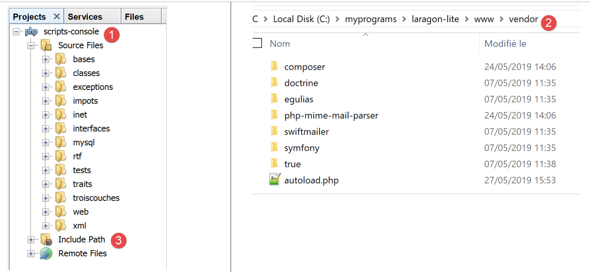
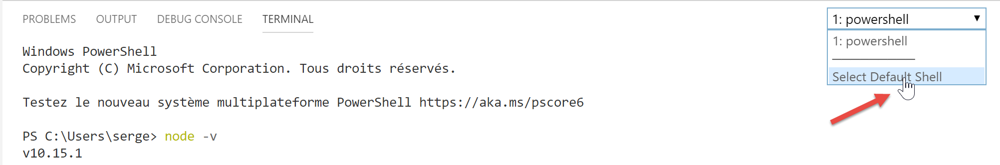
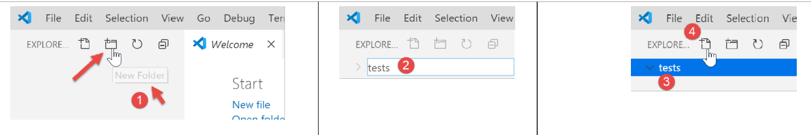
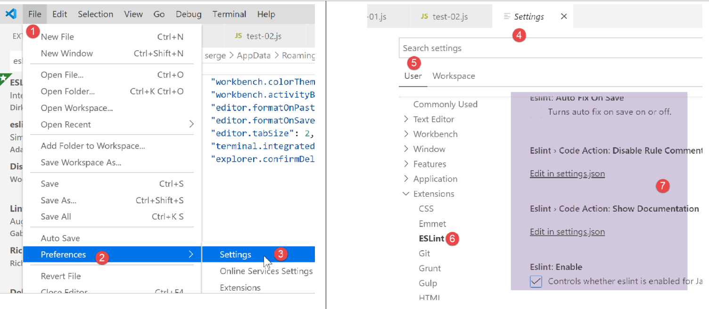

Installation d’un environnement de travail
==========================================

Nous allons utiliser les outils suivants (sous Windows 10 x 64 bits) :

-  [Laragon] pour exécuter le serveur web PHP ;

-  [Netbeans] pour modifier le code PHP ;

-  [Visual Studio Code] pour écrire les codes Javascript ;

-  **[node.js]** pour les exécuter ;

-  **[npm]** pour télécharger et installer les bibliothèques Javascript
   dont nous aurons besoin ;

   1. .. rubric:: Environnement de travail pour le serveur web
         :name: environnement-de-travail-pour-le-serveur-web

Les scripts PHP ont été écrits et testés dans l'environnement suivant :

-  un environnement serveur web Apache / SGBD MySQL / PHP 7.3 appelé
   **Laragon ;**

-  l'IDE de développement **Netbeans 10.0 ;**

   1. .. rubric:: Installation de Laragon
         :name: installation-de-laragon

Laragon est un package réunissant plusieurs logiciels :

-  un serveur web Apache. Nous l'utiliserons pour l'écriture de scripts
   web en PHP ;

-  le SGBD MySQL ;

-  le langage de script PHP ;

-  un serveur Redis implémentant un cache pour des applications web :

Laragon peut être téléchargé (mars 2019) à l'adresse suivante :

https://laragon.org/download/

|image0|

|image1|

|image2|

-  l'installation **[1-5]** donne naissance à l'arborescence suivante :

|image3|

-  en **[6]** le dossier d'installation de PHP ;

Le lancement de **[Laragon]** affiche la fenêtre suivante :

|image4|

-  **[1]** : le menu principal de Laragon ;

-  **[2]** : le bouton **[Start All]** lance le serveur web Apache et le
   SGBD MySQL ;

-  **[3]** : le bouton **[WEB]** affiche la page web
   **[http://localhost]** qui correspond au fichier PHP
   **[<laragon>/www/index.php]** où <laragon> est le dossier
   d’installation de Laragon ;

-  **[4]** : le bouton **[Database]** permet de gérer le SGBD MySQL avec
   l’outil **[phpMyAdmin]**. Il faut auparavant installer celui-ci ;

-  **[5]** : le bouton **[Terminal]** ouvre un terminal de commandes ;

-  **[6]** : le bouton **[Root]** ouvre un explorateur Windows
   positionné sur le dossier **[<laragon>/www]** qui est la racine du
   site web **[http://localhost]**. C’est là qu’il faut placer toutes
   les applications web gérées par le serveur Apache de Laragon ;

Ouvrons un terminal Laragon **[5]** :

|image5|

-  en **[1]**, le type du terminal. Trois types de terminaux sont
   disponibles en **[6]** ;

-  en **[2, 3]** : le dossier courant ;

-  en **[4]**, on tape la commande **[echo %PATH%]** qui affiche la
   liste des dossiers explorés lors de la recherche d’un exécutable.
   Tous les principaux dossiers de Laragon sont inclus dans ce chemin
   des exécutables, ce qui ne serait pas le cas si on ouvrait une
   fenêtre de commandes **[cmd]** dans Windows. Dans ce document,
   lorsqu’on est amené à taper des commandes pour installer tel ou tel
   logiciel, c’est en général dans un terminal Laragon que ces commandes
   sont tapées ;

   1. .. rubric:: Installation de l'IDE Netbeans 10.0
         :name: installation-de-lide-netbeans-10.0

L'IDE Netbeans 10.0 peut être téléchargé à l'adresse suivante (mars
2019) :

`https://netbeans.apache.org/download/index.HTML <https://netbeans.apache.org/download/index.html>`__

|image6|

Le fichier téléchargé est un zip qu’il suffit de dézipper. Une fois
Netbeans installé et lancé, on peut créer un premier projet PHP.

|image7|

-  en **[1]**, prendre l'option File / New Project ;

-  en **[2]**, prendre la catégorie **[PHP]** ;

-  en **[3]**, prendre le type de projet **[PHP Application]** ;

|image8|

-  en **[4]**, donner un nom au projet ;

-  en **[5]**, choisir un dossier pour le projet ;

-  en **[6]**, choisir la version de PHP téléchargée ;

-  en **[7]**, choisir l'encodage UTF-8 pour les fichiers PHP ;

-  en **[8]**, choisir le mode **[Script]** pour exécuter les scripts
   PHP en mode ligne de commande. Choisir **[Local WEB Server]** pour
   exécuter un script PHP dans un environnement web ;

-  en **[9,10]**, indiquer le répertoire d'installation de
   l'interpréteur PHP du package Laragon :

|image9|

-  choisir **[Finish]** pour terminer l'assistant de création du projet
   PHP ;

|image10|

-  en **[11]**, le projet est créé avec un script **[index.php]** ;

-  en **[12]**, on écrit un script PHP minimal ;

-  en **[13]**, on exécute **[index.php]** ;

|image11|

-  en **[14]**, les résultats dans la fenêtre **[output]** de Netbeans ;

-  en **[15]**, on crée un nouveau script ;

-  en **[16]**, le nouveau script ;

Le lecteur pourra créer tous les scripts qui vont suivre dans différents
dossiers du même projet PHP. Les codes source des scripts de ce document
sont disponibles sous la forme de l’arborescence Netbeans suivante :

|image12|

Les scripts de ce document sont placés dans l’arborescence du projet
**[scripts-console]** **[1]**. Nous allons utiliser également des
bibliothèques PHP qui seront placées dans le dossier
**[<laragon-lite>/www/vendor]** **[2]** où <laragon-lite> est le dossier
d’installation du logiciel Laragon. Pour que Netbeans reconnaisse les
bibliothèques de **[2]** comme faisant partie du projet
**[scripts-console]**, il nous faut inclure le dossier **[vendor]**
**[2]** dans la branche **[Include Path]** **[3]** du projet. Nous
allons configurer Netbeans pour que le dossier
**[<laragon-lite>/www/vendor]** **[2]** soit inclus dans tout nouveau
projet PHP et pas seulement dans le projet **[scripts-console]** :

|image13|

-  en **[1-2]**, on va dans les options de Netbeans ;

-  en **[3-4]**, on configure les options de PHP ;

-  en **[5-7]**, on configure le **[Global Include Path]** de PHP : les
   dossiers indiqués en **[7]** sont automatiquement inclus dans le
   **[Include Path]** de tout projet PHP ;

|image14|

-  en **[9]**, on accède aux propriétés de la branche **[Include
   Path]** ;

-  en **[10-11]**, les nouvelles bibliothèques explorées par Netbeans.
   Netbeans explore le code PHP de ces bibliothèques et mémorise leurs
   classes, interfaces, fonctions… afin de pouvoir proposer de l’aide au
   développeur ;

|image15|

-  en **[12]**, un code utilise la classe **[PhpMimeMailParser\Parser]**
   de la bibliothèque **[vendor/php-mime-mail-parser]** ;

-  en **[13]**, Netbeans propose les méthodes de cette classe ;

-  en **[14-15]**, Netbeans affiche la documentation de la méthode
   sélectionnée ;

La notion d’\ **[Include Path]** est ici propre à Netbeans. PHP a
également cette notion mais ce sont a priori deux notions différentes.

Maintenant que l'environnement de travail a été installé, nous pouvons
aborder les bases de PHP.

Environnement de travail pour JavaScript
----------------------------------------

Ces outils peuvent être installés à partir de Laragon (cf. paragraphe
`lien <chap-02.html#laragon>`__) :

|image16|

En **[4]**, on installe **[node.js]**. Une fois l’installation terminée,
on ouvre un terminal Laragon (cf. paragraphe
`lien <chap-02.html#laragon>`__) et on demande la version de
**[node.js]** installée (1) ainsi que celle de **[npm]** (2) :

|image17|

Ensuite nous installons Visual Studio Code appelé fréquemment
**[code]** ou **[VSCode]** **[3-6]**. Ceci fait, nous pouvons lancer cet
outil de développement :

|image18|

|image19|

Configuration de Visual Studio Code
~~~~~~~~~~~~~~~~~~~~~~~~~~~~~~~~~~~

Nous montrons maintenant comment nous avons configuré **[VSCode]** afin
que le lecteur comprenne les copie d’écran qui apparaîtront de temps en
temps. Le lecteur est lui libre de configurer **[VSCode]** comme il
l’entend. Il peut même installer son environnement de travail favori.
Celui-ci importe peu pour ce que nous allons faire par la suite.

Tout d’abord, nous changeons l’apparence de la fenêtre **[VSCode]** pour
avoir un fond clair plutôt que noir :

|image20|

Puis nous cachons la barre de gauche **[1-2]** dont les éléments sont
également disponibles dans le menu. En **[3-6]**, nous demandons un
formatage du code à chaque sauvegarde du fichier et à chaque copier /
coller.

|image21|

Après avoir sauvegardé la configuration **[Ctrl-S]**, on peut fermer la
fenêtre **[Settings]** **[7]**. On peut revenir à tout moment à la
configuration de **[VSCode]** **[8-10]** :

|image22|

Ces configurations sont sauvegardées dans un fichier **[settings.json]**
que l’on peut éditer directement. Ouvrons la fenêtre de configuration
**[Settings]** comme il a été vu :

|image23|

En **[4]**, on peut éditer directement le fichier **[settings.json]** :

|image24|

-  en **[1]**, le chemin du fichier **[settings.json]**. Une façon de
   revenir à la configuration par défaut est de supprimer ce fichier ;

-  en **[2]**, les configurations que nous venons de faire ;

Maintenant, ouvrons un terminal à l’intérieur de **[VSCode]** **[1-2]**
:

|image25|

-  en **[3]**, le type de terminal ouvert, ici PowerShell ;

-  en **[4]**, on peut taper des commandes Windows ;

-  en **[6]**, on peut ouvrir d’autres terminaux ;

-  en **[5]**, la liste des terminaux ouverts ;

-  en **[7]**, supprime le terminal actif ;

Nous utiliserons le terminal de **[VSCode]** pour installer des packages
(bibliothèques) Javascript avec l’outil **[npm]** (Node Package
Manager). Demandons, comme nous l’avons fait précédemment dans un
terminal Laragon, la version de **[npm]** installée :

|image26|

On voit que la commande **[npm]** n’a pas été reconnue. Cela signifie
qu’elle n’appartient pas au PATH (liste des dossiers à explorer pour
chercher un exécutable, ici **[npm]**) du terminal. On peut connaître le
PATH utilisé par le terminal :

|image27|

L’exécutable **[npm]** ne se trouve pas parmi ces dossiers. Comme les
autres outils installés par Laragon, il se trouve dans le dossier
**[<laragon>\bin]** de Laragon et plus précisément dans le dossier de
**[nodejs]** **[4-6]**.

|image28|

Pour lancer **[VSCode]** et avoir accès à **[npm]**, nous lancerons
**[VSCode]** à partir d’un terminal Laragon. Lancé de cette façon,
**[VSCode]** va hériter du PATH du terminal Laragon qui lui, contient le
dossier des exécutables **[node]** et **[npm]** :

|image29|

-  en **[1]** : on tape la commande **[path]** ;

-  en **[2]** : la liste des dossiers du PATH. On y voit le dossier
   **[node-v10]** **[2]**, ce qui nous garantit que les exécutables
   **[node]** et **[npm]** seront trouvés ;

**[VSCode]** est lancé à partir d’un terminal Laragon avec la commande
**[code]** :

|image30|

-  en **[2]**, on ouvre un terminal PowerShell dans **[VSCode]** ;

-  en **[3-4]**, on voit que les exécutables **[node]** et **[npm]**
   sont accessibles ;

**Note** : il ne faut pas fermer le terminal Laragon qui a lancé
l’environnement de développement **[VSCode]**, sinon VSCode lui-même se
ferme.

Nous allons faire une dernière configuration : nous allons changer le
terminal par défaut de **[VSCode]** :

|image31|

|image32|

Le fichier **[settings.json]** se met aussitôt à jour :

|image33|

Maintenant, ouvrons un nouveau terminal **[VSCode]** **[1]** :

|image34|

-  en **[2]**, un terminal **[cmd]** (pas PowerShell) ;

-  en **[3]**, la commande **[path]** donne le PATH du terminal ;

-  en **[4]**, on y voit bien le dossier des exécutables **[node]** et
   **[npm]**

   1. .. rubric:: Ajout d’extensions à Visual Studio Code
         :name: ajout-dextensions-à-visual-studio-code

Créons un fichier Javascript avec **[VSCode]** :

|image35|

|image36|

-  en **[3-4]**, on crée un dossier ;

-  en **[5]**, on en fait le dossier courant de **[VSCode]** ;

-  en **[6]**, on ouvre un terminal ;

-  en **[7]**, on voit qu’on est positionné sur le dossier choisi. Les
   opérations à suivre vont se faire dans celui-ci ;

|image37|

-  en **[1-3]** : on crée un nouveau dossier ;

-  en **[4]** : on ajoute un fichier dans ce dossier ;

|image38|

-  en **[5-7]** : on crée notre 1\ :sup:`er` programme Javascript ;

|image39|

-  en **[8-9]** : on exécute le programme Javascript ;

-  le résultat apparaît dans la console d’exécution **[10]**. On voit en
   **[11]** la commande qui a été exécutée : c’est l’application
   **[node]** qui a exécuté le script **[test-01.js]**. C’est parce que
   cet exécutable est dans le PATH de **[VSCode]** que cela a pu être
   possible, sinon on aurait eu une erreur indiquant que la commande
   **[node]** n’était pas connue ;

Procédons de la même façon pour exécuter un second script
**[test-02.js]** :

|image40|

-  en **[1-3]**, on définit le nouveau script. L’instruction **[use
   strict]** de la ligne 1 demande une vérification stricte de la
   syntaxe. Dans ce contexte, toute variable doit être déclarée avec
   l’un des mots clés **[let, const, var]**. Ce n’est pas le cas de la
   variable **[x]** de la ligne 2 ;

-  lorsqu’on exécute ce code par **[Ctrl-F5]**, on obtient l’erreur
   **[5]**. Il est possible d’être averti de ce type d’erreur avant
   l’exécution. C’est préférable. Nous allons faire deux choses :

   -  installer avec **[npm]** une bibliothèque appelée **[eslint]** qui
      vérifie que la syntaxe du script est conforme à la norme
      ECMAScript 6 ;

   -  installer une extension à Visual Studio Code, appelée elle-aussi
      ESLINT qui facilite l’utilisation de la bibliothèque **[eslint]**
      au sein de **[VSCode]** ;

Installons tout d’abord la bibliothèque Javascript **[eslint]** à l’aide
de l’outil **[npm]**. Pour installer une bibliothèque (on dit un
package) **[npm]**, il faut connaître son nom exact. Si ce n’est pas le
cas, on peut aller sur le site de **[npm]** à l’URL (2019)
**[https://www.npmjs.com/]** :

|image41|

-  en **[3]**, les packages commençant par **[esl]** ;

-  en **[4-6]**, on trouve le package **[eslint]** ;

|image42|

-  en **[7]**, la commande **[npm]** pour installer le package
   **[eslint]** ;

-  en **[8]**, la configuration du package ;

-  en **[9]**, son utilisation pour vérifier la syntaxe d’un script
   Javascript ;

Nous installons le package **[eslint]** dans une fenêtre **[Terminal]**
de **[VSCode]**. Tout d’abord, il nous faut créer un fichier
**[package.json]** à la racine du dossier de travail de **[VSCode]**. Ce
fichier contiendra la liste des packages jS utilisés par le projet
**[VSCode]** :

|image43|

-  en **[1]**, cliquer droit dans l’explorateur de projet (pas sur le
   dossier tests) ;

-  en **[3-4]**, on crée le fichier **[package.json]** à la racine du
   projet **[javascript]**, au même niveau que le dossier **[tests]**
   (mais pas dans **[tests]**) ;

-  en **[4-6]**, on met dans le fichier **[package.json]** un objet jSON
   vide ;

Puis on ouvre un terminal **[VSCode]** pour installer **[eslint]** :

|image44|

-  en **[2]**, on est à la racine du projet **[javascript]** ;

-  en **[3]**, la commande qui installe le package **[eslint]** ;

-  après exécution,

   -  en **[4-5]**, le fichier **[package.json]** a été modifié. Ligne
      3, on trouve la version de **[eslint]** installée. Ligne 2,
      **[devDependencies]** correspond à l’argument **[--save-dev]** de
      l’installation. Cet argument signifie que la dépendance installée
      doit être inscrite dans le fichier **[package.json]** comme
      élément de la propriété **[devDependencies]**. Cette propriété
      liste les dépendances du projet dont on a besoin en mode
      développement mais pas en mode production. En effet, on a besoin
      de la dépendance **[eslint]** uniquement en développement pour
      vérifier que le code écrit respecte la norme ECMAScript ;

   -  en **[6]**, un dossier **[node_modules]** est apparu dans le
      projet. C’est le dossier où sont installées les dépendances du
      projet ;

|image45|

-  en **[7]**, une partie des packages installés. Ceux-ci sont très
   nombreux. En effet, non seulement le package **[eslint]** a été
   installé mais également tous les packages sur lesquels celui-ci
   s’appuie ;

|image46|

-  **[1-2]**, dans un terminal **[VSCode]** on émet la commande de
   configuration du package **[eslint]**. Celle-ci va poser diverses
   questions **[3]** pour savoir comment on souhaite utiliser
   **[eslint]**. Dans le doute, laissez les options proposées par
   défaut. Pour sélectionner une option, utilisez les flèches haute et
   basse du clavier pour choisir l’option puis validez celle-ci ;

-  en **[4]**, un fichier **[.eslintrc.js]** a été créé à la racine du
   projet ;

-  en **[6]**, le contenu du fichier. Vous pouvez en copier le contenu
   dans votre propre fichier ;

.. code-block:: javascript 
   :linenos:

   module.exports = {
     "env": {
       "browser": true,
       "es6": true
     },
     "extends": "eslint:recommended",
     "globals": {
       "Atomics": "readonly",
       "SharedArrayBuffer": "readonly"
     },
     "parserOptions": {
       "ecmaVersion": 2018,
       "sourceType": "module"
     },
     "rules": {
     }
   };

Tout ceci n’est pas suffisant pour signaler les erreurs du fichier
**[test-02.js]** :

|image47|

-  il faut taper la commande **[2-3]** pour que le fichier
   **[tests/test-02.js]** soit analysé ;

-  en **[4]**, l’erreur sur la variable non déclarée est détectée ;

Nous allons ajouter à **[VSCode]** une extension qui va permettre de
voir les erreurs Javascript en temps réel. Cette extension s’appuie sur
le package **[eslint]** que nous avons installé :

|image48|

-  en **[3-5]**, nous installons l’extension appelée **[ESLint]** ;

|image49|

-  en **[1]**, une page d’informations sur l’extension nouvellement
   installée ;

en **[2]**, on voit que le mode de vérification de **[ESLint]** est
**[type]**, ce qui signifie que la syntaxe des scripts jS sera vérifiée
en même temps que la frappe du texte ;

ESLint peut être configuré via le fichier de configuration général de
**[VSCode]** :

|image50|

-  en **[6-7]**, la configuration de **[ESLint]**. C’est ici que vous
   pourrez la modifier ;

Revenons maintenant au fichier **[test-02.js]** :

|image51|

-  en **[3-4]**, les erreurs sur la variable **[x]** sont désormais
   signalées ;

-  en **[5]** : le nombre d’erreurs ESLint dans le fichier ;

-  en **[6]**, indique que dans le dossier **[tests]**, il y a des
   fichiers erronés ;

Si on corrige l’erreur, les avertissements d’ESLint disparaissent :

|image52|

Installons maintenant une extension appelée **[Code Runner]** :

|image53|

-  une fois installée l’extension **[Code-Runner]** **[1-5]**, on peut
   la configurer avec **[6-7]** (ci-dessus) ;

|image54|

-  en **[1-2]**, les éléments de configuration de **[Code-Runner]** ;

-  en **[3]**, on demande à ce que le terminal de sortie soit nettoyé
   avant chaque exécution ;

-  en **[4]**, on localise l’élément **[Executor Map]** qui liste les
   outils d’exécution de différents langages ;

-  en **[5-6]**, on copie la configuration dans le presse-papiers ;

-  en **[7-8]**, on modifie le fichier **[settings.json]** ;

|image55|

-  en **[2]**, on ajoute la virgule derrière le dernier élément du
   fichier **[settings.json]** **[1]** ;

-  en **[3]**, on colle ce qu’on a copié en **[5-6]** précédemment :
   c’est la liste des commandes permettant d’exécuter les différents
   langages supportés par **[VSCode]** ;

-  en **[4]**, la commande permettant d’exécuter les fichiers
   Javascript. Celle-ci ne fonctionne que si **[node]** est dans le PATH
   de **[VSCode]**. Si ce n’est pas le cas, on peut mettre le chemin
   complet de l’exécutable **[5]** ;

Ceci fait sauvegardons la configuration (Ctrl-S). Avec l’extension
**[Code Runner]**, les fichiers Javascript peuvent être exécutés avec un
clic droit sur le code **[6]** (ci-dessus) :

|image56|

Quelques commandes [VSCode] utiles
~~~~~~~~~~~~~~~~~~~~~~~~~~~~~~~~~~

-  pour formater votre code, cliquez droit dessus **[1]** ;

-  pour fermer les fenêtres ouvertes, cliquez droit sur leurs titres
   **[2-3]** ;

|image57|

-  pour afficher une fenêtre particulière **[4-5]** ;

-  pour sauvegarder votre projet (Workspace) **[6-9]** ;

-  pour sauvegarder un projet **[10-11]** ;

|image58|

|image59|

-  pour ouvrir un projet **[11-16]** :

|image60|

-  voir les extensions installées **[19-20]** :

|image61|

Nous avons désormais de bons outils pour développer en Javascript. Nous
allons maintenant présenter ce langage à l’aide de courts extraits de
code. Comme cette présentation se fait à la suite d’un cours PHP, nous
ferons parfois des comparaisons entre ces deux langages pour signaler
des différences entre eux.

.. |image0| image:: ./chap-02/media/image1.png
   :width: 3.77992in
   :height: 2.06339in

.. |image2| image:: ./chap-02/media/image3.png
   :width: 5.69646in
   :height: 2.13386in
.. |image3| image:: ./chap-02/media/image4.png
   :width: 6.59016in
   :height: 2.87795in

.. |image5| image:: ./chap-02/media/image6.png
   :width: 5.81535in
   :height: 2.1374in

.. |image10| image:: ./chap-02/media/image11.png
   :width: 5.6374in
   :height: 1.6374in
.. |image11| image:: ./chap-02/media/image12.png
   :width: 5.83898in
   :height: 1.01929in

.. |image13| image:: ./chap-02/media/image14.png
   :width: 7.24803in
   :height: 2.57835in
.. |image14| image:: ./chap-02/media/image15.png
   :width: 2.15748in
   :height: 2.04291in
.. |image15| image:: ./chap-02/media/image16.png
   :width: 3.74449in
   :height: 4.65748in

.. |image27| image:: ./chap-02/media/image28.png
   :width: 6.39764in
   :height: 1.04331in

.. |image33| image:: ./chap-02/media/image34.png
   :width: 5.74449in
   :height: 1.56338in

.. |image56| image:: ./chap-02/media/image57.png
   :width: 5.51575in
   :height: 1.79134in

