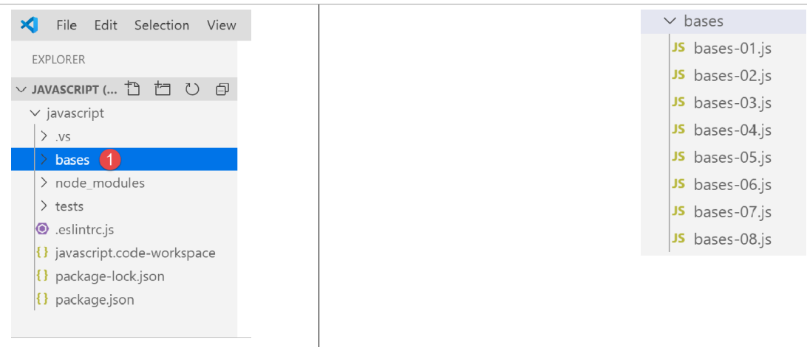
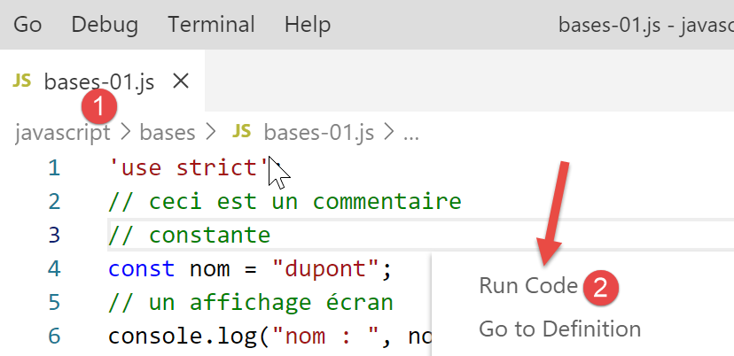
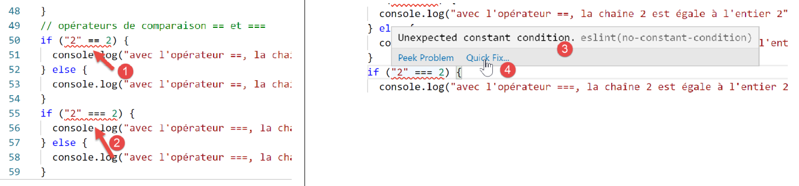
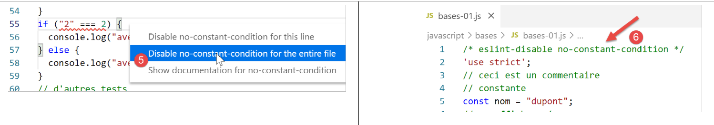
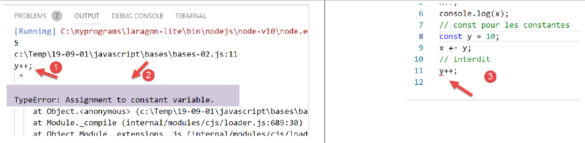
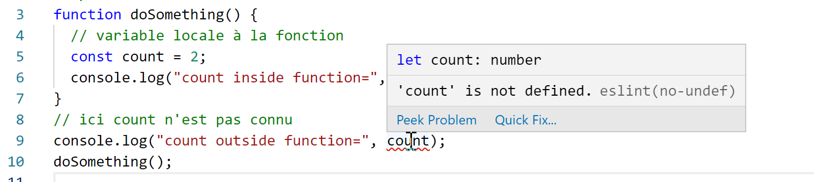
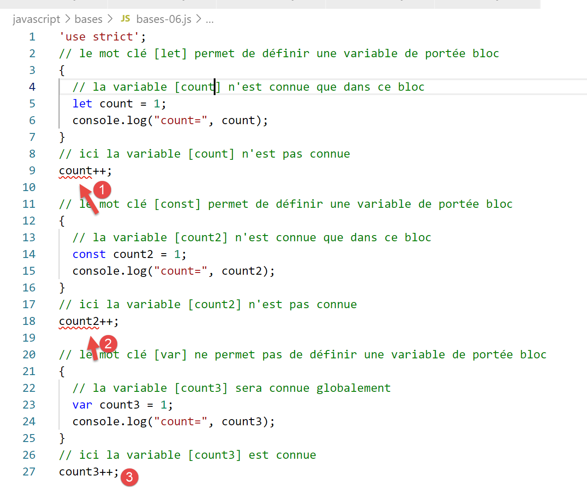

Les bases de Javascript
=======================

**Note** : dans la suite, le terme **[Javascript]** désignera toujours
la norme ECMAScript 6.

A l’intérieur du projet Javascript précédent, créez un dossier
**[bases]**. Nous y mettrons les exemples de cette section :

|image0|

script [bases-01]
-----------------

Pour introduire les bases de PHP7, nous avions utilisé le code
suivant(cf. paragraphe
`lien <https://tahe.developpez.com/tutoriels-cours/php7/>`__) :

.. code-block:: javascript 
   :linenos:

   <?php

   // ceci est un commentaire
   // variable utilisée sans avoir été déclarée
   $nom = "dupont";
   // un affichage écran
   print "nom=$nom\n";
   // un tableau avec des éléments de type différent
   $tableau = array("un", "deux", 3, 4);
   // son nombre d'éléments
   $n = count($tableau);
   // une boucle
   for ($i = 0; $i < $n; $i++) {
     print "tableau[$i]=$tableau[$i]\n";
   }
   // initialisation de 2 variables avec le contenu d'un tableau
   list($chaine1, $chaine2) = array("chaine1", "chaine2");
   // concaténation des 2 chaînes
   $chaine3 = $chaine1 . $chaine2;
   // affichage résultat
   print "[$chaine1,$chaine2,$chaine3]\n";
   // utilisation fonction
   affiche($chaine1);
   // le type d'une variable peut être connu
   afficheType("n", $n);
   afficheType("chaine1", $chaine1);
   afficheType("tableau", $tableau);
   // le type d'une variable peut changer en cours d'exécution
   $n = "a changé";
   afficheType("n", $n);
   // une fonction peut rendre un résultat
   $res1 = f1(4);
   print "res1=$res1\n";
   // une fonction peut rendre un tableau de valeurs
   list($res1, $res2, $res3) = f2();
   print "(res1,res2,res3)=[$res1,$res2,$res3]\n";
   // on aurait pu récupérer ces valeurs dans un tableau
   $t = f2();
   for ($i = 0; $i < count($t); $i++) {
     print "t[$i]=$t[$i]\n";
   }
   // des tests
   for ($i = 0; $i < count($t); $i++) {
     // n'affiche que les chaînes
     if (getType($t[$i]) === "string") {
       print "t[$i]=$t[$i]\n";
     }
   }
   // opérateurs de comparaison == et ===
   if("2"==2){
     print "avec l'opérateur ==, la chaîne 2 est égale à l'entier 2\n";
   }else{
     print "avec l'opérateur ==, la chaîne 2 n'est pas égale à l'entier 2\n";
   }
   if("2"===2){
     print "avec l'opérateur ===, la chaîne 2 est égale à l'entier 2\n";
   }
   else{
     print "avec l'opérateur ===, la chaîne 2 n'est pas égale à l'entier 2\n";
   }
   // d'autres tests
   for ($i = 0; $i < count($t); $i++) {
     // n'affiche que les entiers >10
     if (getType($t[$i]) === "integer" and $t[$i] > 10) {
       print "t[$i]=$t[$i]\n";
     }
   }
   // une boucle while
   $t = [8, 5, 0, -2, 3, 4];
   $i = 0;
   $somme = 0;
   while ($i < count($t) and $t[$i] > 0) {
     print "t[$i]=$t[$i]\n";
     $somme += $t[$i];   //$somme=$somme+$t[$i]
     $i++;               //$i=$i+1
   }//while
   print "somme=$somme\n";

   // fin programme
   exit;

   //----------------------------------
   function affiche($chaine) {
     // affiche $chaine
     print "chaine=$chaine\n";
   }

   //affiche
   //----------------------------------
   function afficheType($name, $variable) {
     // affiche le type de $variable
     print "type[variable $" . $name . "]=" . getType($variable) . "\n";
   }

   //afficheType
   //----------------------------------
   function f1($param) {
     // ajoute 10 à $param
     return $param + 10;
   }

   //----------------------------------
   function f2() {
     // rend 3 valeurs
     return array("un", 0, 100);
   }
   ?>

Traduit en Javascript, cela donne le code suivant :

.. code-block:: javascript 
   :linenos:

   'use strict';
   // ceci est un commentaire
   // constante
   const nom = "dupont";
   // un affichage écran
   console.log("nom : ", nom);
   // un tableau avec des éléments de type différent
   const tableau = ["un", "deux", 3, 4];
   // son nombre d'éléments
   let n = tableau.length;
   // une boucle
   for (let i = 0; i < n; i++) {
     console.log("tableau[", i, "] = ", tableau[i]);
   }
   // initialisation de 2 variables avec le contenu d'un tableau
   let [chaine1, chaine2] = ["chaine1", "chaine2"];
   // concaténation des 2 chaînes
   const chaine3 = chaine1 + chaine2;
   // affichage résultat
   console.log([chaine1, chaine2, chaine3]);
   // utilisation fonction
   affiche(chaine1);
   // le type d'une variable peut être connu
   afficheType("n", n);
   afficheType("chaine1", chaine1);
   afficheType("tableau", tableau);
   // le type d'une variable peut changer en cours d'exécution
   n = "a changé";
   afficheType("n", n);
   // une fonction peut rendre un résultat
   let res1 = f1(4);
   console.log("res1=", res1);
   // une fonction peut rendre un tableau de valeurs
   let res2, res3;
   [res1, res2, res3] = f2();
   console.log("(res1,res2,res3)=", [res1, res2, res3]);
   // on aurait pu récupérer ces valeurs dans un tableau
   let t = f2();
   for (let i = 0; i < t.length; i++) {
     console.log("t[i]=", t[i]);
   }
   // des tests
   for (let i = 0; i < t.length; i++) {
     // n'affiche que les chaînes
     if (typeof (t[i]) === "string") {
       console.log("t[i]=", t[i]);
     }
   }
   // opérateurs de comparaison == et ===
   if ("2" == 2) {
     console.log("avec l'opérateur ==, la chaîne 2 est égale à l'entier 2");
   } else {
     console.log("avec l'opérateur ==, la chaîne 2 n'est pas égale à l'entier 2");
   }
   if ("2" === 2) {
     console.log("avec l'opérateur ===, la chaîne 2 est égale à l'entier 2");
   } else {
     console.log("avec l'opérateur ===, la chaîne 2 n'est pas égale à l'entier 2");
   }
   // d'autres tests
   for (let i = 0; i < t.length; i++) {
     // n'affiche que les entiers >10
     if (typeof (t[i]) === "number" && Math.floor(t[i]) === t[i] && t[i] > 10) {
       console.log("t[i]=", t[i]);
     }
   }
   // une boucle while
   t = [8, 5, 0, -2, 3, 4];
   let i = 0;
   let somme = 0;
   while (i < t.length && t[i] > 0) {
     console.log("t[i]=", t[i]);
     somme += t[i];
     i++;
   }
   console.log("somme=", somme);

   // arrêt du programme car il n'y a plus de code exécutable

   //affiche
   //----------------------------------
   function affiche(chaine) {
     // affiche chaine
     console.log("chaine=", chaine);
   }

   //afficheType
   //----------------------------------
   function afficheType(name, variable) {
     // affiche le type de variable
     console.log("type[variable ", name, "]=", typeof (variable));
   }

   //----------------------------------
   function f1(param) {
     // ajoute 10 à param
     return param + 10;
   }

   //----------------------------------
   function f2() {
     // rend 3 valeurs
     return ["un", 0, 100];
   }

Commentons les différences entre les codes PHP et ECMAScript 6 avec la
déclaration **[use strict]** (ligne 1) :

-  la 1ère différence est qu’en ECMAScript **on déclare les variables**
   avec les mots clés suivants :

   -  **[let]** pour déclarer une variable dont la valeur **peut
      changer** au cours de l’exécution du code ;

   -  **[const]** pour déclarer une variable dont la valeur **ne va pas
      changer** (une constante donc) au cours de l’exécution du code ;

   -  on peut également utiliser le mot clé **[var]** à la place de
      **[let]**. C’était le mot clé utilisé avec ECMAScript 5. Nous ne
      l’utiliserons pas dans ce cours ;

-  ligne 6 : la méthode d’affichage **[console.log]** peut afficher
   toutes sortes de données : chaînes, nombres, booléens, tableaux,
   objets. La méthode PHP **[print]** ne sait pas afficher nativement
   des tableaux et objets. Dans l’expression **[console.log]**,
   **[console]** est un objet et **[log]** une méthode de cet objet ;

-  ligne 8 : les tableaux Javascript sont des **objets référencés par un
   pointeur**. Lorsqu’on écrit :

.. code-block:: javascript 
   :linenos:

   const tableau = ["un", "deux", 3, 4];

..

   la variable **[tableau]** est un **pointeur** sur le tableau littéral
   **["un", "deux", 3, 4]**. Modifier le contenu du tableau ne modifie
   pas son pointeur. Aussi un tableau sera-t-il le plus souvent déclaré
   avec le mot clé **[const]**. En PHP, un tableau n’est pas référencé
   par un pointeur. C’est une donnée littérale ;

-  ligne 12 : la variable de boucle **[i]** est déclarée (let) dans la
   boucle. Le mot clé **[let]** respecte la portée de bloc (code entre
   accolades). Ainsi la variable **[i]** de la ligne 12 n’est-elle
   connue que dans la boucle ;

-  ligne 18 : l’opérateur de concaténation de chaîne est l’opérateur +
   en Javascript, . en PHP. Une particularité de cet opérateur est qu’il
   a précédence sur l’opérateur + d’addition. Ainsi :

   -  en PHP, ‘1’ +2 donne le nombre 3 ;

   -  en Javascript ‘1’+2 donne la chaîne ‘12’ ;

-  ligne 20 : **[console.log]** sait afficher des tableaux ;

-  ligne 82 : en Javascript, il n’est pas possible d’indiquer le type
   des paramètres d’une fonction ;

-  ligne 91 : l’opérateur **[typeof]** permet de connaître le type d’une
   donnée. Il y en a quatre : nombre, chaîne de caractères, booléen et
   objet. On notera qu’en Javascript on n’a pas de type **[integer]** ni
   de type **[tableau]**. Comme il a été dit, les tableaux sont
   manipulés via des pointeurs et tombe dans la catégorie des objets ;

-  lignes 50-59 : comme en PHP, Javascript a deux opérateurs de
   comparaison, == et ‘===’ avec la même signification qu’en PHP. ESLint
   signale le plus souvent l’opérateur == comme une erreur possible. On
   utilisera systématiquement l’opérateur ‘===’ ;

-  ligne 79 : on aurait pu mettre l’instruction **[return]** mais ESLint
   émet l’avertissement que **[return]** ne doit s’utiliser que dans une
   fonction ;

Exécutons ce code :

|image1|

Les résultats de l’exécution :

.. code-block:: javascript 
   :linenos:

   [Running] C:\myprograms\laragon-lite\bin\nodejs\node-v10\node.exe "c:\Temp\19-09-01\javascript\bases\bases-01.js"
   nom : dupont
   tableau[ 0 ] = un
   tableau[ 1 ] = deux
   tableau[ 2 ] = 3
   tableau[ 3 ] = 4
   [ 'chaine1', 'chaine2', 'chaine1chaine2' ]
   chaine= chaine1
   type[variable n ]= number
   type[variable chaine1 ]= string
   type[variable tableau ]= object
   type[variable n ]= string
   res1= 14
   (res1,res2,res3)= [ 'un', 0, 100 ]
   t[ 0 ]= un
   t[ 1 ]= 0
   t[ 2 ]= 100
   t[ 0 ]= un
   avec l'opérateur ==, la chaîne 2 est égale à l'entier 2
   avec l'opérateur ===, la chaîne 2 n'est pas égale à l'entier 2
   t[ 2 ]= 100
   t[ 0 ]= 8
   t[ 1 ]= 5
   somme= 13

   [Done] exited with code=0 in 0.316 seconds

Dans le code écrit, ESLINT signale deux erreurs :

|image2|

-  en passant le curseur sur la ligne rouge de l’avertissement, on a le
   message d’erreur **[3]**. Ici ESLint ne comprend pas qu’on compare
   deux constantes. L’un des deux opérandes devrait être une variable ;

-  en **[4]**, une option **[Quick Fix]** permet de lever
   l’avertissement si on décide de ne pas corriger l’erreur ;

|image3|

-  en **[5]**, on a la possibilité de désactiver l’avertissement pour la
   ligne courante ou pour l’ensemble du fichier. C’est cette dernière
   option que nous choisissons ici . La ligne **[6]** est alors générée
   au début du fichier ;

   1. .. rubric:: script [bases-02]
         :name: script-bases-02

Le script **[bases-02]** montre l’utilisation des mots clés **[let]** et
**[const]** :

.. code-block:: javascript 
   :linenos:

   'use strict';
   // pour initialiser une variable, on utilise let ou const
   // let pour les variables
   let x = 4;
   x++;
   console.log(x);
   // const pour les constantes
   const y = 10;
   x += y;
   // interdit
   y++;

-  la ligne 11 provoque une erreur à l’exécution **[1-2]**. Elle est
   signalée par ESLint avant l’exécution **[3]** :

|image4|

script [bases-03]
-----------------

Le script **[bases-03]** examine la portée des variables en Javascript :

.. code-block:: javascript 
   :linenos:

   'use strict';
   // portée des variables
   let count = 1;
   function doSomething() {
     // count est ici connu
     console.log("count=",count);
   }
   // appel
   doSomething();

-  la variable **[count]** déclarée en-dehors de la fonction
   **[doSomething]** est pourtant connue dans cette fonction. C’est une
   différence fondamentale avec PHP ;

**Exécution**

.. code-block:: javascript 
   :linenos:

   [Running] C:\myprograms\laragon-lite\bin\nodejs\node-v10\node.exe "c:\Temp\19-09-01\javascript\bases\bases-03.js"
   count= 1

   [Done] exited with code=0 in 0.3 seconds

script [bases-04]
-----------------

Une variable locale cache une variable globale de même nom :

.. code-block:: javascript 
   :linenos:

   'use strict';
   // portée des variables
   const count = 1;
   function doSomething() {
     // la variable locale cache la variable globale
     const count = 2;
     console.log("count inside function=",count);
   }
   // variable globale
   console.log("count outside function=",count);
   // variable locale
   doSomething();

**Exécution**

.. code-block:: javascript 
   :linenos:

   [Running] C:\myprograms\laragon-lite\bin\nodejs\node-v10\node.exe "c:\Temp\19-09-01\javascript\bases\bases-04.js"
   count outside function= 1
   count inside function= 2

   [Done] exited with code=0 in 0.246 seconds

script [bases-05]
-----------------

Une variable définie dans une fonction n’est pas connue en-dehors de
celle-ci :

.. code-block:: javascript 
   :linenos:

   'use strict';
   // portée des variables
   function doSomething() {
     // variable locale à la fonction
     const count = 2;
     console.log("count inside function=", count);
   }
   // ici count n'est pas connu
   console.log("count outside function=", count);
   doSomething();

ESLint déclare une erreur sur la ligne 9 :

|image5|

script [bases-06]
-----------------

Les mots clés **[let]** et **[const]** définissent des variables de
portée **[bloc]** (code entre accolades) mais pas le mot clé **[var]** :

.. code-block:: javascript 
   :linenos:

   'use strict';
   // le mot clé [let] permet de définir une variable de portée bloc
   {
     // la variable [count] n'est connue que dans ce bloc
     let count = 1;
     console.log("count=", count);
   }
   // ici la variable [count] n'est pas connue
   count++;

   // le mot clé [const] permet de définir une variable de portée bloc
   {
     // la variable [count2] n'est connue que dans ce bloc
     const count2 = 1;
     console.log("count=", count2);
   }
   // ici la variable [count2] n'est pas connue
   count2++;

   // le mot clé [var] ne permet pas de définir une variable de portée bloc
   {
     // la variable [count3] sera connue globalement
     var count3 = 1;
     console.log("count=", count3);
   }
   // ici la variable [count3] est connue
   count3++;

**Commentaires**

-  ligne 5 : la variable **[count]** n’est connue que dans le bloc de
   code dans laquelle elle est déclarée (lignes 3-7) ;

-  ligne 14 : la constante **[count2]** n’est connue que dans le bloc de
   code dans laquelle elle est déclarée (lignes 12-16) ;

-  ligne 23 : la variable **[count3]** est connue en-dehors du bloc de
   code dans laquelle elle est déclarée (lignes 21-25) ;

ESLint déclare les erreurs suivantes :

|image6|

Pour ces raisons de portée de bloc, nous n’utiliserons par la suite que
les mots clés **[let]** et **[const]**.

script [bases-07]
-----------------

Les types de données en Javascript :

.. code-block:: javascript 
   :linenos:

   'use strict';

   // type de données jS
   const var1 = 10;
   const var2 = "abc";
   const var3 = true;
   const var4 = [1, 2, 3];
   const var5 = {
     nom: 'axèle'
   };
   const var6 = function () {
     return +3;
   }
   // affichage des types
   console.log("typeof(var1)=", typeof (var1));
   console.log("typeof(var2)=", typeof (var2));
   console.log("typeof(var3)=", typeof (var3));
   console.log("typeof(var4)=", typeof (var4));
   console.log("typeof(var5)=", typeof (var5));
   console.log("typeof(var6)=", typeof (var6));

**Exécution**

.. code-block:: javascript 
   :linenos:

   [Running] C:\myprograms\laragon-lite\bin\nodejs\node-v10\node.exe "c:\Temp\19-09-01\javascript\bases\bases-07.js"
   typeof(var1)= number
   typeof(var2)= string
   typeof(var3)= boolean
   typeof(var4)= object
   typeof(var5)= object
   typeof(var6)= function

   [Done] exited with code=0 in 0.26 seconds

**Commentaires**

-  ligne 7 (code) : un tableau est un objet. A ce titre **[var4]** est
   un pointeur vers le tableau, pas le tableau lui-même ;

-  ligne 8 (code) : **[var5]** est un pointeur vers un objet littéral.
   On verra que les objets littéraux de Javascript ressemblent fort aux
   instances de classe de PHP. Eux-aussi sont référencés via des
   pointeurs ;

-  ligne 11 (code) : une variable peut être de type **[fonction]**
   (ligne 7 des résultats) ;

   1. .. rubric:: script [bases-08]
         :name: script-bases-08

Ce script montre les changements de type possibles en Javascript.

.. code-block:: javascript 
   :linenos:

   'use strict';

   // changements implicites de types
   // type -->bool
   console.log("---------------[Conversion implicite vers un booléen]------------------------------");
   showBool("abcd");
   showBool("");
   showBool([1, 2, 3]);
   showBool([]);
   showBool(null);
   showBool(0.0);
   showBool(0);
   showBool(4.6);
   showBool({});
   showBool(undefined);

   function showBool(data) {
     // la conversion de data en booléen se fait automatiquement dans le test qui suit
     console.log("[data=", data, "], [type(data)]=", typeof (data), "[valeur booléenne(data)]=", data ? true : false);
   }

   // changements implicites de type  vers un type numérique
   console.log("---------------[Conversion implicite vers un nombre]------------------------------");
   showNumber("12");
   showNumber("45.67");
   showNumber("abcd");

   function showNumber(data) {
     // data + 1 ne marche pas car alors jS fait une concaténation de chaînes plutôt qu'une addition
     const nombre = data * 1;
     console.log("[data=", data, "], [type(data)]=", typeof (data), "[nombre]=", nombre, "[type(nombre)]=", typeof (nombre));
   }

   // changements explicites de types vers un booléen
   console.log("---------------[Conversion explicite vers un booléen]------------------------------");
   showBool2("abcd");
   showBool2("");
   showBool2([1, 2, 3]);
   showBool2([]);
   showBool2(null);
   showBool2(0.0);
   showBool2(0);
   showBool2(4.6);
   showBool2({});
   showBool2(undefined);

   function showBool2(data) {
     // la conversion de data en booléen se fait explicitement dans le test qui suit
     console.log("[", data, "], [type(data)]=", typeof (data), "[valeur booléenne(data)]=", Boolean(data));
   }
   // changements explicites de type vers Number
   console.log("---------------[Conversion explicite vers un nombre]------------------------------");
   showNumber2("12.45");
   showNumber2(67.8);
   showNumber2(true);
   showNumber2(null);

   function showNumber2(data) {
     const nombre = Number(data);
     console.log("[data=", data, "], [type(data)]=", typeof (data), "[nombre]=", nombre, "[type(nombre)]=", typeof (nombre));
   }

   // vers String
   console.log("---------------[Conversion explicite vers un string]------------------------------");
   showString(5);
   showString(6.7);
   showString(false);
   showString(null);

   function showString(data) {
     const chaîne = String(data);
     console.log("[data=", data, "], [type(data)]=", typeof (data), "[chaîne]=", chaîne, "[type(chaîne)]=", typeof (chaîne));
   }

   // qqs conversions implicites inattendues
   console.log("---------------[Autres cas]------------------------------");
   const string1 = '1000.78';
   // concaténation de chaînes par défaut
   const data1 = string1 + 1.034;
   console.log("data1=", data1, "type=", typeof (data1));
   const data2 = 1.034 + string1;
   console.log("data2=", data2, "type=", typeof (data2));
   // conversion explicite vers nombre
   const data3 = Number(string1) + 1.034;
   console.log("data3=", data3, "type=", typeof (data3));
   // true est converti en le nombre 1
   const data4 = true * 1.18;
   console.log("data4=", data4, "type=", typeof (data4));
   // false est converti en le nombre 0
   const data5 = false * 1.18;
   console.log("data5=", data5, "type=", typeof (data5));

**Exécution**

.. code-block:: javascript 
   :linenos:

   [Running] C:\myprograms\laragon-lite\bin\nodejs\node-v10\node.exe "c:\Data\st-2019\dev\es6\javascript\bases\bases-08.js"
   ---------------[Conversion implicite vers un booléen]------------------------------
   [data= abcd ], [type(data)]= string [valeur booléenne(data)]= true
   [data= ], [type(data)]= string [valeur booléenne(data)]= false
   [data= [ 1, 2, 3 ] ], [type(data)]= object [valeur booléenne(data)]= true
   [data= [] ], [type(data)]= object [valeur booléenne(data)]= true
   [data= null ], [type(data)]= object [valeur booléenne(data)]= false
   [data= 0 ], [type(data)]= number [valeur booléenne(data)]= false
   [data= 0 ], [type(data)]= number [valeur booléenne(data)]= false
   [data= 4.6 ], [type(data)]= number [valeur booléenne(data)]= true
   [data= {} ], [type(data)]= object [valeur booléenne(data)]= true
   [data= undefined ], [type(data)]= undefined [valeur booléenne(data)]= false
   ---------------[Conversion implicite vers un nombre]------------------------------
   [data= 12 ], [type(data)]= string [nombre]= 12 [type(nombre)]= number
   [data= 45.67 ], [type(data)]= string [nombre]= 45.67 [type(nombre)]= number
   [data= abcd ], [type(data)]= string [nombre]= NaN [type(nombre)]= number
   ---------------[Conversion explicite vers un booléen]------------------------------
   [ abcd ], [type(data)]= string [valeur booléenne(data)]= true
   [ ], [type(data)]= string [valeur booléenne(data)]= false
   [ [ 1, 2, 3 ] ], [type(data)]= object [valeur booléenne(data)]= true
   [ [] ], [type(data)]= object [valeur booléenne(data)]= true
   [ null ], [type(data)]= object [valeur booléenne(data)]= false
   [ 0 ], [type(data)]= number [valeur booléenne(data)]= false
   [ 0 ], [type(data)]= number [valeur booléenne(data)]= false
   [ 4.6 ], [type(data)]= number [valeur booléenne(data)]= true
   [ {} ], [type(data)]= object [valeur booléenne(data)]= true
   [ undefined ], [type(data)]= undefined [valeur booléenne(data)]= false
   ---------------[Conversion explicite vers un nombre]------------------------------
   [data= 12.45 ], [type(data)]= string [nombre]= 12.45 [type(nombre)]= number
   [data= 67.8 ], [type(data)]= number [nombre]= 67.8 [type(nombre)]= number
   [data= true ], [type(data)]= boolean [nombre]= 1 [type(nombre)]= number
   [data= null ], [type(data)]= object [nombre]= 0 [type(nombre)]= number
   ---------------[Conversion explicite vers un string]------------------------------
   [data= 5 ], [type(data)]= number [chaîne]= 5 [type(chaîne)]= string
   [data= 6.7 ], [type(data)]= number [chaîne]= 6.7 [type(chaîne)]= string
   [data= false ], [type(data)]= boolean [chaîne]= false [type(chaîne)]= string
   [data= null ], [type(data)]= object [chaîne]= null [type(chaîne)]= string
   ---------------[Autres cas]------------------------------
   data1= 1000.781.034 type= string
   data2= 1.0341000.78 type= string
   data3= 1001.814 type= number
   data4= 1.18 type= number
   data5= 0 type= number

