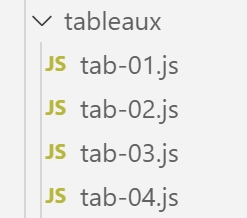

Les tableaux
============

|image0|

script [tab-01]
---------------

Le script suivant illustre certaines caractéristiques des tableaux
Javascript. Ceux-ci ressemblent aux tableaux PHP avec cependant une
grande différence : ils sont manipulés via des pointeurs et sont
considérés comme des objets.

.. code-block:: javascript 
   :linenos:

   'use strict';

   // un tableau est un objet manipulé via son adresse
   const tab1 = [1, 2, 3];
   // copie d'adresses
   const tab2 = tab1;
   // tab1 et tab2 pointent sur le même tableau
   console.log("tab1===tab2 :", tab1 === tab2);
   // on peut modifier le tableau en passant indifféremment par tab1 ou tab2
   tab2[1] = 10;
   console.log("tab1=", tab1);
   console.log("tab2=", tab2);

**Exécution**

.. code-block:: javascript 
   :linenos:

   [Running] C:\myprograms\laragon-lite\bin\nodejs\node-v10\node.exe "c:\Temp\19-09-01\javascript\tableaux\tab-01.js"
   tab1===tab2 : true
   tab1= [ 1, 10, 3 ]
   tab2= [ 1, 10, 3 ]

**Commentaires**

-  la ligne 2 des résultats montre que **[tab1]** et **[tab2]** sont
   deux entités égales, en fait deux pointeurs égaux ;

-  les lignes 4 et 5 des résultats montrent que ces deux pointeurs
   pointent sur le même tableau ;

script [tab-02]
---------------

Ce script montre que le tableau Javascript est différent des tableaux
des langages compilés.

.. code-block:: javascript 
   :linenos:

   'use strict';

   // tableau
   const tab = [];
   console.log("tab=", tab, ", longueur=[", tab.length, "]");
   console.log("-------------------------------");
   // initialisation d'un élément
   tab[3] = 100;
   tab[1] = "huit";
   // tableau
   console.log("tab=", tab, ", longueur=[", tab.length, "]");
   console.log("-------------------------------");
   // toString
   console.log("tab.toString=[", tab.toString(), "]");
   console.log("-------------------------------");
   // les clés du tableau sont ses indices
   for (let key of tab.keys()) {
     console.log("clé=[", key, "], valeur=[", tab[key], "]");
   }
   console.log("-------------------------------");
   // les valeurs du tableau
   for (let value of tab.values()) {
     console.log("valeur=[", value, "]");
   }

-  ligne 4 : un tableau vide ;

-  ligne 8 : un tableau n’a pas de taille fixe. C’est simplement une
   suite d’éléments indexée par un n°. On peut initialiser l’élément n°
   3 même si les éléments **[0, 1, 2]** ne sont pas encore définis ;

-  lignes 16-24 : un tableau Javascript a un comportement analogue à
   celui du tableau PHP ;

**Exécution**

.. code-block:: javascript 
   :linenos:

   [Running] C:\myprograms\laragon-lite\bin\nodejs\node-v10\node.exe "c:\Temp\19-09-01\javascript\tableaux\tab-02.js"
   tab= [] , longueur=[ 0 ]
   -------------------------------
   tab= [ <1 empty item>, 'huit', <1 empty item>, 100 ] , longueur=[ 4 ]
   -------------------------------
   tab.toString=[ ,huit,,100 ]
   -------------------------------
   clé=[ 0 ], valeur=[ undefined ]
   clé=[ 1 ], valeur=[ huit ]
   clé=[ 2 ], valeur=[ undefined ]
   clé=[ 3 ], valeur=[ 100 ]
   -------------------------------
   valeur=[ undefined ]
   valeur=[ huit ]
   valeur=[ undefined ]
   valeur=[ 100 ]

script [tab-03]
---------------

Ce script montre différentes méthodes de l’objet **[tableau]**.

.. code-block:: javascript 
   :linenos:

   'use strict';
   // un tableau peut contenir différents types de données
   const tab = [1, 2, "un", "deux", true, [10, 20], { prop1: 10, prop2: "abc" }];
   // console.log sait afficher le contenu d'un tableau
   show(1);
   console.log("tab=", tab);
   show(2);
   // parcours du tableau avec foreach
   tab.forEach(element => {
     console.log("élément=", element, typeof (element));
   });
   show("2b");
   // une autre écriture pour faire la même chose
   tab.forEach(function (element) {
     console.log("élément=", element, typeof (element));
   });
   show(3);
   // parcours du tableau avec for
   for (let i = 0; i < tab.length; i++) {
     console.log("i=", i, "tab[i]=", tab[i]);
   }
   show(4);
   // modification tab[i]
   tab[5] = [];
   // affichage
   console.log("tab=", tab);
   show(5);
   // on enlève le dernier élément
   let element = tab.pop(tab);
   console.log("élément=", element, "tab=", tab);
   show(6);
   // on ajoute un élément à la fin du tableau
   tab.push('xyz');
   console.log("tab=", tab);
   show(7);
   // on ajoute un élément au début du tableau
   tab.unshift(1000);
   console.log("tab=", tab);
   show(8);
   // on enlève le 1er élément du tableau
   element = tab.shift();
   console.log("élément=", element, "tab=", tab);
   show(9);
   // on enlève l'élément n° 2 du tableau
   element = tab.splice(2, 1);
   console.log("élément=", element, "tab=", tab);
   show(10);
   // on enlève du tableau deux éléments à partir de l'élément n° 1
   element = tab.splice(1, 2);
   console.log("élément=", element, "tab=", tab);

   // fonction
   function show(param) {
     console.log("[", param, ":::::::::::::::::::::::::::::::::::::::::::::::::::::::::::::::::: ]");
   }

**Commentaires**

-  la différence entre tableaux PHP et tableaux Javascript est illustrée
   par les lignes 3 et 24 :

   -  la ligne 3 déclare la variable **[tab]** comme une constante ;

   -  la ligne 24 modifie l’élément tab\ **[5]** ;

..

   Ligne 3, c’est le pointeur qui pointe sur le tableau qui est déclaré
   constant, ce n’est pas le tableau lui-même. Celui-ci peut être
   modifié.

-  lignes 14-16 : le tableau **[tab]** est parcouru à l’aide d’une
   méthode **[forEach]** du tableau **[tab]**. Cette méthode reçoit en
   paramètre la définition d’une fonction, qu’on pourrait appeler une
   fonction littérale. Cette fonction paramètre reçoit un paramètre :
   l’élément courant du tableau **[tab]**. La fonction est appelée pour
   chaque élément du tableau. Ce type d’écriture est courant en
   Javascript ;

-  lignes 9-10 : on utilise une autre syntaxe pour définir la fonction
   paramètre. Au lieu d’écrire :

   -  **function(p1, p2, …, pn){….}**

..

   on écrit :

-  **(p1,p2, ..,pn)=>{.…}**. On appelle cela, la notation « flèche » ou
   « arrow » ;

-  le reste du code est expliqué par les commentaires ;

De ce script, on notera que :

-  un tableau est un objet référencé par un pointeur ;

-  que cet objet a des méthodes **[forEach, pop, push, shift,
   unshift]** ;

script [tab-04]
---------------

Ce script présente d’autres méthodes des objets tableau.

.. code-block:: javascript 
   :linenos:

   'use strict';

   // méthode de manipulation de tableaux

   // un tableau
   const tab = [];
   for (let i = 0; i < 10; i++) {
     tab[i] = i * 10;
   }
   // affichage
   console.log("tab=", tab);
   // map
   const tab2 = tab.map(element => {
     return { prop1: element, prop2: element * element }
   });
   // affichage
   console.log("tab=", tab);
   console.log("tab2=", tab2);
   // reduce sans valeur initiale
   const somme = tab.reduce((accumulator, currentValue) => accumulator + currentValue);
   console.log("somme tab=", somme);
   // reduce avec valeur initiale
   const somme2 = tab.reduce((accumulator, currentValue) => accumulator + currentValue, 10);
   console.log("somme2 tab=", somme2);
   // filter
   const tab4 = tab.filter((element) => {
     if (element > 50) {
       return element;
     }
   });
   console.log("tab4=", tab4);
   // find
   const element1 = tab.find((element) => (element > 20));
   console.log("élément1=", element1);
   // findIndex
   const index1 = tab.findIndex((element) => (element === 20));
   console.log("index1 20=", index1);
   // indexOf
   const index2 = tab.indexOf(30);
   console.log("index2 30=", index2);
   const index3 = tab.indexOf(31);
   console.log("index3 31=", index3);
   // lastIndexOf
   const index4 = [4, 5, 4, 2].lastIndexOf(4);
   console.log("index4 4=", index4);
   // sort
   const tab5 = [4, 5, 4, 2].sort();
   console.log("tab5=", tab5);
   // sort inverse
   const tab6 = [4, 5, 4, 2].sort((e1, e2) => {
     if (e1 > e2) {
       return -1;
     }
     else if (e1 === e2) {
       return 0;
     } else {
       return +1;
     }
   });
   console.log("tab6=", tab6);

**Commentaires**

-  lignes 13-15 : la méthode **[map]** admet une fonction de
   transformation comme paramètre. Celle-ci est appelée de façon répétée
   pour chaque élément du tableau. Elle est chargée de transformer
   celui-ci en autre chose, ici un objet avec les propriétés **[prop1,
   prop2]**. La méthode **[map]** rend un nouveau tableau. L’ancien
   n’est pas modifié :

.. code-block:: javascript 
   :linenos:

   tab= [ 0, 10, 20, 30, 40, 50, 60, 70, 80, 90 ]
   tab2= [ { prop1: 0, prop2: 0 },
   { prop1: 10, prop2: 100 },
   { prop1: 20, prop2: 400 },
   { prop1: 30, prop2: 900 },
   { prop1: 40, prop2: 1600 },
   { prop1: 50, prop2: 2500 },
   { prop1: 60, prop2: 3600 },
   { prop1: 70, prop2: 4900 },
   { prop1: 80, prop2: 6400 },
   { prop1: 90, prop2: 8100 } ]

-  ligne 20 : la méthode **[reduce]** admet pour paramètre une fonction
   à deux paramètres appelée de façon répétée pour chaque élément du
   tableau. Cette fonction admet deux paramètres :

   -  **[currentValue]** est l’élément courant du tableau ;

   -  **[accumulator]** est le dernier résultat obtenu par la fonction.
      Si aucune valeur initiale n’est prévue pour cet accumulateur,
      alors celle-ci sera 0 ;

   -  la 1ère fois que la fonction d’accumulation est appelée, elle rend
      **[0+tab[0]**]. C’est cette valeur qui est affectée à
      l’accumulateur ;

   -  la seconde fois, elle rend accumulateur+tab\ **[1]**, donc
      tab\ **[0]**\ +tab\ **[1]** ;

   -  la troisème fois, elle rend accumulateur+tab\ **[2]**, donc
      tab\ **[0]**\ +tab\ **[1]**\ +tab\ **[2]** ;

   -  etc. Au final, l’accumulateur représentera la somme de tous les
      éléments du tableau **[tab]** ;

-  ligne 26 : la méthode **[filter]** a pour paramètre une fonction de
   filtrage. Celle-ci est appelée de façon répétée pour chaque élément
   du tableau et reçoit celui-ci en paramètre. Elle doit rendre :

   -  **[true]** si l’élément doit être gardé ;

   -  **[false]** sinon ;

-  ligne 33 : la méthode **[find]** a pour paramètre une fonction de
   recherche. Celle-ci est appelée de façon répétée pour chaque élément
   du tableau et reçoit celui-ci en paramètre. Elle doit rendre
   **[true]** si l’élément reçu satisfait le critère de recherche.
   Celle-ci s’arrête alors. La méthode **[find]** rend donc 0 ou 1
   élément ;

-  ligne 36 : la méthode **[findIndex]** fonctionne comme la méthode
   **[find]** mais au lieu de rendre l’élément trouvé, elle rend son
   index dans le tableau ;

-  lignes 39, 41, la méthode **[indexOf(valeur)]** recherche
   **[valeur]** dans le tableau et rend son index, ou -1 s’il n’est pas
   trouvé ;

-  ligne 44 : la méthode **[lastIndexOf(valeur)]** fonctionne comme la
   méthode **[indexOf(valeur)]** mais commence sa recherche par la fin
   du tableau ;

-  ligne 47 : la méthode **[sort]** sans paramètres rend un tableau trié
   dans l’ordre naturel (nombres, chaînes) ;

-  ligne 50 : lorsque l’ordre naturel ne convient pas, il faut passer à
   la méthode **[sort]** une fonction à deux paramètres (e1,e2) qui
   rend :

   -  +1 si e1 doit être classé après e2 ;

   -  -1 si e1 doit être classé avant e2 ;

   -  0 si les deux éléments doivent avoir le même classement ;

..

   La fonction passée en paramètre à la méthode **[sort]** est appelée
   de façon répétée par celle-ci pour comparer deux éléments du
   tableau ;

