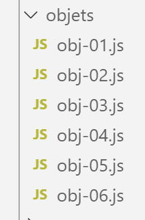
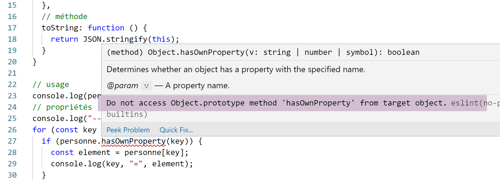

Les objets littéraux
====================

Nous appelons ici ‘objets littéraux’ des objets définis littéralement
dans le code. Javascript a la notion de classe, et d’objet instance de
classe. Ce n’est donc pas ce type d’objet dont nous parlons maintenant.

|image0|

script [obj-01]
---------------

Nous présentons ici les premières propriétés des objets littéraux. La
principale est que l’objet est manipulé via un pointeur.

.. code-block:: javascript 
   :linenos:

   'use strict';
   // un objet vide
   const obj1={};
   // on peut créer dynamiquement les propriétés de l'objet
   obj1.prop1="abcd";
   console.log('obj1=',obj1);
   // autre propriété
   obj1.prop2=[1,2,3];
   console.log("obj1=",obj1);
   // autre propriété avec une notation différente
   obj1['prop3']=true;
   console.log("obj1=",obj1);
   // obj1 est une référence sur l'objet (pointeur), pas l'objet lui-même
   const obj2=obj1;
   // obj2 et obj1 pointent sur le même objet
   obj2.prop1="xyzt";
   console.log("obj1=",obj1);
   console.log("obj2=",obj2);
   // les propriété peuvent être des variables
   const var1='prop1';
   console.log('prop1=',obj1[var1]);

**Exécution**

.. code-block:: javascript 
   :linenos:

   [Running] C:\myprograms\laragon-lite\bin\nodejs\node-v10\node.exe "c:\Temp\19-09-01\javascript\objets\obj-01.js"
   obj1=[object Object]
   obj1= { prop1: 'abcd', prop2: [ 1, 2, 3 ] }
   obj1= { prop1: 'abcd', prop2: [ 1, 2, 3 ], prop3: true }
   obj1= { prop1: 'xyzt', prop2: [ 1, 2, 3 ], prop3: true }
   obj2= { prop1: 'xyzt', prop2: [ 1, 2, 3 ], prop3: true }
   prop1= xyzt

**Commentaires**

-  ligne 3 du code : un objet est manipulé via un pointeur. Donc
   **[obj1]** est un pointeur. Modifier l’objet pointé ne modifie pas le
   pointeur **[obj1]**. C’est pourquoi, comme pour les tableaux, une
   référence d’objet est déclarée avec le mot clé **[const]** ;

-  ligne 6 du code : comme pour les tableaux, **[console.log]** sait
   afficher des objets ;

-  ligne 11 du code : obj1.prop3 peut être réécrit obj1.\ **[‘prop3’]**.
   Cette dernière notation est utile lorsque ‘prop3’ est en fait une
   variable (lignes 20-21) ;

-  lignes 13-18 du code : montrent que l’instruction **[obj2=obj1]** est
   une copie de référence d’objet et non de l’objet lui-même ;

script [obj-02]
---------------

Ce script montre que les propriétés d’un objet peuvent avoir pour valeur
un objet. On a alors des objets multi-niveaux. On introduit également
l’objet global **[JSON]** qui permet de faire des conversions objet ↔
chaîne de caractères.

.. code-block:: javascript 
   :linenos:

   'use strict';
   // un objet à plusieurs niveaux
   const personne = {
     prénom: "martin",
     âge: 12,
     père: {
       prénom: "paul",
       âge: 45
     },
     mère: {
       prénom: "micheline",
       âge: 42
     }
   }
   // accès aux propriétés
   console.log("prénom personne=", personne.prénom);
   console.log("prénom mère=", personne.mère.prénom);
   personne.mère.âge = 40;
   console.log("âge mère=", personne.mère.âge);
   // console.log sait afficher des objets
   console.log("personne=", personne);
   console.log("mère=", personne.mère);
   // on peut aussi afficher la chaîne jSON de l'objet
   let json = JSON.stringify(personne);
   console.log("jSON=", json);
   // on peut relire le jSON
   let personne2 = JSON.parse(json);
   console.log("père=", personne2.père);

**Commentaires**

-  ligne 24 : transformation d’un objet Javascript en chaîne jSON ;

-  ligne 27 : transformation d’une chaîne jSON en objet Javascript ;

**Exécution**

.. code-block:: javascript 
   :linenos:

   [Running] C:\myprograms\laragon-lite\bin\nodejs\node-v10\node.exe "c:\Temp\19-09-01\javascript\objets\obj-02.js"
   prénom personne= martin
   prénom mère= micheline
   âge mère= 40
   personne= { 'prénom': 'martin',
   'âge': 12,
   'père': { 'prénom': 'paul', 'âge': 45 },
   'mère': { 'prénom': 'micheline', 'âge': 40 } }
   mère= { 'prénom': 'micheline', 'âge': 40 }
   jSON= {"prénom":"martin","âge":12,"père":{"prénom":"paul","âge":45},"mère":{"prénom":"micheline","âge":40}}
   père= { 'prénom': 'paul', 'âge': 45 }

**Commentaires**

-  ligne 10 : dans une chaîne jSON, les propriétés sont obligatoirement
   entourées de guillemets ainsi que les valeurs de type chaîne de
   caractères ;

script [obj-03]
---------------

Ce script introduit la notion de getter / setter d’une propriété d’un
objet :

.. code-block:: javascript 
   :linenos:

   'use strict';
   // getters et setters d'un objet
   const personne = {
     // getter
     get nom() {
       console.log("getter nom");
       return this._nom;
     },
     // setter
     set nom(unNom) {
       console.log("setter nom");
       this._nom = unNom;
     }
   };
   // setter
   personne.nom = "Hercule";
   // getter
   console.log(personne.nom);
   // l'objet lui-même
   console.log("personne=", personne);
   // ça n'empêche pas d'accéder à la propriété [_nom] directement
   personne._nom = "xyz";
   console.log("personne=", personne);

**Commentaires**

-  lignes 5-7 : définition d’un **[getter]**, une fonction qui rend
   généralement la valeur d’une propriété de l’objet mais qui en fait
   peut rendre n’importe quoi. Le mot clé **[function]** est remplacé
   par le mot clé **[get]** ;

-  ligne 7 : le getter rend la propriété **[_nom]**. On voit que
   celle-ci n’a pas besoin d’être déclarée ;

-  lignes 10-13 : définition d’un **[setter]**, une fonction qui affecte
   généralement la valeur reçue à une propriété de l’objet mais qui en
   fait peut faire n’importe quoi. Le mot clé **[function]** est
   remplacé par le mot clé **[set]**. Le **[setter]** peut être utilisé
   pour vérifier la validité de la valeur passée en paramètre au
   **[setter]** ;

-  ligne 16 : la fonction **[set nom]** va être appelée implicitement ;

-  ligne 18 : la fonction **[get nom]** va être appelée implicitement ;

-  ligne 22 : montre que l’utilisation des getter / setter dépend de la
   bonne volonté du développeur. Si celui-ci connaît le nom de la
   propriété gérée par ceux-ci, il peut y accéder directement ;

**Exécution**

.. code-block:: javascript 
   :linenos:

   [Running] C:\myprograms\laragon-lite\bin\nodejs\node-v10\node.exe "c:\Temp\19-09-01\javascript\objets\obj-03.js"
   setter nom
   getter nom
   Hercule
   personne= { nom: [Getter/Setter], _nom: 'Hercule' }
   personne= { nom: [Getter/Setter], _nom: 'xyz' }

On notera lignes 5-6, que **[console.log]** affiche également les
propriétés qui sont des fonctions.

script [obj-04]
---------------

Ce script montre trois façons d’écrire les noms des propriétés d’un
objet et deux façons d’y accéder.

.. code-block:: javascript 
   :linenos:

   'use strict';
   // les noms des propriétés d'un objet  peuvent être littéraux [nom], être entourés d'apostrophes ['nom']
   // ou de guillements ["nom"]

   // littéraux
   const obj1 = {
     nom: "martin",
     prénom: "jean"
   };
   console.log("prénom=", obj1.prénom);

   // entourés d'apostrophes
   const obj2 = {
     'nom': "martin",
     'prénom': "jean"
   };
   console.log("nom=", obj2.nom);

   // entourés de guillemets
   const obj3 = {
     "nom": "martin",
     "prénom": "jean"
   };

   // deux syntaxes possibles pour accéder à la propriété [nom]
   console.log("nom=", obj3.nom);
   console.log("nom=", obj3['nom']);

**Exécution**

.. code-block:: javascript 
   :linenos:

   [Running] C:\myprograms\laragon-lite\bin\nodejs\node-v10\node.exe "c:\Temp\19-09-01\javascript\objets\obj-04.js"
   prénom= jean
   nom= martin
   nom= martin
   nom= martin

script [obj-05]
---------------

Le script montre que les propriétés d’un objet littéral peuvent être des
fonctions. On est alors très proche de l’objet instance de classe, où on
a des propriétés et des méthodes.

.. code-block:: javascript 
   :linenos:

   'use strict';

   // un objet peut avoir des propriétés de type [function]
   const personne = {
     // propriétés
     prénom: "martin",
     âge: 12,
     père: {
       prénom: "paul",
       âge: 45
     },
     mère: {
       prénom: "micheline",
       âge: 42
     },
     // méthode
     toString: function () {
       return JSON.stringify(this);
     }
   }

   // usage
   console.log("personne=", personne);
   console.log("personne.toString=", personne.toString());

-  lignes 17-19 : une méthode interne à l’objet. Dans celle-ci, on
   accède aux propriétés de l’objet via le mot clé **[this]** (ligne
   18). **[this]** désigne l’objet lui-même, **[this.prénom]**, la
   propriété **[prénom]** de celui-ci ;

**Exécution**

.. code-block:: javascript 
   :linenos:

   [Running] C:\myprograms\laragon-lite\bin\nodejs\node-v10\node.exe "c:\Temp\19-09-01\javascript\objets\obj-05.js"
   personne= { 'prénom': 'martin',
   'âge': 12,
   'père': { 'prénom': 'paul', 'âge': 45 },
   'mère': { 'prénom': 'micheline', 'âge': 42 },
   toString: [Function: toString] }
   personne.toString= {"prénom":"martin","âge":12,"père":{"prénom":"paul","âge":45},"mère":{"prénom":"micheline","âge":42}}

script [obj-06]
---------------

Ce script montre comment avoir accès aux propriétés d’un objet lorsqu’on
ne connaît pas a priori le nom de celles-ci.

.. code-block:: javascript 
   :linenos:

   'use strict';

   // un objet peut avoir des propriétés de type [function]
   let personne = {
     // propriétés
     prénom: "martin",
     âge: 12,
     père: {
       prénom: "paul",
       âge: 45
     },
     mère: {
       prénom: "micheline",
       âge: 42
     },
     // méthode
     toString: function () {
       return JSON.stringify(this);
     }
   }

   // usage
   console.log(personne);
   // propriétés
   console.log("-----------------------");
   for (const key in personne) {
     if (personne.hasOwnProperty(key)) {
       const element = personne[key];
       console.log(key, "=", element);
     }
   }
   // pour échapper à l'avertissement eslint (1)
   console.log("-----------------------");
   for (const key in personne) {
     if (Object.prototype.hasOwnProperty.call(personne, key)) {
       const element = personne[key];
       console.log(key, "=", element);
     }
   }
   // pour échapper à l'avertissement eslint (2)
   console.log("-----------------------");
   for (const key in personne) {
     // eslint-disable-next-line no-prototype-builtins
     if (personne.hasOwnProperty(key)) {
       const element = personne[key];
       console.log(key, "=", element);
     }
   }

**Commentaires**

-  lignes 26-31 : le code qui permet d’avoir la liste des propriétés,
   sans les méthodes, d’un objet. Ce code fait l’objet d’un
   avertissement d’ESLint :

|image1|

-  lignes 32-39 : le code qui permet d’échapper à l’avertissement
   d’ESLint. On passe par le prototype de la classe **[Object]** ;

-  lignes 41-47 : ou bien on se contente de désactiver l’avertissement
   (ligne 43) ;

script [obj-07]
---------------

Le script [obj-07] montre la possibilité de déstructurer un objet :

.. code-block:: javascript 
   :linenos:

   'use strict';
   // déstructuration

   // littéraux
   const obj1 = {
     nom: "martin",
     prénom: "jean"
   };

   // déstructuration obj1 dans variables [n,p]
   const { nom: n, prénom: p } = obj1;
   console.log("n=", n, "p=", p);

   // déstructuration obj1 dans variables [n2,p2]
   function f({ nom: n2, prénom: p2 }) {
     console.log("f-n2=", n2, "f-p2=", p2);
   }
   f(obj1);

   // déstructuration obj1 dans variables [nom,prénom]
   function g({ nom: nom, prénom: prénom }) {
     console.log("g-nom=", nom, "g-prénom=", prénom);
   }
   g(obj1);

   // déstructuration obj1 dans variables [nom,prénom]
   // avec notation raccourcie équivalente à h({nom:nom,prénom:prénom})
   function h({ nom, prénom }) {
     console.log("h-nom=", nom, "h-prénom=", prénom);
   }
   h(obj1);

**Commentaires**

-  ligne 11 : ce sont les accolades {} qui permettent la
   déstructuration. La syntaxe

.. code-block:: javascript 
   :linenos:

   const { nom: n, prénom: p } = obj1

..

   crée deux variables [n] et [p] et est équivalente à :

.. code-block:: javascript 
   :linenos:

   const n = obj1.nom
   const p = obj1.prénom

..

   La déclaration pourrait se lire de la façon suivante :

.. code-block:: javascript 
   :linenos:

   const { nom => n, prénom => p } = obj1

..

   pour rappeler que les valeurs des attributs [nom, prénom] vont dans
   les variables [n, p] ;

-  l’opération de déstructuration se répète aux lignes 15, 21 et 28. A
   chaque fois, c’est la présence des accolades {} qui indique qu’il va
   y avoir déstructuration d’un objet dans des variables ;

-  la ligne 28 peut être déconcertante. C’est un raccourci pour la
   notation :

.. code-block:: javascript 
   :linenos:

   function h({ nom : nom, prénom : prénom })

Les résultats de l’exécution sont les suivants :

.. code-block:: javascript 
   :linenos:

   n= martin p= jean
   f-n2= martin f-p2= jean
   g-nom= martin g-prénom= jean
   h-nom= martin h-prénom= jean

script [obj-08]
---------------

Le script [obj-08] montre comment obtenir une copie d’un objet :

.. code-block:: javascript 
   :linenos:

   'use strict'

   // clônage d'objets
   const obj1 = {
     nom: "martin",
     prénom: "jean"
   };

   // clône (copie) de obj1 avec l'opérateur de spread
   const obj2 = { ...obj1 }

   // vérifications
   // obj2 pointe sur une copie de obj1
   console.log("obj2===obj1 :", obj1 === obj2)
   console.log("obj2=", obj2)

-  ligne 10 : l’opération de copie de l’objet [obj1]. L’opérateur ...
   est appelé opérateur de spread ;

Les résultats de l’exécution sont les suivants :

.. code-block:: javascript 
   :linenos:

   obj2===obj1 : false
   obj2= { nom: 'martin', 'prénom': 'jean' }

-  ligne 1 : montre que les références [obj1] et [obj2] ne pointent pas
   sur le même objet ;

-  ligne 2 : montre que l’objet pointé par [obj2] est une copie de
   l’objet pointé par [obj1] ;

Conclusion
----------

Les scripts de cette section ont montré que l’objet littéral de
Javascript est proche de l’objet instance de classe des langages à
objets. On peut y définir propriétés, méthodes et getters / setters.
C’est un objet dynamique dont on peut définir les propriétés à
l’exécution. Il se comporte alors comme un dictionnaire dont les
éléments peuvent être de tout type et notamment de type **[fonction]**.

