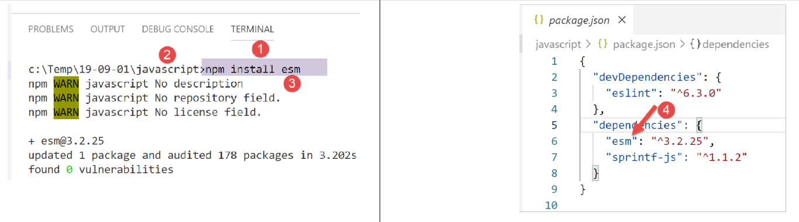

Les chaînes de caractères
=========================

Les chaînes de caractères de Javascript sont très semblables à celles de
PHP.

|image0|

script [str-01]
---------------

La première chose à comprendre est qu’une fois une chaîne créée, elle
n’est plus modifiable. On dispose de nombreuses méthodes pour produire
une nouvelle chaîne à partir de la chaîne initiale mais celle-ci reste
toujours inchangée. Par ailleurs, une chaîne de caractères peut être de
deux types :

-  **[string]** lorsqu’elle est initialisée avec une chaîne littérale ;

-  **[object]** lorsqu’elle est créée comme instance de la classe
   **[String]** ;

.. code-block:: javascript 
   :linenos:

   'use strict';

   // les chaînes de caractères sont en lecture seule (on ne peut pas les modifier)

   // une chaîne
   const chaîne1 = "abcd ";
   // type
   console.log("typeof(chaîne1)=", typeof (chaîne1));
   // caractère n° 2
   console.log("chaîne1[2]=", chaîne1[2]);
   // provoque une erreur
   chaîne1[2] = "0";

**Exécution**

.. code-block:: javascript 
   :linenos:

   [Running] C:\myprograms\laragon-lite\bin\nodejs\node-v10\node.exe -r esm "c:\Temp\19-09-01\javascript\strings\str-01.js"
   typeof(chaîne1)= string
   chaîne1[2]= c
   c:\Temp\19-09-01\javascript\strings\str-01.js:1
   TypeError: Cannot assign to read only property '2' of string 'abcd '
   at Object.<anonymous> (c:\Temp\19-09-01\javascript\strings\str-01.js:12:12)
   at Generator.next (<anonymous>)

script [str-02]
---------------

Ce script montre qu’on peut construire une chaîne de caractères de deux
façons.

.. code-block:: javascript 
   :linenos:

   'use strict';

   // les chaînes de caractères peuvent être de deux types

   // une chaîne littérale
   const chaîne1 = "abcd ";
   // type
   console.log("typeof(chaîne1)=", typeof (chaîne1));
   // instance de String
   const chaîne2 = new String("xyzt");
   // type
   console.log("typeof(chaîne2)=", typeof (chaîne2));
   // autre écriture (sans new) – type [string] et non [object]
   const chaîne3 = String("12 34");
   // type
   console.log("typeof(chaîne3)=", typeof (chaîne3));
   // le type [string] et le type [object] offrent les mêmes méthodes, celles de la classe String
   console.log("chaîne1.length=", chaîne1.length);
   console.log("chaîne2.length=", chaîne2.length);

**Commentaires**

-  ligne 6 : la méthode usuelle de définition d’une chaîne.
   **[chaîne1]** sera de type **[string]** ;

-  ligne 10 : on peut construire une chaîne à l’aide du constructeur de
   la classe **[String]**. **[chaîne2]** sera de type **[object]** ;

**Exécution**

.. code-block:: javascript 
   :linenos:

   [Running] C:\myprograms\laragon-lite\bin\nodejs\node-v10\node.exe "c:\Temp\19-09-01\javascript\strings\str-02.js"
   typeof(chaîne1)= string
   typeof(chaîne2)= object
   typeof(chaîne3)= string
   chaîne1.length= 5
   chaîne2.length= 4

Le type **[string]** bénéficie des méthodes de la classe **[String]**.

script [str-03]
---------------

Ce script montre une chaîne particulière avec interpolation de
variables.

.. code-block:: javascript 
   :linenos:

   'use strict';

   // chaine
   const chaîne = "Introduction à Javascript par l'exemple";
   // chaîne avec interpolation de variables
   const str = `[${chaîne}].substr(3, 2)=` + chaîne.substr(3, 2)
   console.log(str);

**Commentaires**

-  ligne 6 : il est possible d’avoir des chaînes de caractères contenant
   des expression ${variable} qui sont remplacées par la valeur de la
   variable. On est là dans la même logique que les variables $ dans les
   chaînes de caractères PHP. On notera la notation d’une telle chaîne :
   elle est entourée de « backstick » ou apostrophe inverse (AltGr-7 sur
   un clavier français) ;

**Exécution**

.. code-block:: javascript 
   :linenos:

   [Running] C:\myprograms\laragon-lite\bin\nodejs\node-v10\node.exe -r esm "c:\Temp\19-09-01\javascript\strings\tempCodeRunnerFile.js"
   [Introduction à Javascript par l'exemple].substr(3, 2)=ro

script [str-04]
---------------

La chaîne avec interpolation de variables reste insuffisante. Il n’est
en effet pas possible de mettre une expression à la place de la variable
dans l’expression ${variable}. Pour ceux qui ont programmé en C, il n’y
a rien de tel que les fonctions **[printf, sprintf]** pour écrire ou
construire des chaînes formatées. Des centaines de développeurs ont
développé des milliers de packages Javascript formant un écosystème
immense. Lorsqu’on a un besoin non satisfait nativement par Javascript,
il est temps de chercher un package qui le satisfasse. Pour cela nous
utilisons le gestionnaire de packages **[npm]**. Celui-ci dispose d’une
option **[search]** qui permet de chercher une chaîne de caractères dans
la description des packages. **[npm]** renvoie la liste des packages
satisfaisant à la recherche. Nous allons donc chercher la chaîne
**[sprintf]** dans la description des packages :

|image1|

-  dans la colonne **[4]**, les mots clés des packages de la colonne
   **[3]** ;

-  dans la colonne **[5]**, la description des packages de la colonne
   **[3]** ;

L’étape suivante est d’aller sur le site de l’outil **[npm]**,
**[https://www.npmjs.com/]** et de lire la description des packages :

|image2|

En **[3]**, on examine la liste des packages et on en choisit un.

|image3|

Dans la description du package, on trouve les informations pour
l’installer et l’utiliser :

|image4|

Nous installons le package **[sprintf-js]** dans un terminal de
**[VSCode]** :

|image5|

Cette installation va modifier le fichier **[package.json]** situé à la
racine du dossier **[javascript]** **[2]** :

|image6|

On voit ci-dessus que le package a été installé dans les
**[dependencies]**, ç-à-d dans les packages nécessaires à l’exécution du
projet. On rappelle qu’on met dans **[devDependencies]** les packages
nécessaires uniquement pendant le développement du projet. Ils ne sont
pas utilisés pendant l’exécution. Cette différence est importante
lorsqu’il faut créer la version finale du projet pour sa mise en
production. Il existe des outils pour :

-  rassembler tous les fichiers jS nécessaires à l’exécution dans un
   seul fichier. Les packages des **[devDependencies]** ne sont donc pas
   inclus dans ce fichier final ;

-  minifier celui-ci, ç-à-d rendre sa taille la plus petite possible.
   Pour cela par exemple, tous les commentaires sont éliminés ;

-  « obscurcir » le code pour le rendre difficilement compréhensible.
   Par exemple, les variables taux, salaire, impôt vont être remplacées
   par des variables a, b, c ;

-  faire d’autres optimisations ;

Cette optimisation du fichier final d’un projet jS est utilisée en
programmation web. Une application web peut dépendre de très nombreux
fichiers Javascript. Le chargement de ceux-ci par un navigateur peut
ralentir l’affichage de la première page de l’application.
L’optimisation précédente vise à améliorer ce temps de chargement. Si le
temps de chargement est jugé trop long par les utilisateurs,
l’application ne sera pas utilisée.

Maintenant que nous disposons du package **[sprintf-js]**, il nous faut
l’utiliser. C’est le script **[str-04]** :

.. code-block:: javascript 
   :linenos:

   'use strict';
   // utilisation d'un package externe pour disposer de la fonction sprintf
   import { sprintf } from 'sprintf-js';
   // chaine
   const chaîne = "Introduction à Javascript par l'exemple";
   // méthode
   console.log(sprintf("[%s].substr(3,2)=[%s]", chaîne, chaîne.substr(3, 2)));

Avec ECMAScript 6, on utilise le mot clé **[import]** pour **importer**
un objet exporté par un package. Pour savoir ce qu’exporte le package,
on peut aller voir son code :

|image7|

-  en **[1]**, clic droit sur le package importé ;

-  en **[2]**, on veut en voir la définition ;

-  en **[3-4]**, on voit que le package exporte une fonction appelée
   **[sprintf]** ;

La fonction **[sprintf]** du package **[sprintf-js]** est importée avec
l’instruction :

.. code-block:: javascript 
   :linenos:

   import { sprintf } from 'sprintf-js';

Le code complet :

.. code-block:: javascript 
   :linenos:

   'use strict';
   // utilisation d'un package externe pour disposer de la fonction sprintf
   import { sprintf } from 'sprintf-js';
   // chaine
   const chaîne = "Introduction à Javascript par l'exemple";
   // méthode
   console.log(sprintf("[%s].substr(3,2)=[%s]", chaîne, chaîne.substr(3, 2)));

produit les résultats suivants :

.. code-block:: javascript 
   :linenos:

   [Running] C:\myprograms\laragon-lite\bin\nodejs\node-v10\node.exe "c:\Temp\19-09-01\javascript\strings\str-04.js"
   c:\Temp\19-09-01\javascript\strings\str-04.js:3
   import { sprintf } from 'sprintf-js';
   ^

   SyntaxError: Unexpected token {
   at new Script (vm.js:79:7)
   at createScript (vm.js:251:10)
   at Object.runInThisContext (vm.js:303:10)
   at Module._compile (internal/modules/cjs/loader.js:657:28)

Ligne 3, l’instruction **[import]** n’est pas comprise. Cela vient du
fait que la version 10.15.1 de **[node.js]** utilisée dans ce cours
(sept 2019) n’observe pas encore la norme ECMAScript pour l’importation
de packages appelés modules. En 2019, **[node.js]** observe une norme de
modules appelée CommonJS. L’intégration des modules ECMAScript par
**[node.js]** est prévue en 2020. Là encore des développeurs se sont mis
à la tâche et ont produit des packages permettant l’utilisation de
modules ES6 avec **[node.js]** dès maintenant (2019).

Nous allons utiliser un package appelé **[esm]**
(**E**\ CMA\ **S**\ cript **M**\ odules). Nous l’installons dans un
terminal du projet **[javascript]** :

|image8|

En **[4]**, on constate que l’installation du package **[esm]**
**[1-3]** a modifié le fichier **[javascript/package.json]**.

Nous n’avons pas fini. Pour que le module **[esm]** soit utilisé par
**[node.js]**, il faut lancer celui-ci avec l’argument **[-r esm]**.

Nous modifions dons la configuration de l’extension **[Code Runner]** de
**[VSCode]** :

|image9|

|image10|

En **[11]**, on ajoute l’argument **[-r esm]** et on sauvegarde (Ctrl-S)
la configuration.

Maintenant, nous pouvons exécuter le script **[str-04]** :

.. code-block:: javascript 
   :linenos:

   'use strict';
   // utilisation d'un package externe pour disposer de la fonction sprintf
   import { sprintf } from 'sprintf-js';
   // chaine
   const chaîne = "Introduction à Javascript par l'exemple";
   // méthode substr
   console.log(sprintf("[%s].substr(3,2)=[%s]", chaîne, chaîne.substr(3, 2)));

|image11|

script [str-05]
---------------

Voici ce que dit la documentation sur la fonction **[sprintf]** :

*The placeholders in the format string are marked by % and are followed
by one or more of these elements, in this order:*

-  *An optional number followed by a $ sign that selects which argument
   index to use for the value. If not specified, arguments will be
   placed in the same order as the placeholders in the input string.*

-  *An optional + sign that forces to preceed the result with a plus or
   minus sign on numeric values. By default, only the - sign is used on
   negative numbers.*

-  *An optional padding specifier that says what character to use for
   padding (if specified). Possible values are 0 or any other character
   precedeed by a ' (single quote). The default is to pad with spaces.*

-  *An optional - sign, that causes sprintf to left-align the result of
   this placeholder. The default is to right-align the result.*

-  *An optional number, that says how many characters the result should
   have. If the value to be returned is shorter than this number, the
   result will be padded. When used with the j (JSON) type specifier,
   the padding length specifies the tab size used for indentation.*

-  *An optional precision modifier, consisting of a . (dot) followed by
   a number, that says how many digits should be displayed for floating
   point numbers. When used with the g type specifier, it specifies the
   number of significant digits. When used on a string, it causes the
   result to be truncated.*

-  *A type specifier that can be any of:*

-  *% — yields a literal % character*

-  *b — yields an integer as a binary number*

-  *c — yields an integer as the character with that ASCII value*

-  *d or i — yields an integer as a signed decimal number*

-  *e — yields a float using scientific notation*

-  *u — yields an integer as an unsigned decimal number*

-  *f — yields a float as is; see notes on precision above*

-  *g — yields a float as is; see notes on precision above*

-  *o — yields an integer as an octal number*

-  *s — yields a string as is*

-  *t — yields true or false*

-  *T — yields the type of the
   argument\ *\ `1 <https://www.npmjs.com/package/sprintf-js#fn-1>`__

-  *v — yields the primitive value of the specified argument*

-  *x — yields an integer as a hexadecimal number (lower-case)*

-  *X — yields an integer as a hexadecimal number (upper-case)*

-  *j — yields a JavaScript object or array as a JSON encoded string*

Le script **[script-05]** met en œuvre quelques-uns de ces formats :

.. code-block:: javascript 
   :linenos:

   'use strict';
   // utilisation d'un package externe pour disposer de la fonction sprintf
   import { sprintf } from 'sprintf-js';
   // chaine
   const chaîne = "Javascript";
   // chaînes de caractères
   console.log(sprintf("[%s, %%s]=>[%s]", chaîne, chaîne));
   console.log(sprintf("[%s, %%20s]=>[%20s]", chaîne, chaîne));
   console.log(sprintf("[%s, %%-20s]=>[%-20s]", chaîne, chaîne));
   // entiers
   console.log(sprintf("[%d, %%d]=>[%d]", 10, 10));
   console.log(sprintf("[%d, %%4d]=>[%4d]", 10, 10));
   console.log(sprintf("[%d, %%-4d]=>[%-4d]", 10, 10));
   console.log(sprintf("[%d, %%04d]=>[%04d]", 10, 10));
   // réels
   console.log(sprintf("[%f, %%f]=>[%f]", -10.5, -10.5));
   console.log(sprintf("[%f, %%10.2f]=>[%10.2f]", -10.5, -10.5));
   console.log(sprintf("[%f, %%-10.2f]=>[%-10.2f]", -10.5, -10.5));
   console.log(sprintf("[%f, %%010.3f]=>[%010.3f]", -10.5, -10.5));
   // json
   console.log(sprintf("personne (%%j)=%j", { nom: "mathieu", âge: 34 }));
   // type
   console.log(sprintf("type personne (%%T)=%T", { nom: "mathieu", âge: 34 }));
   // booléen
   console.log(sprintf("booléen (%%t)=%t", 4 === 4));

**Exécution**

.. code-block:: javascript 
   :linenos:

   [Running] C:\myprograms\laragon-lite\bin\nodejs\node-v10\node.exe -r esm "c:\Data\st-2019\dev\es6\javascript\strings\str-05.js"
   [Javascript, %s]=>[Javascript]
   [Javascript, %20s]=>[ Javascript]
   [Javascript, %-20s]=>[Javascript ]
   [10, %d]=>[10]
   [10, %4d]=>[ 10]
   [10, %-4d]=>[10 ]
   [10, %04d]=>[0010]
   [-10.5, %f]=>[-10.5]
   [-10.5, %10.2f]=>[ -10.50]
   [-10.5, %-10.2f]=>[-10.50 ]
   [-10.5, %010.3f]=>[-00010.500]
   personne (%j)={"nom":"mathieu","âge":34}
   type personne (%T)=object
   booléen (%t)=true

script [str-06]
---------------

Le script **[str-06]** présente quelques méthodes de la classe
**[String]** utilisables également sur le type **[string]** :

.. code-block:: javascript 
   :linenos:

   'use strict';
   // utilisation d'un package externe pour disposer de la fonction sprintf
   import { sprintf } from 'sprintf-js';
   // chaine
   const chaîne = "  Introduction à Javascript ";
   // quelques méthodes
   // substr(10,2) : 2 caractères à partir du n° 10
   console.log(sprintf("[%s].substr(10,2)=[%s]", chaîne, chaîne.substr(10, 2)));
   // trim : élimination des blancs de début et fin de chaîne (blanc=\b \t \r \n \f)
   console.log(sprintf("[%s].trim()=[%s]", chaîne, chaîne.trim()));
   // toLowerCase : transformation en minuscules
   console.log(sprintf("[%s].toLowerCase=[%s]", chaîne, chaîne.toLowerCase()));
   // toUpperCase : transformation en majuscules
   console.log(sprintf("[%s].toUpperCase=[%s]", chaîne, chaîne.toUpperCase()));
   // indexOf : position d'une chaîne  cherchée dans la chaîne, -1 si la sous-chaîne n'existe pas
   console.log(sprintf("[%s].indexOf('Java')=[%s]", chaîne, chaîne.indexOf('Java')));
   console.log(sprintf("[%s].trim().indexOf('abcd')=[%s]", chaîne, chaîne.indexOf('abcd')));
   // includes : vrai si la chaîne cherchée est dans la chaîne
   console.log(sprintf("[%s].includes('Java')=[%s]", chaîne, chaîne.includes('Java')));
   // length : longueur de la chaîne - n'est pas une méthode mais une propriété
   console.log(sprintf("[%s].length=[%s]", chaîne, chaîne.length));
   // slice (7,10) : chaînes des caractères n° 7 à 9
   console.log(sprintf("[%s].slice(7,10)=[%s]", chaîne, chaîne.slice(7, 10)));
   // match : cherche une expression dans la chaîne - cette expression peut être une expression régulière
   // /intro/i : expression régulière désignant la chaîne [intro] en majuscules ou minuscules
   // rend la chaîne trouvée
   console.log(sprintf("[%s].match(/intro/i)=[%s]", chaîne, chaîne.match(/intro/i)));
   // replace : remplace chaine1 par chaine2 dans chaîne
   // remplace la 1ère occurrence de i par x
   console.log(sprintf("[%s].replace('i','x')=[%s]", chaîne, chaîne.replace('i', 'x')));
   // remplace toutes les occurrences de i par x
   // /i/g est une expression régulière désignant toutes (g) les occurrences de i
   console.log(sprintf("[%s].replace(/i/g,'x')=[%s]", chaîne, chaîne.replace(/i/g, 'x')));
   // split : divise la chaîne en mots séparés par le paramètre de split
   // rend le tableau de ces mots
   // /\s*/ : mots séparés par 0 ou plusieurs espaces
   console.log(sprintf("[%s].split(/\\s*/)=[%s]", chaîne, chaîne.split(/\s*/)));
   // /\s+/ : mots séparés par un ou plusieurs espaces
   console.log(sprintf("[%s].split(/\\s+/)=[%s]", chaîne, chaîne.split(/\s+/)));

**Exécution**

.. code-block:: javascript 
   :linenos:

   [Running] C:\myprograms\laragon-lite\bin\nodejs\node-v10\node.exe -r esm "c:\Data\st-2019\dev\es6\javascript\strings\str-06.js"
   [ Introduction à Javascript ].substr(10,2)=[ti]
   [ Introduction à Javascript ].trim()=[Introduction à Javascript]
   [ Introduction à Javascript ].toLowerCase=[ introduction à javascript ]
   [ Introduction à Javascript ].toUpperCase=[ INTRODUCTION À JAVASCRIPT ]
   [ Introduction à Javascript ].indexOf('Java')=[17]
   [ Introduction à Javascript ].trim().indexOf('abcd')=[-1]
   [ Introduction à Javascript ].includes('Java')=[true]
   [ Introduction à Javascript ].length=[28]
   [ Introduction à Javascript ].slice(7,10)=[duc]
   [ Introduction à Javascript ].match(/intro/i)=[Intro]
   [ Introduction à Javascript ].replace('i','x')=[ Introductxon à Javascript ]
   [ Introduction à Javascript ].replace(/i/g,'x')=[ Introductxon à Javascrxpt ]
   [ Introduction à Javascript ].split(/\s*/)=[,I,n,t,r,o,d,u,c,t,i,o,n,à,J,a,v,a,s,c,r,i,p,t,]
   [ Introduction à Javascript ].split(/\s+/)=[,Introduction,à,Javascript,]

.. |image11| image:: ./chap-06/media/image12.png
   :width: 6.31102in
   :height: 0.84252in
