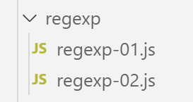

Expressions régulières
======================

|image0|

script [regex-01]
-----------------

Dans le cours PHP, nous avions utilisé le code suivant pour illustrer
les expressions régulières de PHP 7 :

.. code-block:: javascript 
   :linenos:

   <?php

   // type strict pour les paramètres de fonctions
   declare (strict_types=1);

   // expressions régulières en php
   // récupérer les différents champs d'une chaîne
   // le modèle : une suite de chiffres entourée de caractères quelconques
   // on ne veut récupérer que la suite de chiffres
   $modèle = "/(\d+)/";
   // on confronte la chaîne au modèle
   compareModele2Chaine($modèle, "xyz1234abcd");
   compareModele2Chaine($modèle, "12 34");
   compareModele2Chaine($modèle, "abcd");

   // le modèle : une suite de chiffres entourée de caractères quelconques
   // on veut la suite de chiffres ainsi que les champs qui suivent et précèdent
   $modèle = "/^(.*?)(\d+)(.*?)$/";
   // on confronte la chaîne au modèle
   compareModele2Chaine($modèle, "xyz1234abcd");
   compareModele2Chaine($modèle, "12 34");
   compareModele2Chaine($modèle, "abcd");

   // le modèle - une date au format jj/mm/aa
   $modèle = "/^\s*(\d\d)\/(\d\d)\/(\d\d)\s*$/";
   compareModele2Chaine($modèle, "10/05/97");
   compareModele2Chaine($modèle, "  04/04/01  ");
   compareModele2Chaine($modèle, "5/1/01");

   // le modèle - un nombre décimal
   $modèle = "/^\s*([+|-]?)\s*(\d+\.\d*|\.\d+|\d+)\s*/";
   compareModele2Chaine($modèle, "187.8");
   compareModele2Chaine($modèle, "-0.6");
   compareModele2Chaine($modèle, "4");
   compareModele2Chaine($modèle, ".6");
   compareModele2Chaine($modèle, "4.");
   compareModele2Chaine($modèle, " + 4");

   // fin
   exit;

   // --------------------------------------------------------------------------
   function compareModele2Chaine(string $modèle, string $chaîne): void {
     // compare la chaîne $chaîne au modèle $modèle
     // on confronte la chaîne au modèle
     $champs = [];
     $correspond = preg_match($modèle, $chaîne, $champs);
     // affichage résultats
     print "\nRésultats($modèle,$chaîne)\n";
     if ($correspond) {
       for ($i = 0; $i < count($champs); $i++) {
         print "champs[$i]=$champs[$i]\n";
       }
     } else {
       print "La chaîne [$chaîne] ne correspond pas au modèle [$modèle]\n";
     }
   }

Nous transposons ce code en Javascript de la façon suivante :

.. code-block:: javascript 
   :linenos:

   'use strict';

   /// expressions régulières en javascript
   // récupérer les différents champs d'une chaîne
   // le modèle : une suite de chiffres entourée de caractères quelconques
   // on ne veut récupérer que la suite de chiffres
   let modèle = /(\d+)/;
   // on confronte la chaîne au modèle
   compareModèleToChaîne(modèle, "xyz1234abcd");
   compareModèleToChaîne(modèle, "12 34");
   compareModèleToChaîne(modèle, "abcd");

   // le modèle : une suite de chiffres entourée de caractères quelconques
   // on veut la suite de chiffres ainsi que les champs qui suivent et précèdent
   modèle = /^(.*?)(\d+)(.*?)$/;
   // on confronte la chaîne au modèle
   compareModèleToChaîne(modèle, "xyz1234abcd");
   compareModèleToChaîne(modèle, "12 34");
   compareModèleToChaîne(modèle, "abcd");

   // le modèle - une date au format jj/mm/aa
   modèle = /^\s*(\d\d)\/(\d\d)\/(\d\d)\s*$/;
   compareModèleToChaîne(modèle, "10/05/97");
   compareModèleToChaîne(modèle, "  04/04/01  ");
   compareModèleToChaîne(modèle, "5/1/01");

   // le modèle - un nombre décimal
   modèle = /^\s*([+|-]?)\s*(\d+\.\d*|\.\d+|\d+)\s*$/;
   compareModèleToChaîne(modèle, "187.8");
   compareModèleToChaîne(modèle, "-0.6");
   compareModèleToChaîne(modèle, "4");
   compareModèleToChaîne(modèle, ".6");
   compareModèleToChaîne(modèle, "4.");
   compareModèleToChaîne(modèle, " + 4");

   // --------------------------------------------------------------------------
   function compareModèleToChaîne(modèle, chaîne) {
     // compare la chaîne [chaîne] au modèle [modèle]
     console.log(`----------- chaîne=${chaîne}, modèle=${modèle}`)
     // on confronte la chaîne au modèle
     const result1 = modèle.exec(chaîne);
     console.log(`comparaison avec exec=`, result1);
     // une autre façon de faire
     const result2 = chaîne.match(modèle);
     console.log(`comparaison avec match=`, result2);
   }

**Commentaires**

-  les codes PHP et Javascript sont très proches l’un de l’autre ;

-  ligne 7 : on notera qu’en Javascript l’expression régulière n’est pas
   une chaîne de caractères mais un objet. On ne met pas de guillemets
   ou d’apostrophes autour de l’expression ;

-  lignes 41 et 44 : il y a deux méthodes pour obtenir le même
   résultat ;

**Exécution**

.. code-block:: javascript 
   :linenos:

   [Running] C:\myprograms\laragon-lite\bin\nodejs\node-v10\node.exe -r esm "c:\Data\st-2019\dev\es6\javascript\regexp\regexp-01.js"
   type d'une expression régulière : object
   ----------- chaîne=xyz1234abcd, modèle=/(\d+)/
   comparaison avec exec= [ '1234',
   '1234',
   index: 3,
   input: 'xyz1234abcd',
   groups: undefined ]
   comparaison avec match= [ '1234',
   '1234',
   index: 3,
   input: 'xyz1234abcd',
   groups: undefined ]
   ----------- chaîne=12 34, modèle=/(\d+)/
   comparaison avec exec= [ '12', '12', index: 0, input: '12 34', groups: undefined ]
   comparaison avec match= [ '12', '12', index: 0, input: '12 34', groups: undefined ]
   ----------- chaîne=abcd, modèle=/(\d+)/
   comparaison avec exec= null
   comparaison avec match= null
   ----------- chaîne=xyz1234abcd, modèle=/^(.*?)(\d+)(.*?)$/
   comparaison avec exec= [ 'xyz1234abcd',
   'xyz',
   '1234',
   'abcd',
   index: 0,
   input: 'xyz1234abcd',
   groups: undefined ]
   comparaison avec match= [ 'xyz1234abcd',
   'xyz',
   '1234',
   'abcd',
   index: 0,
   input: 'xyz1234abcd',
   groups: undefined ]
   ----------- chaîne=12 34, modèle=/^(.*?)(\d+)(.*?)$/
   comparaison avec exec= [ '12 34',
   '',
   '12',
   ' 34',
   index: 0,
   input: '12 34',
   groups: undefined ]
   comparaison avec match= [ '12 34',
   '',
   '12',
   ' 34',
   index: 0,
   input: '12 34',
   groups: undefined ]
   ----------- chaîne=abcd, modèle=/^(.*?)(\d+)(.*?)$/
   comparaison avec exec= null
   comparaison avec match= null
   ----------- chaîne=10/05/97, modèle=/^\s*(\d\d)\/(\d\d)\/(\d\d)\s*$/
   comparaison avec exec= [ '10/05/97',
   '10',
   '05',
   '97',
   index: 0,
   input: '10/05/97',
   groups: undefined ]
   comparaison avec match= [ '10/05/97',
   '10',
   '05',
   '97',
   index: 0,
   input: '10/05/97',
   groups: undefined ]
   ----------- chaîne= 04/04/01 , modèle=/^\s*(\d\d)\/(\d\d)\/(\d\d)\s*$/
   comparaison avec exec= [ ' 04/04/01 ',
   '04',
   '04',
   '01',
   index: 0,
   input: ' 04/04/01 ',
   groups: undefined ]
   comparaison avec match= [ ' 04/04/01 ',
   '04',
   '04',
   '01',
   index: 0,
   input: ' 04/04/01 ',
   groups: undefined ]
   ----------- chaîne=5/1/01, modèle=/^\s*(\d\d)\/(\d\d)\/(\d\d)\s*$/
   comparaison avec exec= null
   comparaison avec match= null
   ----------- chaîne=187.8, modèle=/^\s*([+|-]?)\s*(\d+\.\d*|\.\d+|\d+)\s*$/
   comparaison avec exec= [ '187.8',
   '',
   '187.8',
   index: 0,
   input: '187.8',
   groups: undefined ]
   comparaison avec match= [ '187.8',
   '',
   '187.8',
   index: 0,
   input: '187.8',
   groups: undefined ]
   ----------- chaîne=-0.6, modèle=/^\s*([+|-]?)\s*(\d+\.\d*|\.\d+|\d+)\s*$/
   comparaison avec exec= [ '-0.6', '-', '0.6', index: 0, input: '-0.6', groups: undefined ]
   comparaison avec match= [ '-0.6', '-', '0.6', index: 0, input: '-0.6', groups: undefined ]
   ----------- chaîne=4, modèle=/^\s*([+|-]?)\s*(\d+\.\d*|\.\d+|\d+)\s*$/
   comparaison avec exec= [ '4', '', '4', index: 0, input: '4', groups: undefined ]
   comparaison avec match= [ '4', '', '4', index: 0, input: '4', groups: undefined ]
   ----------- chaîne=.6, modèle=/^\s*([+|-]?)\s*(\d+\.\d*|\.\d+|\d+)\s*$/
   comparaison avec exec= [ '.6', '', '.6', index: 0, input: '.6', groups: undefined ]
   comparaison avec match= [ '.6', '', '.6', index: 0, input: '.6', groups: undefined ]
   ----------- chaîne=4., modèle=/^\s*([+|-]?)\s*(\d+\.\d*|\.\d+|\d+)\s*$/
   comparaison avec exec= [ '4.', '', '4.', index: 0, input: '4.', groups: undefined ]
   comparaison avec match= [ '4.', '', '4.', index: 0, input: '4.', groups: undefined ]
   ----------- chaîne= + 4, modèle=/^\s*([+|-]?)\s*(\d+\.\d*|\.\d+|\d+)\s*$/
   comparaison avec exec= [ ' + 4', '+', '4', index: 0, input: ' + 4', groups: undefined ]
   comparaison avec match= [ ' + 4', '+', '4', index: 0, input: ' + 4', groups: undefined ]

Les méthodes **[regexp.exec]** et **[string.match]** donnent les mêmes
résultats :

-  **[null]** s’il n’y a pas de correspondances entre la chaîne et son
   modèle ;

-  un tableau t, s’il y a correspondance avec :

   -  t\ **[0]** : la chaîne correspondant au modèle ;

   -  t\ **[1]** : la chaîne correspondant à la 1ère parenthèse du
      modèle ;

   -  t\ **[2]** : la chaîne correspondant à la 2ième parenthèse du
      modèle ;

   -  …

   -  t\ **[input]** : la chaîne entière dans laquelle on a cherché le
      modèle ;

script [regexp-02]
------------------

Parfois on ne souhaite pas récupérer des éléments de la chaîne testée
mais seulement savoir si elle correspond au modèle :

.. code-block:: javascript 
   :linenos:

   'use strict';

   /// expressions régulières en javascript
   // récupérer les différents champs d'une chaîne
   // le modèle : une suite de chiffres entourée de caractères quelconques
   // on ne veut récupérer que la suite de chiffres
   let modèle = /\d+/;
   console.log("type d'une expression régulière : ", typeof (modèle));
   // on confronte la chaîne au modèle
   compareModèleToChaîne(modèle, "xyz1234abcd");
   compareModèleToChaîne(modèle, "12 34");
   compareModèleToChaîne(modèle, "abcd");

   // le modèle : une suite de chiffres entourée de caractères quelconques
   // on veut la suite de chiffres ainsi que les champs qui suivent et précèdent
   modèle = /^.*?\d+.*?$/;
   // on confronte la chaîne au modèle
   compareModèleToChaîne(modèle, "xyz1234abcd");
   compareModèleToChaîne(modèle, "12 34");
   compareModèleToChaîne(modèle, "abcd");

   // le modèle - une date au format jj/mm/aa
   modèle = /^\s*\d\d\/\d\d\/\d\d\s*$/;
   compareModèleToChaîne(modèle, "10/05/97");
   compareModèleToChaîne(modèle, "  04/04/01  ");
   compareModèleToChaîne(modèle, "5/1/01");

   // le modèle - un nombre décimal
   modèle = /^\s*[+|-]?\s*\d+\.\d*|\.\d+|\d+\s*$/;
   compareModèleToChaîne(modèle, "187.8");
   compareModèleToChaîne(modèle, "-0.6");
   compareModèleToChaîne(modèle, "4");
   compareModèleToChaîne(modèle, ".6");
   compareModèleToChaîne(modèle, "4.");
   compareModèleToChaîne(modèle, " + 4");

   // --------------------------------------------------------------------------
   function compareModèleToChaîne(modèle, chaîne) {
     // test
     const correspond = modèle.test(chaîne);
     // compare la chaîne [chaîne] au modèle [modèle]
     console.log(`----------- chaîne=${chaîne}, modèle=${modèle}, correspond=${correspond}`);
   }

**Commentaires**

-  **[regexp-02]** reprend le code de **[regexp-01]** avec les
   différences suivantes :

   -  on ne souhaite pas récupérer des éléments de la chaîne testée.
      Aussi a-t-on enlevé les parenthèses dans les expression régulières
      utilisées ;

   -  ligne 40 : on utilise la méthode **[Regexp.test]** pour savoir si
      une chaîne de caractères vérifie une expression régulière ;

Les résultats de l’exécution sont les suivants :

.. code-block:: javascript 
   :linenos:

   [Running] C:\myprograms\laragon-lite\bin\nodejs\node-v10\node.exe -r esm "c:\Data\st-2019\dev\es6\cours\regexp\regexp-02.js"
   type d'une expression régulière :  object
   ----------- chaîne=xyz1234abcd, modèle=/\d+/, correspond=true
   ----------- chaîne=12 34, modèle=/\d+/, correspond=true
   ----------- chaîne=abcd, modèle=/\d+/, correspond=false
   ----------- chaîne=xyz1234abcd, modèle=/^.*?\d+.*?$/, correspond=true
   ----------- chaîne=12 34, modèle=/^.*?\d+.*?$/, correspond=true
   ----------- chaîne=abcd, modèle=/^.*?\d+.*?$/, correspond=false
   ----------- chaîne=10/05/97, modèle=/^\s*\d\d\/\d\d\/\d\d\s*$/, correspond=true
   ----------- chaîne=  04/04/01  , modèle=/^\s*\d\d\/\d\d\/\d\d\s*$/, correspond=true
   ----------- chaîne=5/1/01, modèle=/^\s*\d\d\/\d\d\/\d\d\s*$/, correspond=false
   ----------- chaîne=187.8, modèle=/^\s*[+|-]?\s*\d+\.\d*|\.\d+|\d+\s*$/, correspond=true
   ----------- chaîne=-0.6, modèle=/^\s*[+|-]?\s*\d+\.\d*|\.\d+|\d+\s*$/, correspond=true
   ----------- chaîne=4, modèle=/^\s*[+|-]?\s*\d+\.\d*|\.\d+|\d+\s*$/, correspond=true
   ----------- chaîne=.6, modèle=/^\s*[+|-]?\s*\d+\.\d*|\.\d+|\d+\s*$/, correspond=true
   ----------- chaîne=4., modèle=/^\s*[+|-]?\s*\d+\.\d*|\.\d+|\d+\s*$/, correspond=true
   ----------- chaîne= + 4, modèle=/^\s*[+|-]?\s*\d+\.\d*|\.\d+|\d+\s*$/, correspond=true

   [Done] exited with code=0 in 0.269 seconds

