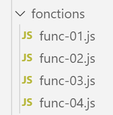

Les fonctions
=============

|image0|

script [func-01]
----------------

Le script s’intéresse au mode de passage des paramètres d’une fonction :

-  passage par valeur pour nombres, chaînes et booléens ;

-  passage par référence pour les tableaux, objets littéraux et
   fonctions ;

.. code-block:: javascript 
   :linenos:

   'use strict';
   // mode de passage des paramètres d'une fonction
   // -----------------------nombre - passage par valeur
   function doSomethingWithNumber(param) {
     param++;
     console.log("[param inside function]=", param, "[type]=", typeof (param), "[passage par référence]=", param === count);
   }
   // code d'appel
   let count = 10;
   doSomethingWithNumber(count);
   console.log("[count outside function]=", count);

   // --------------------- chaîne - passage par valeur
   function doSomethingWithString(param) {
     param += " xyz"
     console.log("[param inside function]=", param, "[type]=", typeof (param), "[passage par référence]=", param === text);
   }
   // code d'appel
   let text = "abcd";
   doSomethingWithString(text);
   console.log("[text outside function]=", text);

   // --------------------- booléen - passage par valeur
   function doSomethingWithBoolean(param) {
     param = !param;
     console.log("[param inside function]=", param, "[type]=", typeof (param), "[passage par référence]=", param === bool);
   }
   // code d'appel
   let bool = true;
   doSomethingWithBoolean(bool);
   console.log("bool [outside function]=", bool);

   // --------------------- tableau - passage par référence
   function doSomethingWithArray(param) {
     param.push(1000);
     console.log("[param inside function]=", param, "[type]=", typeof (param), "[passage par référence]=", param === tab);
   }
   // code d'appel
   const tab = [10, 20, 30];
   doSomethingWithArray(tab);
   console.log("[tab outside function]=", tab);

   // --------------------- objet - passage par référence
   function doSomethingWithObject(param) {
     param.unePropriétéNouvelle = "xyz";
     console.log("[param inside function]=", param, "[type]=", typeof (param), "[passage par référence]=", param === obj);
   }
   // code d'appel
   const obj = [10, 20, 30];
   doSomethingWithObject(obj);
   console.log("[obj outside function]=", obj);

   // --------------------- fonction - passage par référence
   function doSomethingWithFunction(param) {
     // une chose plutôt bizarre qui marche pourtant
     param.unePropriétéNouvelle = "xyz";
     console.log("[param inside function]=", param, "[type]=", typeof (param), "[passage par référence]=", param === f);
   }
   // code d'appel
   const f = x => x + 4;
   doSomethingWithFunction(f);
   console.log("[f outside function]=", f, f.unePropriétéNouvelle, typeof (f));

**Exécution**

.. code-block:: javascript 
   :linenos:

   [Running] C:\myprograms\laragon-lite\bin\nodejs\node-v10\node.exe -r esm "c:\Data\st-2019\dev\es6\javascript\fonctions\func-01.js"
   [param inside function]= 11 [type]= number [passage par référence]= false
   [count outside function]= 10
   [param inside function]= abcd xyz [type]= string [passage par référence]= false
   [text outside function]= abcd
   [param inside function]= false [type]= boolean [passage par référence]= false
   bool [outside function]= true
   [param inside function]= [ 10, 20, 30, 1000 ] [type]= object [passage par référence]= true
   [tab outside function]= [ 10, 20, 30, 1000 ]
   [param inside function]= [ 10, 20, 30, 'unePropriétéNouvelle': 'xyz' ] [type]= object [passage par référence]= true
   [obj outside function]= [ 10, 20, 30, 'unePropriétéNouvelle': 'xyz' ]
   [param inside function]= x => x + 4 [type]= function [passage par référence]= true
   [f outside function]= x => x + 4 xyz function

script [func-02]
----------------

Le script suivant montre que le type **[function]** est un type de
donnée comme un autre et qu’une variable peut avoir ce type. Il montre
également deux façons de définir une fonction :

-  l’une avec le mot clé **[function]** ;

-  l’autre avec la notation « flèche » => ;

.. code-block:: javascript 
   :linenos:

   'use strict';
   // on peut affecter une fonction à une variable
   const variable1 = function (a, b) {
   return a + b;
   };
   console.log("typeof(variable1)=", typeof (variable1));
   // la variable peut ensuite s'utiliser comme une fonction
   console.log("variable1(10,12)=", variable1(10, 12));
   // la définition de la fonction peut se faire avec la notation =>
   const variable2 = (a, b, c) => {
   return a - b + c;
   };
   console.log("variable2(10,12,14)=", variable2(10, 12, 14));
   // on peut ne pas mettre les accolades s'il n'y a qu'une expression dans le code de la fonction
   // cette expression est alors la valeur de retour de la fonction
   const variable3 = (a, b, c) => a + b + c;
   console.log("variable3(10,12,14)=", variable3(10, 12, 14));

**Exécution**

.. code-block:: javascript 
   :linenos:

   [Running] C:\myprograms\laragon-lite\bin\nodejs\node-v10\node.exe -r esm "c:\Data\st-2019\dev\es6\javascript\fonctions\func-02.js"
   typeof(variable1)= function
   variable1(10,12)= 22
   variable2(10,12,14)= 12
   variable3(10,12,14)= 36

script [func-03]
----------------

Ce script revient sur la possibilté de passer une fonction en paramètre
à une autre fonction. Ce procédé est abondamment utilisé dans les
frameworks Javascript.

.. code-block:: javascript 
   :linenos:

   'use strict';
   // les paramètres d'une fonction peuvent être de type [fonction]

   // fonction f1
   function f1(param1, param2) {
     return param1 + param2 + 10;
   }
   // fonction f2
   function f2(param1, param2) {
     return param1 + param2 + 20;
   }
   // fonction g avec une fonction f en paramètre
   function g(param1, param2, f) {
     return f(param1, param2) + 100;
   }
   // utilisations de g
   console.log(g(0, 10, f1));
   console.log(g(0, 10, f2));
   // le paramètre effectif de type fonction peut être passé en direct - forme 1
   console.log(g(0, 10, (param1, param2) => {
     return param1 + param2 + 30;
   }));
   // le paramètre effectif de type fonction peut être passé en direct - forme 2
   console.log(g(0, 10, function (param1, param2) {
     return param1 + param2 + 40;
   }));

**Exécution**

.. code-block:: javascript 
   :linenos:

   [Running] C:\myprograms\laragon-lite\bin\nodejs\node-v10\node.exe -r esm "c:\Data\st-2019\dev\es6\javascript\fonctions\func-03.js"
   120
   130
   140
   150

script [func-04]
----------------

Le script suivant montre qu’une fonction Javascript peut se comporter
comme une classe :

.. code-block:: javascript 
   :linenos:

   'use strict';
   // une fonction peut être utilisée comme un objet

   // une coquille vide
   function f() {

   }
   // à qui on attribue des propriétés de l'extérieur
   f.prop1 = "val1";
   f.show = function () {
     console.log(this.prop1);
   }
   // utilisation de f
   f.show();

   // une fonction g fonctionnant comme une classe
   function g() {
     this.prop2 = "val2";
     this.show = function () {
       console.log(this.prop2);
     }
   }
   // instanciation de la fonction avec [new]
   new g().show();

**Commentaires**

-  lignes 5-7 : le corps de la fonction f ne définit aucune propriété ;

-  lignes 9-12 : on donne de l’extérieur des propriétés à la fonction
   f ;

-  ligne 14 : utilisation de la function (objet) f. Notez qu’on n’écrit
   pas **[f()]** mais simplement **[f]**. On a là la notation d’un
   objet ;

-  lignes 17-22 : on définit une fonction **[g]** comme si c’était une
   classe avec propriétés et méthodes ;

-  ligne 24 : la fonction **[g]** est instanciée par **[new g()]** ;

**Résultats de l’exécution**

.. code-block:: javascript 
   :linenos:

   [Running] C:\myprograms\laragon-lite\bin\nodejs\node-v10\node.exe -r esm "c:\Data\st-2019\dev\es6\javascript\classes\class-00.js"
   val1
   val2

ES6 a introduit la notion de classe qui nous permet désormais d’éviter
de passer par des fonctions pour avoir des classes.

script [func-05]
----------------

Le script [func-05] montre l’usage d’un opérateur appelé [rest
operator] :

.. code-block:: javascript 
   :linenos:

   'use strict';
   // rest operator
   function f(arg1, ...otherArgs) {
     // 1er argument
     console.log("arg1=", arg1);
     // les autres arguments
     let i = 0;
     otherArgs.forEach(element => {
       console.log("otherArguments[", i, "]=", element);
       i++;
     });
   }

   // appel
   f(1, "deux", "trois", { x: 2, y: 3 })

-  ligne 3 : la notation [...otherArgs] fait qu’avec un appel de type
   f(param1, param2, param3) on aura ligne 3 :

   -  arg1=param1

   -  otherArgs=[param2, param3]. [otherArgs] est donc un tableau qui
      rassemble tous les paramètres effectifs passés derrière [param1] ;

Les résultats de l’application sont les suivants :

.. code-block:: javascript 
   :linenos:

   arg1= 1
   otherArguments[ 0 ]= deux
   otherArguments[ 1 ]= trois
   otherArguments[ 2 ]= { x: 2, y: 3 }

