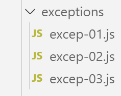
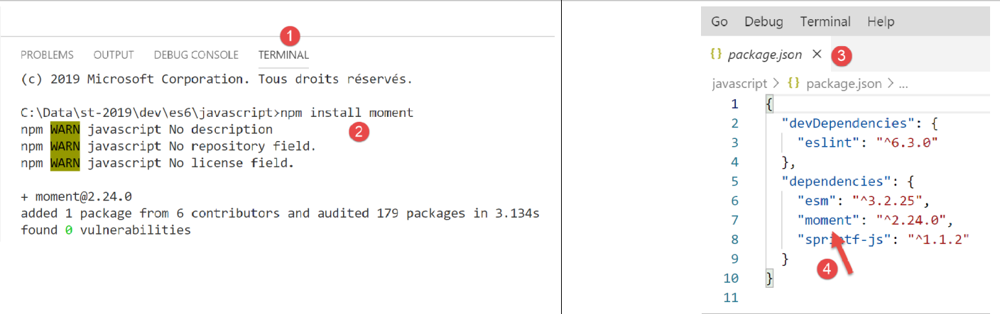

Les erreurs et exceptions
=========================

|image0|

Javascript n’a pas un système d’exceptions très évolué. Il offre
néanmoins l’instruction **[throw]** qui permet de signaler une erreur
ainsi que la structure try / catch / finally qui permet d’intercepter
ces erreurs.

script [excep-01]
-----------------

Dans le script qui suit, nous allons afficher la date du moment sous la
forme **[heures:minutes:secondes:millisecondes]**. Pour ce faire, nous
allons utiliser une bibliothèques jS appelée **[moment.js]**. Nous
l’installons, comme d’habitude, avec l’outil **[npm]** :

|image1|

Le code du script est le suivant :

.. code-block:: javascript 
   :linenos:

   'use strict';

   // package moment
   import moment from 'moment';

   ...

Pour savoir comment écrire la ligne **[import]** de la ligne 4, on peut
regarder la définition du module **[moment]** :

|image2|

-  en **[1-2]**, on va à la définition du module ;

-  en **[3]**, on a un fichier Typescript, pas Javascript. A
   l’exécution, ce fichier Typescript est compilé en fichier Javascript
   avant d’être utilisé ;

-  en **[4]**, on cherche les instructions **[export]** (Ctrl-F) ;

-  en **[5]**, l’instruction exporte l’objet **[moment]**. Celui-ci peut
   être importé en ES6 de la façon suivante :

.. code-block:: javascript 
   :linenos:

   import moment from 'moment';

..

   On peut utiliser n’importe quel nom pour importer l’objet
   **[moment]**, par exemple :

.. code-block:: javascript 
   :linenos:

   import m from 'moment';

Revenons au code du script :

.. code-block:: javascript 
   :linenos:

   'use strict';

   // package moment
   import moment from 'moment';

   // principe du try / catch / finally
   for (let i = 0; i < 10; i++) {
     // date - heure du moment courant
     const now = Date.now();
     // formatage heure pour avoir les millisecondes
     const time = moment(now).format("HH:mm:ss:SSS");
     // les millisecondes
     const milli = Number(time.substr(time.length - 3));
     // affichage
     console.log("--------------------itération n° ", i, "à", time);
     try {
       // nbre variant selon l’heure du moment
       const nbre = milli % 2;
       if (nbre === 0) {
         // lancer un msg d'erreur
         throw "erreur";
       }
       // si on arrive ici c'est qu'il n'y a pas eu d'erreur
       console.log("pas d'erreur");
     } catch (error) {
       // si on arrive ici, c'est qu'il y a eu erreur
       console.log("erreur1=", error);
     } finally {
       // exécuté dans tous les cas erreur ou pas
       console.log("finally")
     }
   }

**Commentaires**

-  ligne 4 : import de la bibliothèque **[moment]** ;

-  le principe du script est de boucler 10 fois (ligne 7). A chaque tour
   de boucle, on récupère l’heure du moment sous la forme
   **[heures:minutes:secondes:millisecondes]** (lignes 8-13) ;

-  si le nombre de millisecondes est pair, on lance un message d’erreur
   (lignes 19-22) ;

-  il s’agit ici de comprendre le fonctionnement du try / catch /
   finally

**Exécution**

.. code-block:: javascript 
   :linenos:

   [Running] C:\myprograms\laragon-lite\bin\nodejs\node-v10\node.exe -r esm "c:\Data\st-2019\dev\es6\javascript\exceptions\excep-01.js"
   --------------------itération n° 0 à 17:57:04:440
   erreur1= erreur
   finally
   --------------------itération n° 1 à 17:57:04:447
   pas d'erreur
   finally
   --------------------itération n° 2 à 17:57:04:448
   erreur1= erreur
   finally
   --------------------itération n° 3 à 17:57:04:448
   erreur1= erreur
   finally
   --------------------itération n° 4 à 17:57:04:448
   erreur1= erreur
   finally
   --------------------itération n° 5 à 17:57:04:448
   erreur1= erreur
   finally
   --------------------itération n° 6 à 17:57:04:448
   erreur1= erreur
   finally
   --------------------itération n° 7 à 17:57:04:448
   erreur1= erreur
   finally
   --------------------itération n° 8 à 17:57:04:449
   pas d'erreur
   finally
   --------------------itération n° 9 à 17:57:04:449
   pas d'erreur
   finally

On voit que la clause **[finally]** est toujours exécutée qu’il y ait
erreur ou pas.

script [excep-02]
-----------------

Ce script que l’instruction **[throw]** peut lancer n’importe quel type
de donnée et que cette donnée est récupérée intégralement par la clause
**[catch]**.

.. code-block:: javascript 
   :linenos:

   'use strict';

   // on peut "lancer" (throw) à peu près n'importe quoi pour signaler une erreur
   let i = 0;
   console.log("--------------------essai n° ", i);
   // lancer une chaîne de caractères
   try {
     throw "msg d'erreur";
   } catch (error) {
     // il y a eu erreur
     console.log("erreur=[", error, "], type=", typeof (error));
   }
   // lancer un tableau
   i++;
   console.log("--------------------essai n° ", i);
   try {
     throw [1, 2, 3]
   } catch (error) {
     // il y a eu erreur
     console.log("erreur=[", error, "], type=", typeof (error));
   }
   // lancer un objet littéral
   i++;
   console.log("--------------------essai n° ", i);
   try {
     throw { nom: "hercule", pays: "grèce antique" }
   } catch (error) {
     // il y a eu erreur
     console.log("erreur=[", error, "], type=", typeof (error));
   }
   // lancer un type Error
   i++;
   console.log("--------------------essai n° ", i);
   try {
     throw new Error("erreur de connexion au réseau");
   } catch (error) {
     // il y a eu erreur
     console.log("erreur=[", error, "], type=", typeof (error));
   }
   // lancer un type Error
   i++;
   console.log("--------------------essai n° ", i);
   try {
     throw new Error("erreur de connexion au réseau");
   } catch (error) {
     // il y a eu erreur - le message est dans [error.message]
     console.log("erreur.message=[", error.message, "], type(error)=", typeof (error));
   }

**Commentaires**

-  lignes 35, 44 : **[Error]** est une classe Javascript dont le
   constructeur admet comme 1\ :sup:`er` paramètre facultatif un message
   d’erreur. Ce message peut être récupéré dans la propriété
   **[Error.message]** (ligne 47) ;

-  il existe d’autres classes que **[Error]** pour signaler une erreur :
   [EvalError, InternalError, RangeError, ReferenceError, SyntaxError,
   TypeError, URIError) ;

**Exécution**

.. code-block:: javascript 
   :linenos:

   [Running] C:\myprograms\laragon-lite\bin\nodejs\node-v10\node.exe -r esm "c:\Data\st-2019\dev\es6\javascript\exceptions\excep-02.js"
   --------------------essai n° 0
   erreur=[ msg d'erreur ], type= string
   --------------------essai n° 1
   erreur=[ [ 1, 2, 3 ] ], type= object
   --------------------essai n° 2
   erreur=[ { nom: 'hercule', pays: 'grèce antique' } ], type= object
   --------------------essai n° 3
   erreur=[ Error: erreur de connexion au réseau
   at Object.<anonymous> (c:\Data\st-2019\dev\es6\javascript\exceptions\excep-02.js:35:9)
   at Object.<anonymous> (c:\Temp\19-09-01\javascript\node_modules\esm\esm.js:1:251206)
   at c:\Temp\19-09-01\javascript\node_modules\esm\esm.js:1:245054
   at Generator.next (<anonymous>)
   at bl (c:\Temp\19-09-01\javascript\node_modules\esm\esm.js:1:245412)
   at kl (c:\Temp\19-09-01\javascript\node_modules\esm\esm.js:1:247659)
   at Object.u (c:\Temp\19-09-01\javascript\node_modules\esm\esm.js:1:287740)
   at Object.o (c:\Temp\19-09-01\javascript\node_modules\esm\esm.js:1:287137)
   at Object.<anonymous> (c:\Temp\19-09-01\javascript\node_modules\esm\esm.js:1:284879)
   at Object.apply (c:\Temp\19-09-01\javascript\node_modules\esm\esm.js:1:199341) ], type= object
   --------------------essai n° 4
   erreur.message=[ erreur de connexion au réseau ], type(error)= object

script [excep-03]
-----------------

Ce script montre qu’on peut, dans un **[catch]**, différentier le type
d’instance **[Error]** interceptée par le **[catch]** :

.. code-block:: javascript 
   :linenos:

   'use strict';

   // package moment
   import moment from 'moment';

   // différencier l'instance d'Error reçue dans un [catch]
   for (let i = 0; i < 10; i++) {
     // date - heure du moment courant
     const now = Date.now();
     // formatage heure pour avoir les millisecondes
     const time = moment(now).format("HH:mm:ss:SSS");
     // les millisecondes
     const milli = Number(time.substr(time.length - 3));
     console.log("--------------------itération n° ", i);
     try {
       // nbre [0, 1, 2]
       const nbre = milli % 3;
       switch (nbre) {
         case 0:
           throw new ReferenceError("erreur 1");
         case 1:
           throw new RangeError("erreur 2");
         default:
           throw new EvalError("erreur 3");
       }
     } catch (error) {
       // il y a eu erreur
       if (error instanceof ReferenceError) {
         console.log("ReferenceError :", error.message);
       } else {
         if (error instanceof RangeError) {
           console.log("RangeError :", error.message);
         }
         else {
           if (error instanceof EvalError) {
             console.log("EvalError :", error.message);
           }
         }
       }
     }
   }

**Exécution**

.. code-block:: javascript 
   :linenos:

   [Running] C:\myprograms\laragon-lite\bin\nodejs\node-v10\node.exe -r esm "c:\Data\st-2019\dev\es6\javascript\exceptions\excep-03.js"
   --------------------itération n° 0
   ReferenceError : erreur 1
   --------------------itération n° 1
   RangeError : erreur 2
   --------------------itération n° 2
   RangeError : erreur 2
   --------------------itération n° 3
   RangeError : erreur 2
   --------------------itération n° 4
   RangeError : erreur 2
   --------------------itération n° 5
   RangeError : erreur 2
   --------------------itération n° 6
   EvalError : erreur 3
   --------------------itération n° 7
   EvalError : erreur 3
   --------------------itération n° 8
   EvalError : erreur 3
   --------------------itération n° 9
   EvalError : erreur 3

