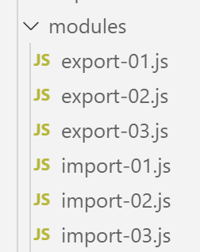

Les modules ES6
===============

|image0|

Les modules ES6 permettent de construire des applications Javascript
structurées en modules indépendants et réutilisables.

scripts [import-01, export-01]
------------------------------

Le script **[import-01]** va utiliser le module **[export-01]**.
Celui-ci est défini de la façon suivante :

.. code-block:: javascript 
   :linenos:

   // export par défaut d'un objet non nommé
   export default {
     data: 2,
     do() {
       console.log(this.data);
     }
   };

**Commentaires**

-  les lignes **[2-7]** définissent un objet non nommé avec les
   propriétés **[data, do]** ;

-  ligne 2 : l’instruction **[export default]** exporte cet objet.
   Celui-ci pourra donc être importé ;

Le module **[export-01]** est utilisé par le script **[import-01]** de
la façon suivante :

.. code-block:: javascript 
   :linenos:

   'use strict';
   // import d'un objet exporté par défaut
   import export01 from './export-01';
   // utilisation de cet objet
   export01.do();
   // on peut importer un export par défaut sous n'importe quel nom
   import data from './export-01';
   console.log(data.data);

**Commentaires**

-  les lignes 3 et 7 importent l’objet exporté par défaut du module
   **[export-01]** sous deux noms différents ;

-  une fois un objet importé, on peut l’utiliser comme s’il avait été
   défini localement dans le script ;

**Exécution**

.. code-block:: javascript 
   :linenos:

   [Running] C:\myprograms\laragon-lite\bin\nodejs\node-v10\node.exe -r esm "c:\Data\st-2019\dev\es6\javascript\modules\import-01.js"
   2
   2

scripts [import-02, export-02]
------------------------------

Ces scripts montrent un export d’un objet nommé.

Le script **[export-02]** est le suivant :

.. code-block:: javascript 
   :linenos:

   // export par défaut d'un objet nommé
   const data = {
     data: 2,
     do() {
       console.log(this.data);
     }
   };
   // export
   export default data;

-  ligne 9 : on exporte l’objet **[data]** ;

Que l’objet exporté soit nommé ou non ne change rien à l’opération
d’import. Le script **[import-02]** est le suivant :

.. code-block:: javascript 
   :linenos:

   'use strict';
   // import d'un objet exporté par défaut
   import module1 from './export-02';
   // utilisation de cet objet
   module1.do();
   // on peut importer un export par défaut sous n'importe quel nom
   import module2 from './export-02';
   console.log(module2.data);

**Exécution**

.. code-block:: javascript 
   :linenos:

   [Running] C:\myprograms\laragon-lite\bin\nodejs\node-v10\node.exe -r esm "c:\Data\st-2019\dev\es6\javascript\modules\import-02.js"
   2
   2

scripts [import-03, export-03]
------------------------------

Un module peut exporter plusieurs éléments.

Le script **[export-03]** est le suivant :

.. code-block:: javascript 
   :linenos:

   // multi-exports
   // export objet
   const data = {
     data: 2,
     do() {
       console.log(this.data);
     }
   };
   // export fonction
   export { data };
   function doSomething() {
     console.log("doSomething");
   }
   export { doSomething };

**Commentaires**

-  lignes 10 et 14 : export de deux éléments. L’export d’un élément se
   fait avec la syntaxe **[export {élément}]** ;

Le script **[import-03]** utilise le module **[export-03]** de la façon
suivante :

.. code-block:: javascript 
   :linenos:

   'use strict';
   // import d'un module [export03]
   import {data, doSomething} from './export-03';
   // utilisation des imports
   data.do();
   doSomething();
   // autre écriture
   import * as module from './export-03';
   // utilisation de l'import
   console.log(module.data);
   module.doSomething();

-  ligne 3 : les **[imports]** se font avec les noms exacts des objets
   exportés ;

-  ligne 8 : on peut importer tous les objets exportés dans un objet
   nommé (ici **[module]**) ;

**Exécution**

.. code-block:: javascript 
   :linenos:

   [Running] C:\myprograms\laragon-lite\bin\nodejs\node-v10\node.exe -r esm "c:\Data\st-2019\dev\es6\javascript\modules\import-03.js"
   2
   doSomething
   { data: 2, do: [Function: do] }
   doSomething

