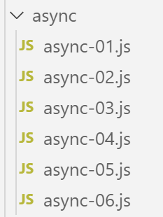
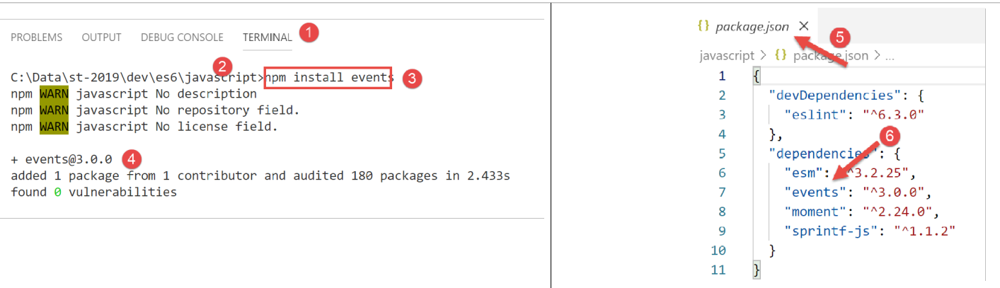

Programmation événementielle et fonctions asynchrones
=====================================================

|image0|

Une fonction asynchrone est une fonction dont l’exécution est lancée
mais dont on n’attend pas le résultat. Lorsque l’exécution est terminée,
la fonction asynchrone émet un événement et transmet son résultat via
celui-ci.

Ce mode de fonctionnement est bien adapté à l’exécution au sein d’un
navigateur web. En effet, une application exécutée au sein d’un
navigateur est une application à événements : l’application réagit à des
événements, principalement provoqués par l’utilisateur (clics,
déplacements de souris, frappe de texte, …). Les applications Javascript
exécutées au sein d’un navigateur sont amenées à dialoguer avec des
services externes via le protocole HTTP. Les fonctions natives HTTP de
Javascript sont asynchrones : elles sont lancées et l’obtention de la
réponse du service externe sollicité est signalé par un événement qui
s’ajoute à l’ensemble des événements gérés par l’application.

Les scripts suivants vont être exécutés par **[node.js]** et non par un
navigateur. **[node.js]** a lui également un mode d’exécution par
événement :

-  **[node.js]**, comme un navigateur, utilise une boucle d’événements
   pour exécuter un script ;

-  l’exécution du code principal du script est le 1\ :sup:`er` événement
   exécuté ;

-  si ce code principal a lancé des tâches asynchrones alors l’exécution
   se poursuit tant que ces tâches asynchrones ne sont pas terminées.
   Celles-ci émettent un événement lorsqu’elles sont terminées. Ces
   événements sont mis en file d’attente dans la boucle d’événements ;

-  le script principal doit s’abonner à ces événements s’il veut
   récupérer les résultats des actions asynchrones ;

-  le script n’est terminé que lorsque tous les événements émis par
   celui-ci ont été traités ;

script [async-01]
-----------------

Le script suivant montre le comportement d’un script comportant une
action asynchrone.

.. code-block:: javascript 
   :linenos:

   'use strict';

   // imports
   import moment from 'moment';
   import { sprintf } from 'sprintf-js';

   // début
   const débutScript = moment(Date.now());
   console.log("[début du script],", heure());

   // setTimeout arme un timer de 1000 ms (2ième paramètre) et retourne immédiatement le n° de ce timer
   // lorsque le timer a épuisé les 1000 ms il émet un événement qui est mis en file d'attente du runtime
   // lorsque l'événement est traité par le runtime, la fonction (1er paramètre) est exécutée
   setTimeout(function () {
     // ce code sera exécuté lorsque le timer aura atteint la valeur 0
     console.log("[fin de l'action asynchrone setTimeout],", heure(débutScript));
   }, 1000)

   // s'affichera avant le msg de la fonction interne au timer
   console.log("[fin du code principal du script],", heure(débutScript));

   // utilitaire d'affichage heure et durée
   function heure(début) {
     // heure du moment courant
     const now = moment(Date.now());
     // formatage heure
     let result = "heure=" + now.format("HH:mm:ss:SSS");
     // faut-il calculer une durée ?
     if (début) {
       const durée = now - début;
       const milliseconds = durée % 1000;
       const seconds = Math.floor(durée / 1000);
       // formatage heure + durée
       result = result + sprintf(", durée= %s seconde(s) et %s millisecondes", seconds, milliseconds);
     }
     // résultat
     return result;
   }

-  ligne 4 : on importe la bibliothèque **[moment]** pour pouvoir
   formater les dates (ligne 27) ;

-  ligne 5 : on importe la bibliothèque **[sprintf-js]** pour pouvoir
   formater les durées (ligne 34) ;

-  ligne 8 : on note l’heure de début du script ;

-  ligne 9 : on l’affiche à l’aide de la méthode **[heure]** des lignes
   20-34 ;

-  lignes 14-17 : la fonction **[setTimeout]** a deux paramètres (f,
   durée) : **f** est une fonction qui est exécutée lorsque **[durée]**
   millisecondes se sont écoulées ;

-  ligne 14 : à l’exécution du script, la fonction **[setTimeout]** est
   exécutée :

   -  ligne 17 : un minuteur de 1000 ms est armé et le décompte commence
      jusqu’à atteindre ultérieurement 0. La fonction **[setTimeout]**
      est terminée dès que le minuteur est initialisé et le décompte
      commencé. Elle **n’attend pas** la fin de ce décompte. Elle rend
      un n° identifiant le minuteur utilisé et l’exécution passe à
      l’instruction suivante, ligne 20. Ici, le résultat de
      **[setTimeout]** n’est pas utilisé ;

-  ligne 16 : ce message va s’afficher à la fin du délai de 1000 ms de
   la fonction **[setTimeout]** ;

-  lignes 15-16 : la fonction f, 1\ :sup:`er` paramètre de la fonction
   **[setTimeout]**, va être exécutée à la fin du délai des 1000 ms. Le
   message de la ligne 16 va alors s’afficher ;

-  ligne 20 : ce message va s’afficher avant celui de la ligne 16 ;

Fonction **heure** :

-  ligne 23 : la fonction admet un paramètre facultatif **[heure]** qui
   est l’heure de début d’une opération dont elle doit afficher la
   durée ;

-  lignes 25-27 : on calcule et formate l’heure du moment ;

-  ligne 29 : si le paramètre **[début]** est présent alors il faut
   calculer une durée ;

-  ligne 30 : la durée de l’opération. On obtient un nombre de
   millisecondes ;

-  lignes 31-32 : ce nombre de millisecondes est décomposé en secondes
   et millisecondes ;

-  ligne 34 : la durée est ajoutée à l’heure ;

**Exécution**

.. code-block:: javascript 
   :linenos:

   [Running] C:\myprograms\laragon-lite\bin\nodejs\node-v10\node.exe -r esm "c:\Data\st-2019\dev\es6\javascript\async\async-01.js"
   [début du script], heure=09:26:40:238
   [fin du code principal du script], heure=09:26:40:246, durée= 0 seconde(s) et 11 millisecondes
   [fin de l'action asynchrone setTimeout], heure=09:26:41:249, durée= 1 seconde(s) et 14 millisecondes

   [Done] exited with code=0 in 1.672 seconds

-  ligne 4, on voit que l’action asynchrone **[setTimeOut]** s’est
   terminée 1s environ après la fin du code principal du script ;

-  ligne 6 : l’heure affichée ligne 3 est celle de la fin du code
   principal. Si celui-ci a lancé des tâches asynchrones, le script
   n’est terminé que lorsque toutes les tâches asynchrones ont été
   exécutées. La durée affichée ligne 6, est la durée totale d’exécution
   du script (code principal + tâches asynchrones) ;

La fonction **[setTimeout]** va nous permettre de simuler des tâches
asynchrones dans un environnement **[node.js]**. En effet, la fonction
**[setTimeout]** se comporte comme une tâche asynchrone :

-  elle rend un résultat immédiatement, ici un n° de timer, par le
   mécanisme usuel des fonctions (return) ;

-  elle peut rendre **ultérieurement** (ce n’est pas encore le cas
   ci-dessus) d’autres résultats **via des événements** qui sont alors
   traités par la boucle d’événements de **[node.js]** ;

-  dans la plupart des cas qui vont suivre, ces événements seront au
   nombre de deux :

   -  un événement qu’on pourrait appeler **[success]** qui sera émis
      par la tâche asynchrone qui a réussi ce qu’elle devait faire. Une
      donnée, le résultat de la tâche, est associée à l’événement émis ;

   -  un événement qu’on pourrait appeler **[failure]** qui sera émis
      par la tâche asynchrone qui a échoué à faire ce qu’elle devait
      faire. Une donnée, un objet décrivant l’erreur généralement, est
      associé à l’événement émis. Des erreurs possibles par exemple avec
      une tâche internet asynchrone seraient ‘réseau indisponible’,
      ‘machine serveur inexistante’, ‘timeout dépassé’, ...

-  le code principal qui a lancé une tâche asynchrone peut s’abonner aux
   événements que cette tâche est susceptibe d’émettre. Lorsqu’un de
   ceux-ci est émis, le code principal en est averti et peut déclencher
   l’exécution d’une fonction particulière destinée à traiter
   l’événement. Cette fonction reçoit en paramètre, la donnée que la
   tâche asynchrone a associée à l’événement émis ;

script [async-02]
-----------------

Dans ce script, la fonction asynchrone **[setTimeout]** va émettre des
événements pour communiquer des données aux codes qui se seront abonnés
à ceux-ci.

L’accès aux événements de **[node.js]** nécessite des bibliohèques
supplémentaires. Nous choisissons la bibliothèque **[events]** que nous
installons avec **[npm]** :

|image1|

Le script **[async-02]** est le suivant :

.. code-block:: javascript 
   :linenos:

   'use strict';

   // les fonctions asynchrones peuvent rendre un résultat en émettant un événement
   // le code principal peut récupérer ces résultats en s'abonnant aux événements émis

   // imports
   import moment from 'moment';
   import { sprintf } from 'sprintf-js';
   import EventEmitter from 'events';

   // début
   const débutScript = moment(Date.now());
   console.log("[début du script],", heure());
   // un émetteur d'événements
   const eventEmitter = new EventEmitter();

   // setTimeout arme un timer de 1000 ms (2ième paramètre) et retourne immédiatement le n° de ce timer
   // lorsque le timer a épuisé les 1000 ms il émet un événement qui est mis en file d'attente du runtime
   // lorsque l'événement est traité par le runtime, la fonction (1er paramètre) est exécutée
   setTimeout(function () {
     // ce code sera exécuté lorsque le timer aura atteint la valeur 0
     console.log("[setTimeout, fin du timer d'1 s],", heure(débutScript));
     // on émet un événement pour dire qu'un résultat est disponible
     eventEmitter.emit("timer1Success", { success: 4 });
     // on émet un autre événement pour dire qu'un autre résultat est disponible
     eventEmitter.emit("timer1Failure", { failure: 6 });
   }, 1000)

   // on s'abonne à l'évt [timer1Success]
   eventEmitter.on('timer1Success', (result) => {
     console.log(sprintf("la fonction asynchrone du timer a rendu le résultat [%j], %s, via l'événement [timer1Success]", result, heure(débutScript)));
   });

   // on s'abonne à l'évt [timer1Failure]
   eventEmitter.on('timer1Failure', (result) => {
     console.log(sprintf("la fonction asynchrone du timer a rendu le résultat [%j], %s, via l'événement [timer1Failure]", result, heure(débutScript)));
   });

   // s'affichera avant les msg des evts émis par la fonction associée à [timer1]
   console.log("[fin du code principal du script],", heure(débutScript));

   // utilitaire d'affichage heure et durée
   function heure(début) {
     // heure du moment courant
     const now = moment(Date.now());
     // formatage heure
     let result = "heure=" + now.format("HH:mm:ss:SSS");
     // faut-il calculer une durée ?
     if (début) {
       const durée = now - début;
       const milliseconds = durée % 1000;
       const seconds = Math.floor(durée / 1000);
       // formatage heure + durée
       result = result + sprintf(", durée= %s seconde(s) et %s millisecondes", seconds, milliseconds);
     }
     // résultat
     return result;
   }

**Commentaires**

-  ligne 9, on importe la classe **[EventEmitter]** de la bibliothèque
   **[events]**. C’est une nouveauté : nous n’avions jusqu’à maintenant
   importé que des objets littéraux et des fonctions ;

-  ligne 15 : on crée un émetteur d’événements **[node.js]** en
   instanciant la classe **[EventEmitter]** avec le mot clé **[new]** ;

-  lignes 20-27 : la fonction asynchrone **[setTimeout]**. Elle va
   émettre deux événements lors de son exécution :

   -  ligne 24, l’événement **[timer1Success]** avec comme valeur
      associée l’objet {success : 4} ;

   -  ligne 26, l’événement **[timer1Failure]** avec comme valeur
      associée l’objet {failure : 6} ;

   -  une fonction asynchrone peut émettre autant d’événements qu’elle
      veut. On a dit précédemment que le plus souvent elle émettait l’un
      des deux événements **[success, failure]**, pas les deux comme on
      le fait ici ;

-  ligne 20 : l’exécution de **[setTimeout]** est instantanée : un timer
   est armé et le n° de celui-ci rendu au code appelant. L’émission des
   événements se fera plus tard, ici 1 seconde plus tard ;

-  l’émission d’événements est inutile s’il n’y a aucun code pour les
   exploiter lorsqu’ils surviendront. C’est pourquoi le code principal
   doit s’abonner aux deux événements **[timer1Success, timer1Failure]**
   s’il veut les gérer, notamment récupérer les données associées à ces
   événements ;

-  lignes 30-32 : le code principal s’abonne à l’événement
   **[timer1Success]**. Lorsque la bouche d’événements de **[node.js]**
   traitera cet événement, il appellera la fonction qui est le second
   paramètre de la méthode **[eventEmitter.on]** en lui passant la
   donnée (ici appelée **[result]**) associée à l’événement
   **[timer1Success]** ;

-  ligne 31 : la fonction de traitement de l’événement affichera le jSON
   de la donnée associée à l’événement ainsi que l’heure du moment ;

-  lignes 35-37 : avec un code analogue, le code principal s’abonne à
   l’événement **[timer1Failure]** ;

-  l’abonnement à un événement (1\ :sup:`er` paramètre) n’exécute pas
   immédiatement le code de la fonction **[callback]** (2ième
   paramètre). Celle-ci ne sera exécutée qu’après que l’événement ait eu
   lieu ;

-  ligne 40 : le code principal du script est terminé mais pas le script
   lui-même puisque le code principal a lancé une tâche asynchrone. Le
   script global ne sera terminé qu’après la fin de cette tâche
   asynchrone ;

C’est ce que montrent les résultats obtenus :

.. code-block:: javascript 
   :linenos:

   [Running] C:\myprograms\laragon-lite\bin\nodejs\node-v10\node.exe -r esm "c:\Data\st-2019\dev\es6\javascript\async\async-02.js"
   [début du script], heure=09:34:58:909
   [fin du code principal du script], heure=09:34:58:916, durée= 0 seconde(s) et 10 millisecondes
   [setTimeout, fin du timer d'1 s], heure=09:34:59:929, durée= 1 seconde(s) et 23 millisecondes
   la fonction asynchrone du timer a rendu le résultat [{"success":4}], heure=09:34:59:931, durée= 1 seconde(s) et 25 millisecondes, via l'événement [timer1Success]
   la fonction asynchrone du timer a rendu le résultat [{"failure":6}], heure=09:34:59:932, durée= 1 seconde(s) et 26 millisecondes, via l'événement [timer1Failure]

   [Done] exited with code=0 in 1.627 seconds

-  ligne 3 : fin du code principal 10 ms après le début du script ;

-  ligne 4 : début de la fonction encapsulée dans le timer de 1000 ms, 1
   seconde environ après le début du script ;

-  ligne 5 : traitement de l’événement **[‘timer1Success’]**, 2 ms plus
   tard ;

-  ligne 6 : traitement de l’événement **[‘timer1Failure’]**, 1 ms plus
   tard que l’événement **[‘timer1Success’]** ;

-  ligne 8 : fin du script global avec une durée totale de 1,627
   seconde ;

script [async-03]
-----------------

Le script suivant montre un autre aspect de la boucle événementielle de
**[node.js]** :

-  la boucle exécute les événements les uns après les autres,
   généralement dans leur ordre d’arrivée. Certains OS accordent des
   priorités aux événements qui sont alors traités par ordre de priorité
   et non par ordre d’arrivée ;

-  la boucle **n’exécute qu’un événement à la fois**. Le suivant n’est
   traité que lorsque le traitement du précédent est terminé. Dans un
   système événementiel, il faut donc éviter d’écrire du code qui
   monopolise longtemps le processeur car alors les événements ne sont
   pas traités lorsqu’ils se produisent mais plus tard lorsque la boucle
   événementielle arrive à eux. On a alors une application peu
   « réactive » ;

Le script **[async-03]** montre un exemple de ce phénomène :

.. code-block:: javascript 
   :linenos:

   'use strict';

   // les fonctions asynchrones peuvent rendre un résultat en émettant un événement
   // le code principal peut récupérer ces résultats en s'abonnant aux événements émis

   // imports
   import moment from 'moment';
   import { sprintf } from 'sprintf-js';
   import EventEmitter from 'events';

   // début
   const débutScript = moment(Date.now());
   console.log("[début du script],", heure());
   // un émetteur d'événements
   const eventEmitter = new EventEmitter();

   // setTimeout arme un timer de 1000 ms (2ième paramètre) et retourne immédiatement le n° de ce timer
   // lorsque le timer a épuisé les 1000 ms il émet un événement qui est mis en file d'attente du runtime
   // lorsque l'événement est traité par le runtime, la fonction (1er paramètre) est exécutée
   setTimeout(function () {
     // ce code sera exécuté lorsque le timer aura atteint la valeur 0
     console.log("[setTimeout, fin du timer d'1 s],", heure(débutScript));
     // on émet un événement pour dire qu'un résultat est disponible
     eventEmitter.emit("timer1Success", { success: 4 });
     // on émet un autre événement pour dire qu'un autre résultat est disponible
     eventEmitter.emit("timer1Failure", { failure: 6 });
   }, 1000)

   // on s'abonne à l'évt [timer1Success]
   eventEmitter.on('timer1Success', (result) => {
     console.log(sprintf("la fonction asynchrone du timer a rendu le résultat [%j], %s, via l'événement [timer1Success]", result, heure(débutScript)));
   });

   // on s'abonne à l'évt [timer1Failure]
   eventEmitter.on('timer1Failure', (result) => {
     console.log(sprintf("la fonction asynchrone du timer a rendu le résultat [%j], %s, via l'événement [timer1Failure]", result, heure(débutScript)));
   });

   // un code synchrone un peu intensif qui a empêcher le code principal de s'achever avant la fin de [timer1]
   for (let i = 0; i < 1000000; i++) {
     for (let j = 0; j < 10000; j++) {
       i + i ^ 2 + i ^ 3;
     }
   }

   // s'affichera avant les msg des evts émis par la fonction associée à [timer1]
   console.log("[fin du script],", heure(débutScript));

   // utilitaire d'affichage heure et durée
   function heure(début) {
    ...
   }

**Commentaires**

-  ce code est celui de l’exemple précédent **[async-02]** auquel on a
   ajouté les lignes 39-44 ;

-  lignes 20-27 : la fonction **[setTimeout]** a été programmée pour
   exécuter une fonction asynchrone interne au bout d’un délai d’une
   seconde. Au bout de cette seconde, l’exécution de la fonction
   asynchrone du timer n’a pas lieu immédiatement : un événement est
   placé dans la boucle d’exécution pour demander celle-ci. Si la boucle
   d’exécution est occupée à traiter un autre événement, l’exécution de
   la fonction asynchrone du timer devra attendre ;

-  lignes 20-27 : dès que la la fonction **[setTimeout]** a armé son
   timer d’un délai d’une seconde, elle lâche le processeur et rend la
   main au code appelant. Celui-ci continue avec les 30-37 qui sont des
   abonnements à des événements et qui ont un temps d’exécution
   négligeable ;

-  le code principal continue avec les lignes 40-44 qui forment une
   boucle de 10\ :sup:`10` itérations. Ce code sera en cours d’exécution
   lorsque le timer va émettre son événement de « fin du délai d’1
   seconde ». Cet événement est alors mis dans la boucle événementielle
   mais devra attendre la fin d’exécution du code principal du script
   pour avoir une chance d’être traité ;

-  ligne 47 : fin du code principal du script. C’est après ce dernier
   affichage que l’événement de fin de timer va pouvoir être traité et
   la fonction asynchrone interne à **[setTimeout]** va pouvoir être
   exécutée ;

Le script donne les résultats suivants :

.. code-block:: javascript 
   :linenos:

   [Running] C:\myprograms\laragon-lite\bin\nodejs\node-v10\node.exe -r esm "c:\Data\st-2019\dev\es6\javascript\async\async-03.js"
   [début du script], heure=08:55:02:665
   [fin du code principal du script], heure=08:55:11:789, durée= 9 seconde(s) et 131 millisecondes
   [setTimeout, fin du timer d'1 s], heure=08:55:11:794, durée= 9 seconde(s) et 136 millisecondes
   la fonction asynchrone du timer a rendu le résultat [{"success":4}], heure=08:55:11:794, durée= 9 seconde(s) et 136 millisecondes, via l'événement [timer1Success]
   la fonction asynchrone du timer a rendu le résultat [{"failure":6}], heure=08:55:11:794, durée= 9 seconde(s) et 136 millisecondes, via l'événement [timer1Failure]

   [Done] exited with code=0 in 9.796 seconds

**Commentaires**

-  ligne 3 : on voit que le code principal du script a mis 9 secondes à
   s’exécuter. Les événements qui ont pu se produire pendant ce temps
   ont été mis en attente dans la boucle événementielle ;

-  ligne 4 : on voit que l’événement **[fin du timer]** a été traité 5
   ms après la fin du code principal. Il a été émis environ 1 s après le
   début du script mais a du attendre 8s supplémentaires pour être
   finalement traité ;

On retiendra de cet exemple que dans un système événementiel, un code ne
doit jamais occuper le processeur très longtemps. Si on a un code
synchrone long à exécuter, on doit se « débrouiller » pour le décomposer
en tâches asynchrones plus courtes qui signaleront leur fin avec un
événement.

script [async-04]
-----------------

Le script **[async-04]** montre un autre mécanisme, appelé
**[Promise]**, une promesse de résultat. Ce mécanisme évite de gérer
explicitement des événements **[node.js]**. C’est fait implicitement et
le développeur peut alors ignorer l’existence de ces événements. Les
comprendre lui permettra cependant de mieux appréhender le
fonctionnement des **[Promise]** qui est de prime abord complexe.

Le type **[Promise]** est une classe Javascript. Son constructeur admet
comme paramètre une fonction asynchrone à qui elle passe deux paramètres
appelés traditionnellement **[resolve]** et **[reject]**. Ils pourraient
porter un autre nom ;

.. code-block:: javascript 
   :linenos:

   const promise=new Promise(function(resolve, reject){
   	// une tâche asynchrone est lancée
   	…
   	// si réussite : appeler resolve(result) où [result] est le résultat de la tâche asynchrone ;
   	// si échec : appeler reject(error) où [error] est un objet encapsulant l’erreur rencontrée ;
   }
   // s’abonner aux événements émis par la tâche asynchrone de la [Promise]

-  le constructeur de **[Promise]** fait deux choses :

   -  il crée un événement pour lancer l’exécution de la fonction
      **[function(resolve, reject)]** qu’on lui a passée en paramètre
      mais n’attend pas son résultat et rend immédiatement un objet
      **[Promise]** au code appelant. Celui-ci peut avoir quatre états :

      -  **[pending]** : l’action asynchrone qui a rendu la
         **[Promise]** n’est pas encore terminée ;

      -  **[fulfilled]** : l’action asynchrone qui a rendu la
         **[Promise]** s’est terminée avec succès ;

      -  **[rejected]** : l’action asynchrone qui a rendu la
         **[Promise]** s’est terminée sur un échec ;

      -  **[settled]** : l’action asynchrone qui a rendu la
         **[Promise]** est terminée ;

..

   Lorsque le constructeur rend son résultat, l’objet **[Promise]** créé
   est dans l’état **[pending]**, en attente des résultats de la
   fonction asynchrone ;

-  la tâche asynchrone des lignes 2-5 est **lancée immédiatement**. Les
   tâches asynchrones sont le plus souvent des tâches asynchrones
   d’entrée / sortie qui se décomposent de la façon suivante :

   1. exécution d’un code synchrone pour lancer l’opération d’E/S avec
      un autre organe, par exemple un serveur distant ;

   2. attente de la réponse de cet organe ;

   3. traitement de cette réponse ;

..

   C’est la phase 2 d’attente de l’organe extérieur au processeur qui
   est le plus coûteux. Plutôt que d’attendre :

-  la réception de la donnée demandée à l’organe extérieur va être
   signalée par un événement ;

-  dans le code synchrone qui va suivre la phase 1 (ligne 7 du code
   exemple), on va s’abonner à cet événement puis à un moment retourner
   dans la boucle d’événements de **[node.js]**. L’événement suivant
   dans la liste des événements en attente va alors être traité ;

-  pendant la phase 2, il y a parallélisme d’exécution mais sur des
   périphériques différents :

   -  le processeur pour la boucle d’événements ;

   -  un organe extérieur (disque, base de données, serveur distant)
      pour la recherche de la donnée demandée ;

-  à la fin de la phase 2, lorsque l’opération d’E/S a obtenu la donnée
   qu’elle demandait, un événement va être émis pour indiquer que le
   résultat de l’E/S est disponible. Cet événement va alors rejoindre
   les autres dans la liste d’attente des événements ;

-  lorsque son tour viendra, il sera traité. La fonction associée à cet
   événement (ligne 7 du code exemple) va alors être exécutée ;

..

   Ce mode de fonctionnement permet d’éviter les temps morts : celui où
   le processeur attend la réponse d’un périphérique plus lent que lui ;

-  lorsque la tâche asynchrone des lignes 2 et 5 a été lancée et a
   terminé son travail, elle a la possibilité de rendre un résultat au
   code appelant, grâce aux deux fonctions **[resolve, reject]** que le
   constructeur **[Promise]** lui a passé en paramètres. La convention
   est la suivante :

   -  la tâche asynchrone signale un succès par **[resolve(result)]**.
      Cela revient à mettre dans la boucle d’événements de
      **[node.js]**, un événement qu’on pourrait appeler **[resolved]**
      avec **[result]** comme donnée associée ;

   -  la tâche asynchrone signale un échec par **[reject(error)]**. Cela
      revient à mettre dans la boucle d’événements de **[node.js]**, un
      événement qu’on pourrait appeler **[rejected]** avec **[error]**
      comme donnée associée, en général un objet détaillant l’erreur qui
      s’est produite ;

   -  il faut donc que le code appelant s’abonne à ces deux événements
      pour être prévenu de la disponibilité du résultat de la fonction
      asynchrone ;

Après l’exécution terminée de la tâche asynchrone encapsulée dans la
**[Promise]**, l’état de l’objet **[promise]** rendu par le constructeur
**[Promise(…)]** change :

-  l’événement **[resolved]** le fait passer de l’état **[pending]** à
   **[resolved]** ;

-  l’événement **[rejected]** le fait passer de l’état **[pending]** à
   **[rejected]** ;

L’abonnement aux événements **[resolved]** et **[rejected]** de la tâche
asynchrone se fait avec des méthodes de la classe **[Promise]** avec la
syntaxe suivante :

.. code-block:: javascript 
   :linenos:

   promise.then(f1).catch(f2).finally(f3) ;

où :

-  **f1** est une fonction exécutée lorsque l’état de **[promise]**
   passe de **[pending]** à **[resolved]**, donc lorsque la tâche
   asynchrone a réussi son travail. Elle reçoit pour paramètre la valeur
   **[result]**, transmise par l’instruction **[resolve(result)]** de la
   tâche asynchrone ;

-  **f2** est une fonction exécutée lorsque l’état de **[promise]**
   passe de **[pending]** à **[rejected]**, donc lorsque la tâche
   asynchrone a échoué à faire son travail. Elle reçoit pour paramètre
   la valeur **[error]**, transmise par l’instruction
   **[reject(errror)]** de la tâche asynchrone ;

-  **f3** est une fonction exécutée après exécution des méthodes
   **[then]** ou **[catch]**, donc tout le temps exécutée. Elle ne
   reçoit aucun paramètre ;

Cette syntaxe cache complètement les événements auxquels on s’abonne.
C’est pourtant un abonnement et comme celui de l’exemple précédent, il
n’exécute pas immédiatement les fonctions **[f1, f2, f3]**. Celles-ci
seront exécutées ou pas lorsque l’un des événements **[resolved,
rejected]** auxquels on s’abonne va se produire.

Le script **[async-04]** montre cette mécanique :

.. code-block:: javascript 
   :linenos:

   'use strict';

   // il est possible d'obtenir les résultats (succes, failure) d'une fonction asynchrone
   // sans utiliser explicitement des événements grâce à la classe [Promise]
   // cette classe utilise implicitement des événements mais ceux-ci ne se voient pas dans le code

   // imports
   import moment from 'moment';
   import { sprintf } from 'sprintf-js';

   // début
   const débutScript = moment(Date.now());
   console.log("[début du script],", heure(débutScript));

   // définition d'une tâche asynchrone à l'aide d'une promesse [Promise]
   // la tâche asynchrone est le paramètre du constructeur [Promise]
   const débutPromise1 = moment(Date.now());
   const promise1 = new Promise(function (resolve) {
     // log
     console.log("[début fonction asynchrone de promise1],", heure(débutPromise1));
     // code asynchrone
     setTimeout(function () {
       console.log("[fin fonction asynchrone de promise1],", heure(débutPromise1));
       // la tâche asynchrone rend un résultat avec la fonction [resolve]
       // la promesse est alors réussie
       resolve('[réussite]');
     }, 1000)
   });

   // on peut connaître le résultat de la promesse [promise1]
   // lorsque celle-ci a été résolue (resolve) ou rejetée (reject)
   // l'instruction qui suit est un abonnement à l'évt [resolved] via la méthode [then]
   // et à l'évt [rejected] via la méthode [catch]
   // la méthode [finally] est exécutée que ce soit après un then ou un catch
   promise1.then(result => {
     // cas de réussite de la promesse  [evt resolved]
     console.log(sprintf("[promise1.then], %s, result=%s", heure(débutPromise2), result));
   }).catch(result => {
     // cas d'erreur  [evt rejected]
     console.log(sprintf("[promise1.catch], %s, result=%s", heure(débutPromise2), result));
   }).finally(() => {
     // exécuté dans tous les cas
     console.log("[promise1.finally]", heure(débutPromise1));
   });

   // définition d'une tâche asynchrone à l'aide d'une promesse [Promise]
   const débutPromise2 = moment(Date.now());
   const promise2 = new Promise(function (resolve, reject) {
     // log
     console.log("[début fonction asynchrone de promise2],", heure(débutPromise1));
     // tâche asynchrone
     setTimeout(function () {
       console.log("[fin fonction asynchrone de promise2],", heure(débutPromise2));
       // la tâche asynchrone rend un résultat avec la fonction [reject]
       // la promesse est alors ratée
       reject('[échec]');
     }, 2000)
   });

   // on peut connaître le résultat de la promesse [promise2]
   // lorsque celle-ci a été résolue (resolve) ou rejetée (reject)
   promise2.then(result => {
     // cas de réussite de la promesse [evt resolved]
     console.log(sprintf("[promise2.then], %s, result=%s", heure(débutPromise2), result));
   }).catch(result => {
     // cas d'erreur [evt rejected]
     console.log(sprintf("[promise2.catch], %s, result=%s", heure(débutPromise2), result));
   }).finally(() => {
     // exécuté dans tous les cas
     console.log(sprintf("[promise2.finally], %s", heure(débutPromise2)));
   });

   // s'affichera avant les msg des fonctions asynchrones et ceux des évts associés
   console.log("[fin du code principal du script],", heure(débutScript));

   // utilitaire
   function heure(début) {
     // heure du moment courant
     const now = moment(Date.now());
     // formatage heure
     let result = "heure=" + now.format("HH:mm:ss:SSS");
     if (début) {
       const durée = now - début;
       const milliseconds = durée % 1000;
       const seconds = Math.floor(durée / 1000);
       // formatage durée
       result = result + sprintf(", durée= %s seconde(s) et %s millisecondes", seconds, milliseconds);
     }
     // résultat
     return result;
   }

**Commentaires**

-  lignes 18-28 : création d’une **[Promise promise1]**. Sa fonction
   asynchrone rend son résultat via un événement au bout d’une seconde.
   Une fois cet opération asynchrone lancée (armement d’un timer), on
   n’attend pas que celle-ci rend son résultat et on passe tout de suite
   au code de la ligne 35 ;

-  lignes 35-44 : on s’abonne aux deux événements **[resolved,
   rejected]** que la fonction asynchrone interne à **[promise1]** peut
   émettre ;

-  lignes 46-71 : on répète la même séquence de code que précédemment
   pour une seconde promesse **[promise2]** ;

-  ligne 74 : le code principal du script est terminé mais pas le script
   dans son ensemble car deux actions asynchrones ont été lancées. On
   retourne dans la boucle événementielle où à un moment l’un des
   événements **[resolved, rejected]** des promesses **[promise1,
   promise2]** va se produire. Il sera alors traité ;

-  puis il y aura retour à la boucle événementielle. Et là le second
   événement **[resolved, rejected]** des promesses **[promise1,
   promise2]** sera traité lorsqu’il se produira ;

**Exécution**

.. code-block:: javascript 
   :linenos:

   [Running] C:\myprograms\laragon-lite\bin\nodejs\node-v10\node.exe -r esm "c:\Data\st-2019\dev\es6\javascript\async\async-04.js"
   [début du script], heure=09:39:05:950, durée= 0 seconde(s) et 3 millisecondes
   [début fonction asynchrone de promise1], heure=09:39:05:958, durée= 0 seconde(s) et 0 millisecondes
   [début fonction asynchrone de promise2], heure=09:39:05:959, durée= 0 seconde(s) et 1 millisecondes
   [fin du code principal du script], heure=09:39:05:960, durée= 0 seconde(s) et 13 millisecondes
   [fin fonction asynchrone de promise1], heure=09:39:06:977, durée= 1 seconde(s) et 19 millisecondes
   [promise1.then], heure=09:39:06:980, durée= 1 seconde(s) et 21 millisecondes, result=[réussite]
   [promise1.finally] heure=09:39:06:982, durée= 1 seconde(s) et 24 millisecondes
   [fin fonction asynchrone de promise2], heure=09:39:07:976, durée= 2 seconde(s) et 17 millisecondes
   [promise2.catch], heure=09:39:07:978, durée= 2 seconde(s) et 19 millisecondes, result=[échec]
   [promise2.finally], heure=09:39:07:980, durée= 2 seconde(s) et 21 millisecondes

   [Done] exited with code=0 in 2.589 seconds

**Commentaires**

-  ligne 3 : la fonction asynchrone de **[promise1]** est lancée mais on
   n’attend pas sa fin qui sera signalée par un événement ;

-  ligne 4 : la fonction asynchrone de **[promise2]** est lancée mais on
   n’attend pas sa fin qui sera signalée par un événement ;

-  ligne 5 : fin du code principal et retour à la boucle
   événementielle ;

-  ligne 6 : traitement de l’événement **[fin fonction asynchrone de
   promise1]**. L’état de **[promise1]** va passer à **[resolved]**. Un
   événement le signale ;

-  ligne 7 : **[promise2]** n’ayant toujours pas fini son travail,
   l’événement **[promise1 resolved]** qui vient d’être mis dans la
   boucle va être traité par la méthode **[promise1.then]** puis par la
   méthode **[promise.finally]** (ligne 8) ;

-  lignes 9-11 : le même mécanisme se déroule lorsque **[promise2]**
   passe de l’état **[pending]** à **[resolved]** ;

script [async-05]
-----------------

Revenons au code du constructeur d’un objet **[Promise]** :

.. code-block:: javascript 
   :linenos:

   const promise=new Promise(function(resolve, reject){
   	// une tâche asynchrone est lancée
   	…
   	// si réussite : appeler resolve(result) où [result] est le résultat de la tâche asynchrone ;
   	// si échec : appeler reject(error) où [error] est un objet encapsulant l’erreur rencontrée ;
   }
   // on s’abonne aux événements émis par la tâche asynchrone

Ligne 2, la tâche asynchrone de la **[Promise]** est lancée. Elle a
souvent besoin de davantage de paramètres que les seuls paramètres
**[resolve, reject]** que la fonction qui l’encapsule lui passe. Dans ce
cas, on encapsule la création de la **[Promise]** dans une fonction qui
va lui passer les paramètres dont sa fonction asynchrone a besoin :

.. code-block:: javascript 
   :linenos:

   // définition de la fonction asynchrone
   function uneFonctionAsynchrone (p1, p2, …, pn){
    return new Promise(function(resolve, reject){
   	// une tâche asynchrone est lancée avec les paramètres (P1, p2, …, pn)
   	…
   	// si réussite : appeler resolve(result) où [result] est le résultat de la tâche asynchrone ;
   	// si échec : appeler reject(error) où [error] est un objet encapsulant l’erreur rencontrée ;
   }
   // on s’abonne aux évts [resolved, rejected] que va émettre la fonction asynchrone [uneFonctionAsynchrone]
   …
   // qq temps plus tard, la fonction asynchrone [uneFonctionAsynchrone] est appelée
   uneFonctionAsynchrone(e1, e2, …, en) ;

Le script suivant :

-  définit deux fonctions asynchrones rendant une **[Promise]** ;

-  lance leur exécution en parallèle et attend que les deux soient
   terminées pour faire un certain travail ;

.. code-block:: javascript 
   :linenos:

   'use strict';

   // on peut définir des fonctions asynchrones qui rendent un type [Promise]
   // elles peuvent être alors taguées avec le mot clé [async]

   // imports
   import moment from 'moment';
   import { sprintf } from 'sprintf-js';

   // début
   const débutScript = moment(Date.now());
   console.log("[début du script],", heure());

   // une fonction asynchrone qui rend une promesse [Promise]
   function async01(p1) {
     return new Promise((resolve) => {
       console.log("[début de la tâche asynchrone async01]");
       // la tâche asynchrone
       const débutAsync01 = moment(Date.now());
       setTimeout(function () {
         console.log("[fin de la tâche asynchrone async01],", heure(débutAsync01));
         // la tâche asynchrone peut rendre un résultat complexe
         resolve({
           prop1: [10, 20, 30],
           prop2: "abcd",
           prop3: p1,
         });
       }, 1000)
     });
   }

   // une fonction asynchrone qui rend une promesse [Promise]
   function async02(p1, p2) {
     return new Promise(resolve => {
       console.log("[début de la tâche asynchrone async02]");
       // tâche asynchrone
       const débutAsync02 = moment(Date.now());
       setTimeout(function () {
         console.log("[fin de la tâche asynchrone async02],", heure(débutAsync02));
         // la tâche asynchrone peut rendre un résultat complexe
         resolve({
           prop1: [11, 21, 31],
           prop2: "xyzt",
           prop3: p1 + p2
         });
       }, 2000)
     })
   }

   // on lance les deux fonctions asynchrones en parallèle
   // et on attend qu'elles aient terminé toutes les deux
   // le then ne s'exécute que si les deux fonctions ont émis l'évt [resolved]
   // le catch s'exécute dès que l'une des deux fonctions émet l'évt [rejected]
   Promise.all([async01(10), async02(10, 20)])
     // le résultat est un tableau [result1, result2] où [result1] est le résultat émis par un [resolve] de [async01]
     // et [result2] le résultat émis par un [resolve] de [async02]
     .then(result => {
       console.log(sprintf("[promise-all success], %s, result=%j", heure(débutScript), result));
     })
     // error est le résultat émis par le premier [reject] de l'une des deux fonctions asynchrones
     .catch(error => {
       console.log(sprintf("[promise-all error], %s, erreur=%j", heure(débutScript), error));
     })
     // finally est exécuté après le then ou le catch
     .finally(() => {
       console.log(sprintf("[promise-all finally], %s", heure(débutScript)));
     });

   // s'affichera avant les msgs des fonctions asynchrones et des évts associés
   console.log("[fin du code principal du script],", heure(débutScript));

   // utilitaire
   function heure(début) {
     // heure du moment courant
     const now = moment(Date.now());
     // formatage heure
     let result = "heure=" + now.format("HH:mm:ss:SSS");
     if (début) {
       const durée = now - début;
       const milliseconds = durée % 1000;
       const seconds = Math.floor(durée / 1000);
       // formatage durée
       result = result + sprintf(", durée= %s seconde(s) et %s millisecondes", seconds, milliseconds);
     }
     // résultat
     return result;
   }

**Commentaires**

-  lignes 15-30 : on définit une fonction **[async01]** qui rend son
   résultat au bout d’1 seconde via un événement de timer. La fonction
   **[async01]** qui est utilisée dans son résultat ligne 26 ;

-  lignes 33-47 : on fait de même avec une fonction **[async02]** qui
   rend son résultat au bout de 2 secondes via un événement de timer. La
   fonction **[async02]** admet deux paramètres qui sont utilisés dans
   son résultat ligne 44 ;

-  lorsqu’elles seront appelées les deux fonctions **[async01,
   async02]** :

   -  seront lancées ;

   -  rendront au code appelant deux promesses **[promise1,
      promise2]** ;

   -  l’exécution reviendra alors au code appelant qui continuera sa
      course ;

   -  au bout d’1 seconde environ **[async01]** émettra un événement
      pour dire qu’elle a terminé son travail. L’événement en question
      sera mis en attente dans la boucle événementielle associé au
      résultat transmis par **[async01]** avec l’événement ;

   -  au bout de 2 secondes environ, le même processus se passera pour
      **[async02]** ;

-  ligne 54 : ce n’est que maintenant que les fonctions asynchrones
   **[async01, async02]** sont exécutées (notations async01(10) et
   async02(10,20)). Elles le sont au sein d’un tableau passé en
   paramètre à la méthode **[Promise.all]**. On sait que **[async01,
   async02]** rendent toutes deux une promesse au code appelant. Aussi
   le paramètre de **[Promise.all]** est un tableau de deux promesses ;

-  **[Promise.all([promise1, promise2, …,
   promisen]).then(f1).catch(f2).finally(f3)**] est un abonnement à des
   événements :

   -  **[Promise.all]** est de type **[Promise]** ;

   -  la fonction **[f1]** de la méthode **[then]** sera exécutée
      lorsque **toutes les promesses** **[promise1, promise2, …,
      promisen]** du tableau paramètre de la méthode **[all]** seront
      passées de l’état **[pending]** à l’état **[resolved]**. Dit
      autrement, **[f1]** sera exécutée lorsque toutes les promesses du
      tableau se seront terminées avec succès ;

   -  la fonction **[f2]** de la méthode **[catch]** sera exécutée dès
      que l’une des promesses du tableau passera de l’état **[pending]**
      à l’état **[rejected]**. Dit autrement, **[f2]** est exécutée dès
      que l’une des promesses du tableau échoue ;

   -  la fonction **[f3]** de la méthode **[finally]** sera exécutée
      après l’exécution d’une des méthodes **[then, catch]**, donc
      toujours exécutée ;

L’exécution du code donne les résultats suivants :

.. code-block:: javascript 
   :linenos:

   [Running] C:\myprograms\laragon-lite\bin\nodejs\node-v10\node.exe -r esm "c:\Data\st-2019\dev\es6\javascript\async\async-05.js"
   [début du script], heure=12:17:17:367
   [début de la tâche asynchrone async01]
   [début de la tâche asynchrone async02]
   [fin du code principal du script], heure=12:17:17:375, durée= 0 seconde(s) et 10 millisecondes
   [fin de la tâche asynchrone async01], heure=12:17:18:391, durée= 1 seconde(s) et 17 millisecondes
   [fin de la tâche asynchrone async02], heure=12:17:19:389, durée= 2 seconde(s) et 14 millisecondes
   [promise-all success], heure=12:17:19:390, durée= 2 seconde(s) et 25 millisecondes, result=[{"prop1":[10,20,30],"prop2":"abcd","prop3":10},{"prop1":[11,21,31],"prop2":"xyzt","prop3":30}]
   [promise-all finally], heure=12:17:19:392, durée= 2 seconde(s) et 27 millisecondes

   [Done] exited with code=0 in 2.572 seconds

-  lignes 6-7 : les deux tâches asynchrones **[async01, async02]** sont
   lancées. Elles fonctionnent en parallèle. Ce n’est pas l’exécution de
   leur code qui est faite en parallèle mais leurs attentes respectives
   de la donnée demandée se passent en même temps ;

-  ligne 5 : le code principal du script est terminé. Restent à attendre
   la fin des deux tâches asynchrones **[async01, async02]** ;

-  ligne 6 : la tâche asynchrone **[async01]** se termine environ 1 s
   après son lancement. Elle rend un résultat avec la fonction
   **[resolve]** donc sa promesse dans le tableau de la ligne 56 du
   code, passe de l’état **[pending]** à **[resolved]**. Ce n’est pas
   suffisant pour déclencher la méthode **[then]**, lignes 59-60 du
   code ;

-  ligne 7 : la tâche asynchrone **[async02]** se termine environ 2 s
   après son lancement. Elle rend un résultat avec la fonction
   **[resolve]** donc sa promesse dans le tableau de la ligne 56 du
   code, passe de l’état **[pending]** à **[resolved]**. La méthode
   **[then]** va être exécutée dès que la boucle événementielle le
   permettra ;

-  ligne 8 : la méthode **[then]** de **[Promise.all]** est exécutée.
   Elle reçoit en paramètre un tableau **[result1, result2]** où
   **[result1]** est le résultat émis par **[async01]**, et
   **[result2]** celui émis par **[async02]** ;

-  ligne 9 : la méthode **[finally]** de **[Promise.all]** est
   exécutée ;

script [async-06]
-----------------

Ce nouveau script montre comment l’utilisation conjointe des mots clés
**[async / await]** permet d’avoir un code **asynchrone** ressemblant à
un code **synchrone**. La gestion des événements est complètement cachée
et la compréhension du code facilitée.

Nous reprenons l’exemple précédent en y amenant les modification
suivantes :

-  on ajoute une troisième fonction asynchrone **[async03]** qui elle
   renvoie son résultat avec la méthode **[Promise.reject]** qui signale
   donc à la boucle événementielle qu’elle a « échoué » à faire son
   travail ;

-  on exécute séquentiellement les trois fonctions asynchrones
   **[async01, async02, async03]**. Dans l’exemple précédent, on avait
   exécuté en parallèle les fonctions asynchrones **[async01,
   async02]** ;

-  avant l’apparition des mots clés **[async/await]**, l’exécution
   séquentielle d’actions asynchrones se faisait à l’aide de
   **[Promise]** emboîtées les unes dans les autres. Dès qu’il y avait
   plusieurs actions asynchrones à exécuter ainsi, le nombre de
   promesses augmentait en conséquence et le code devenait moins
   lisible ;

-  avec les mots clés **[async/await]**, l’exécution séquentielle de
   tâches asynchrones se fait avec une syntaxe à celle de l’exécution de
   tâches synchrones :

.. code-block:: javascript 
   :linenos:

   // fonction asynchrone - utilisation async / await
   async function main() {
     // exécution séquentielle des tâches asynchrones
     try {
       // exécution avec attente de [async01]
       const result1 = await async01(...);
       console.log("[async01 result]=", result1);
       // exécution avec attente de [async02]
       const result2 = await async02(...);
       console.log("[async02 result]=", result2);
       // exécution avec attente de [async03]
       const result3 = await async03(...);
       console.log("[async03 result]=", result3);
     } catch (error) {
       // une des actions asynchrones a échoué
       console.log(sprintf("[sequential error]= %j, %s", error));
     } finally {
       // terminé
       console.log("[fin exécution séquentielle des tâches asynchrones],");
     }

-  ligne 6 : la fonction asynchrone **[async01]** est lancée (mot clé
   **await**) et on attend qu’elle ait publié son résultat par l’une des
   méthodes **[Promise.resolve, Promise.reject]**. C’est donc une
   opération **bloquante **;

-  ligne 6 : le mot clé **[await]** transforme l’opération asynchrone
   **[async01]** en opération bloquante. On sait que l’opération
   **[async01]** rend un résultat de deux façons :

   -  elle **rend** au code appelant, quasi immédiatement, un objet
      **[Promise]** ;

   -  elle **publie** ultérieurement un résultat sur la boucle
      événementielle via les méthodes **[Promise.resolve,
      Promise.reject]**. C’est ce dernier résultat que récupère
      **[result1]**, ligne 6. La gestion événementielle de l’action
      **[async01]** est devenue invisible ;

   -  si le résultat **[result]** de **[async01]** est publié par
      **[Promise.resolve(result)]**, il est affecté à **[result1]**
      ligne 6 et l’exécution continue ligne 7 ;

   -  si le résultat de **[async01]** est publié par
      **[Promise.reject]**, cela provoque une exeption et l’exécution du
      code passe à la ligne 14, celle du **catch**. Le paramètre de la
      clause **[catch]** est l’objet d’erreur (error) publié par
      **[async01]** avec une expression **[Promise.reject(error)]**. La
      tâche asynchrone peut également publier l’erreur par un
      **[throw(error)]**. L’objet **[error]** est celui récupéré dans
      **[catch(error)]** ;

   -  le mot clé **[await]** doit être obligatoirement dans une fonction
      précédée du mot clé **[async]**, ligne 2. Ce mot clé indique que
      la fonction **[main]** est une fonction asynchrone ;

   -  dans l’expression **[await f(…)]**, **[f]** doit être une fonction
      asynchrone rendant un objet **[Promise]** au code appelant ;

-  on refait la même chose pour l’action asynchrone **[async02]**, ligne
   9 et **[async03]**, ligne 12 ;

Toujours avec les mots clés **[async / await]**, il est possible de
faire l’exécution parallèle de tâches asynchrones avec la syntaxe
suivante :

.. code-block:: javascript 
   :linenos:

   try {
       // exécution parallèle des tâches asynchrones
       const result = await Promise.all([async01(...), async02(...), async03(...)]);
       console.log(sprintf("[parallel success], %s, result=%j", heure(débutParallel), result));
     } catch (error) {
       // une des actions asynchrones a échoué
       console.log(sprintf("[parallel error], %s, erreur=%j", heure(débutParallel), error));
     } finally {
       // terminé
       console.log(sprintf("[fin exécution parallèle des tâches asynchrones],%s", heure(débutParallel)));
   }

-  ligne 3 : on a une opération **bloquante** : on attend que les trois
   tâches asynchrones du tableau **[async01(..), async02(..),
   async03(..)]** aient publié leurs résultats sur la boucle
   événementielle avec l’une des méthodes **[Promise.resolve,
   Promise.reject]** ;

-  si les trois tâches asynchrones publient leurs résultats avec
   **[Promise.resolve]**, la constante **[result]** est alors le tableau
   **[result1, result2, result3]** où :

   -  **[result1]** est le résultat publié par **[async01]** avec
      l’expression **[Promise.resolve(result1)]** ;

   -  **[result2]** est le résultat publié par **[async02]** avec
      l’expression **[Promise.resolve(result2)]** ;

   -  **[result3]** est le résultat publié par **[async03]** avec
      l’expression **[Promise.resolve(result3)]** ;

-  si l’une des trois tâches publie son résultat avec une expression
   **[Promise.reject(error)]** alors une exception se produit ;

   -  la constante **[result]** de la ligne 3 ne reçoit pas sa valeur ;

   -  l’exécution passe directement au **[catch]** de la ligne 5 ;

   -  le paramètre (error) du catch, est l’objet (error) publié par
      l’expression **[Promise.reject(error)]** ;

En mixant ces deux syntaxes, on peut exécuter indifféremment des tâches
asynchrones en séquentiel ou en parallèle, tout cela avec une syntaxe
analogue à celle d’un code synchrone. Il faut donc privilégier cette
syntaxe beaucoup plus lisible que les précédentes. Cette syntaxe
**[async / await]** n’est disponible que depuis la version 6
d’ECMAScript. Il y a encore beaucoup de codes Javascript utilisant des
promesses **[Promise]**. C’est pourquoi il est important de comprendre
également le fonctionnement de celles-ci.

Le code complet du script **[async-06]** est le suivant :

.. code-block:: javascript 
   :linenos:

   'use strict';

   // exécution parallèle ou séquentielle de plusieurs tâches asynchrones
   // avec les mots clés async / await

   // imports
   import moment from 'moment';
   import { sprintf } from 'sprintf-js';

   // début
   const débutScript = moment(Date.now());
   console.log("[début du code principal du script],", heure());

   // une fonction asynchrone rendant une [Promise]
   function async01(débutAsync01) {
     return new Promise(function (resolve) {
       console.log("[début fonction asynchrone async01],", heure());
       // fonction asynchrone
       setTimeout(function () {
         console.log("[fin fonction asynchrone async01],", heure(débutAsync01));
         // l'action asynchrone peut rendre un résultat complexe
         // ici réussite
         resolve({
           prop1: [11, 21, 31],
           prop2: "abcd"
         });
       }, 1000)
     });
   }

   // une fonction asynchrone rendant une [Promise]
   function async02(débutAsync02) {
     console.log("[début fonction asynchrone async02],", heure());
     return new Promise(function (resolve) {
       // fonction asynchrone
       setTimeout(function () {
         console.log("[fin fonction asynchrone async02],", heure(débutAsync02));
         // l'action asynchrone peut rendre un résultat complexe
         // ici réussite
         resolve({
           prop1: [12, 22, 32],
           prop2: "xyzt"
         });
       }, 2000)
     })
   }

   // une fonction asynchrone rendant une [Promise]
   function async03(débutAsync03) {
     console.log("[début fonction asynchrone async03],", heure());
     return new Promise((resolve, reject) => {
       // fonction asynchrone
       setTimeout(function () {
         console.log("[fin fonction asynchrone async03],", heure(débutAsync03));
         // l'action asynchrone peut rendre un résultat complexe
         // ici échec
         reject({
           prop1: [13, 23, 33],
           prop2: "échec"
         });
       }, 3000)
     })
   }

   // fonction asynchrone - utilisation async / await
   async function main() {
     const débutSequential = moment(Date.now());
     // exécution séquentielle des tâches asynchrones
     console.log("------------ exécution séquentielle des tâches asynchrones lancée ------------------------")
     try {
       // exécution avec attente de [async01]
       const débutAsync01 = moment(Date.now());
       const result1 = await async01(débutAsync01);
       console.log("[async01 result]=", result1);
       // exécution avec attente de [async02]
       const débutAsync02 = moment(Date.now());
       console.log("début async02-------------", heure());
       const result2 = await async02(débutAsync02);
       console.log("[async02 result]=", result2);
       // exécution avec attente de [async03]
       const débutAsync03 = moment(Date.now());
       console.log("début async03-------------", heure());
       const result3 = await async03(débutAsync03);
       console.log("[async03 result]=", result3);
     } catch (error) {
       // une des actions asynchrones a échoué
       console.log(sprintf("[sequential error]= %j, %s", error, heure(débutSequential)));
     } finally {
       // terminé
       console.log("[fin exécution séquentielle des tâches asynchrones],", heure(débutSequential));
     }

     const débutParallel = moment(Date.now());
     // exécution en parallèle des tâches asynchrones
     console.log("------------ exécution parallèle des tâches asynchrones lancée ------------------------")
     try {
       const result = await Promise.all([async01(débutParallel), async02(débutParallel), async03(débutParallel)]);
       console.log(sprintf("[parallel success], %s, result=%j", heure(débutParallel), result));
     } catch (error) {
       // une des actions asynchrones a échoué
       console.log(sprintf("[parallel error], %s, erreur=%j", heure(débutParallel), error));
     } finally {
       // terminé
       console.log(sprintf("[fin exécution parallèle des tâches asynchrones],%s", heure(débutParallel)));
     }

     // terminé
     console.log("[fin de la fonction main],", heure(débutSequential));
   }
   // exécution fonction asynchrone main
   main();

   // s'affichera avant les différents msgs des fonctions asynchrones et de leurs évts
   console.log("[fin du code principal du script],", heure(débutScript));

   // utilitaire
   function heure(début) {
     // heure du moment courant
     const now = moment(Date.now());
     // formatage heure
     let result = "heure=" + now.format("HH:mm:ss:SSS");
     if (début) {
       const durée = now - début;
       const milliseconds = durée % 1000;
       const seconds = Math.floor(durée / 1000);
       // formatage durée
       result = result + sprintf(", durée= %s seconde(s) et %s millisecondes", seconds, milliseconds);
     }
     // résultat
     return result;
   }

Les résultats de l’exécution sont les suivants :

.. code-block:: javascript 
   :linenos:

   [Running] C:\myprograms\laragon-lite\bin\nodejs\node-v10\node.exe -r esm "c:\Data\st-2019\dev\es6\javascript\async\async-06.js"
   [début du code principal du script], heure=15:02:00:152
   ------------ exécution séquentielle des tâches asynchrones lancée ------------------------
   [début fonction asynchrone async01], heure=15:02:00:161
   [fin du code principal du script], heure=15:02:00:164, durée= 0 seconde(s) et 15 millisecondes
   [fin fonction asynchrone async01], heure=15:02:01:165, durée= 1 seconde(s) et 4 millisecondes
   [async01 result]= { prop1: [ 11, 21, 31 ], prop2: 'abcd' }
   début async02------------- heure=15:02:01:253
   [début fonction asynchrone async02], heure=15:02:01:254
   [fin fonction asynchrone async02], heure=15:02:03:265, durée= 2 seconde(s) et 12 millisecondes
   [async02 result]= { prop1: [ 12, 22, 32 ], prop2: 'xyzt' }
   début async03------------- heure=15:02:03:268
   [début fonction asynchrone async03], heure=15:02:03:268
   [fin fonction asynchrone async03], heure=15:02:06:285, durée= 3 seconde(s) et 18 millisecondes
   [sequential error]= {"prop1":[13,23,33],"prop2":"échec"}, heure=15:02:06:289, durée= 6 seconde(s) et 129 millisecondes
   [fin exécution séquentielle des tâches asynchrones], heure=15:02:06:291, durée= 6 seconde(s) et 131 millisecondes
   ------------ exécution parallèle des tâches asynchrones lancée ------------------------
   [début fonction asynchrone async01], heure=15:02:06:292
   [début fonction asynchrone async02], heure=15:02:06:293
   [début fonction asynchrone async03], heure=15:02:06:294
   [fin fonction asynchrone async01], heure=15:02:07:294, durée= 1 seconde(s) et 2 millisecondes
   [fin fonction asynchrone async02], heure=15:02:08:298, durée= 2 seconde(s) et 6 millisecondes
   [fin fonction asynchrone async03], heure=15:02:09:297, durée= 3 seconde(s) et 5 millisecondes
   [parallel error], heure=15:02:09:298, durée= 3 seconde(s) et 6 millisecondes, erreur={"prop1":[13,23,33],"prop2":"échec"}
   [fin exécution parallèle des tâches asynchrones],heure=15:02:09:299, durée= 3 seconde(s) et 7 millisecondes
   [fin de la fonction main], heure=15:02:09:300, durée= 9 seconde(s) et 140 millisecondes

   [Done] exited with code=0 in 9.668 seconds

