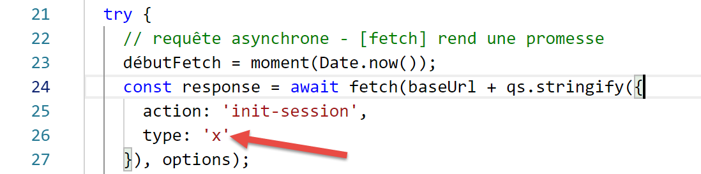

Les fonctions HTTP de Javascript
================================

|image0|

Choix d’une bibliothèque HTTP
-----------------------------

Nous avons fait ici le choix de deux bibliothèques :

EcmaScript 6 a nativement une fonction HTTP appelée **[fetch]** qui
n’est pas implémentée par **[node.js]** (sept 2019). Il existe une
bibliothèque appelée **[node-fetch]** qui permet d’utiliser la fonction
**[fetch]** sous Node. Cette bibliothèque utilise certaines API propres
à **[node.js]**. Un code **[node-fetch]** peut être alors non
transportable à 100 % dans un environnement non **[node]**, dans un
navigateur par exemple ;

Il existe par ailleurs une bibliothèque nommée **[axios]** dédiée aux
requêtes HTTP compatible aussi bien avec **[node.js]** qu’avec les
navigateurs. C’est cette bibliothèque que nous utiliserons au final.

Nous allons présenter un même script écrit avec ces deux bibliothèques
pour montrer que la démarche de codage avec elles est analogue.

Mise en place d’un environnement de travail
-------------------------------------------

Installation du serveur de calcul d’impôt
~~~~~~~~~~~~~~~~~~~~~~~~~~~~~~~~~~~~~~~~~

Ultimement, nous allons écrire une application web avec l’architecture
suivante :

|image1|

**JS** : Javascript

Le code Javascript est client :

-  d’un service de pages ou fragments statiques ;

-  d’un service jSON ;

Le code Javascript est donc un client jSON et à ce titre peut être
organisé en couches **[UI, métier, dao]** (UI : User Interface) comme
l’ont été nos clients jSON écrits en PHP.

Le serveur sera celui du calcul de l’impôt dont nous avons déjà écrit 13
versions. Nous allons en écrire une 14\ :sup:`ième`. Nous commençons
donc par dupliquer, sous Netbeans, le dossier de la version 13, dans le
dossier de la version 14 :

|image2|

-  en **[6]**, nous modifions le fichier **[config.json]** de la version
   14 de la façon suivante :

.. code-block:: javascript 
   :linenos:

   {
       "databaseFilename": "Config/database.json",
       "rootDirectory": "C:/myprograms/laragon-lite/www/php7/scripts-web/impots/version-14",
       "relativeDependencies": [

           "/Entities/BaseEntity.php",
           "/Entities/Simulation.php",
           ...
       "vues": {
           "vue-authentification.php": [700, 221, 400],
           "vue-calcul-impot.php": [200, 300, 341, 350, 800],
           "vue-liste-simulations.php": [500, 600]
       },
       "vue-erreurs": "vue-erreurs.php"
   }

-  ligne 3, nous changeons le dossier racine de l’application ;

Pour accéder à ce serveur, il faut lancer les services **[Laragon]**.

Ceci fait, nous pouvons tester avec **[Postman]** (cf. article
`lien <https://tahe.developpez.com/tutoriels-cours/php7/>`__), cette
nouvelle version du serveur, identique pour l’instant à la version 13.
Nous pouvons utiliser la collection de requêtes utilisées pour tester la
version 12 du serveur de calcul d’impôt :

|image3|

-  en **[1-4]**, utiliser la requête **[init-session-700]** pour
   initialiser une session jSON ;

-  en **[4-5]**, mettre **[version-14]** au lieu de **[version-12]**
   pour tester la version 14 du projet ;

-  à l’exécution on doit recevoir la réponse jS0N **[6]** du serveur ;

La version 14 du serveur est désormais opérationnelle. Nous serons
amenés à la modifier légèrement. Rappelons l’API de ce serveur :

+----------------------+----------------------+----------------------+
| **Action**           | **Rôle**             | **Contexte           |
|                      |                      | d’exécution**        |
+======================+======================+======================+
| init-session         | Sert à fixer le type | Requête **GET        |
|                      | (json, xml, html)    | main.php?action=i    |
|                      | des réponses         | nit-session&type=x** |
|                      | souhaitées           |                      |
|                      |                      | peut être émise à    |
|                      |                      | tout moment          |
+----------------------+----------------------+----------------------+
| auth                 | Autorise ou non un   | Requête **POST       |
| entifier-utilisateur | utilisateur à se     | ma                   |
|                      | connecter            | in.php?action=authen |
|                      |                      | tifier-utilisateur** |
|                      |                      |                      |
|                      |                      | La requête doit      |
|                      |                      | avoir deux           |
|                      |                      | paramètres postés    |
|                      |                      | **[user, password]** |
|                      |                      |                      |
|                      |                      | Ne peut être émise   |
|                      |                      | que si le type de la |
|                      |                      | session (json, xml,  |
|                      |                      | html) est connu      |
+----------------------+----------------------+----------------------+
| calculer-impot       | Fait une simulation  | Requête **POST       |
|                      | de calcul d’impôt    | main.php?act         |
|                      |                      | ion=calculer-impot** |
|                      |                      |                      |
|                      |                      | La requête doit      |
|                      |                      | avoir trois          |
|                      |                      | paramètres postés    |
|                      |                      | **[marié, enfants,   |
|                      |                      | salaire]**           |
|                      |                      |                      |
|                      |                      | Ne peut être émise   |
|                      |                      | que si le type de la |
|                      |                      | session (json, xml,  |
|                      |                      | html) est connu et   |
|                      |                      | l’utilisateur        |
|                      |                      | authentifié          |
+----------------------+----------------------+----------------------+
| lister-simulations   | Demande à voir la    | Requête **GET        |
|                      | liste des            | main.php?action=     |
|                      | simulations opérées  | lister-simulations** |
|                      | depuis le début de   |                      |
|                      | la session           | La requête n’accepte |
|                      |                      | aucun autre          |
|                      |                      | paramètre            |
|                      |                      |                      |
|                      |                      | Ne peut être émise   |
|                      |                      | que si le type de la |
|                      |                      | session (json, xml,  |
|                      |                      | html) est connu et   |
|                      |                      | l’utilisateur        |
|                      |                      | authentifié          |
+----------------------+----------------------+----------------------+
| supprimer-simulation | Supprime une         | Requête **GET        |
|                      | simulation de la     | main.                |
|                      | liste des            | php?action=lister-si |
|                      | simulations          | mulations&numéro=x** |
|                      |                      |                      |
|                      |                      | La requête n’accepte |
|                      |                      | aucun autre          |
|                      |                      | paramètre            |
|                      |                      |                      |
|                      |                      | Ne peut être émise   |
|                      |                      | que si le type de la |
|                      |                      | session (json, xml,  |
|                      |                      | html) est connu et   |
|                      |                      | l’utilisateur        |
|                      |                      | authentifié          |
+----------------------+----------------------+----------------------+
| fin-session          | Termine la session   | Techniquement        |
|                      | de simulations.      | l’ancienne session   |
|                      |                      | web est supprimée et |
|                      |                      | une nouvelle session |
|                      |                      | est créée            |
|                      |                      |                      |
|                      |                      | Ne peut être émise   |
|                      |                      | que si le type de la |
|                      |                      | session (json, xml,  |
|                      |                      | html) est connu et   |
|                      |                      | l’utilisateur        |
|                      |                      | authentifié          |
+----------------------+----------------------+----------------------+

Installation des bibliothèques HTTP du client Javascript
~~~~~~~~~~~~~~~~~~~~~~~~~~~~~~~~~~~~~~~~~~~~~~~~~~~~~~~~

Dans un premier temps, nous travaillerons avec l’architecture suivante :

|image4|

-  en **[1]**, un script console **[node.js]** fait une requête HTTP
   vers le serveur jSON du calcul de l’impôt ;

-  en **[4]**, il reçoit cette réponse et l’affiche sur la console ;

Dans l’exemple n° 1, nous utiliserons les bibliothèques **[node-fetch]**
et **[axios]** puis nous ne conserverons qu’\ **[axios]** pour les
exemples suivants. Nous installons maintenant ces deux bibliothèques
Javascript à partir du terminal de **[VSCode]** :

|image5|

Nous utiliserons également la bibliothèque **[qs]** qui permet
l’encodage URL d’une chaîne de caractères. On se rappelle que cet
encodage est utilisé pour encoder les paramètres d’une requête HTTP GET
ou POST.

|image6|

script [fetch-01]
-----------------

Le script **[fetch-01]** utilise la bibliothèque **[node-fetch]** pour
initialiser une session jSON avec le serveur de calcul d’impôt. Son code
est le suivant :

.. code-block:: javascript 
   :linenos:

   'use strict';

   // imports
   import fetch from 'node-fetch';
   import qs from 'qs';
   import { sprintf } from 'sprintf-js';
   import moment from 'moment';

   // URL de base du serveur de calcul d'impôt
   const baseUrl = 'http://localhost/php7/scripts-web/impots/version-14/main.php?';
   // init session
   async function initSession() {
     // options de la requête HHTP [get /main.php?action=init-session&type=json]
     const options = {
       method: "GET",
       timeout: 2000
     };
     // exécution de la requête HTTP [get /main.php?action=init-session&type=json]
     let débutFetch;
     try {
       // requête asynchrone - [fetch] rend une promesse
       débutFetch = moment(Date.now());
       const response = await fetch(baseUrl + qs.stringify({
         action: 'init-session',
         type: 'json'
       }), options);
       // [response] est l'ensemble de la réponse HTTP du serveur (entêtes HTTP + réponse elle-même)
       // on affiche cette réponse pour voir sa structure
       console.log(sprintf("réponse fetch formatée en json,=%j, %s", response, heure(débutFetch)));
       console.log("réponse fetch en javascript=", response);
       // on peut avoir aux entêtes HTTP
       console.log("entêtes de la réponse=", response.headers);
       // si réponse de type application / json, la réponse json du serveur est obtenue avec la fonction asynchrone [response.json()]
       // dans ce cas le code appelant obtient un objet [Promise]
       // [await] permet d'obtenir la réponse [json] du serveur plutôt que sa promesse
       const débutJson = moment(Date.now());
       const objet = await response.json();
       console.log(sprintf("réponse json=%j, type=%s, %s", objet, typeof (objet), heure(débutJson)));
       return objet;
       // si réponse de type text / plain, la réponse texte du serveur est obtenue avec [response.text()]
       // dans ce cas le code appelant obtient un objet [Promise]
       // [await] permet d'obtenir la réponse [texte] du serveur plutôt que sa promesse
       // const text = await response.text();
       // console.log("réponse texte=", text);
       // return text;
     } catch (error) {
       // on est là parce que le serveur a envoyé un code d'erreur [404 Not Found, ...] accompagné d'un corps vide - on affiche l'erreur pour voir sa structure
       // ou bien parce que le client [fetch] a lancé une exception (réseau inaccesible, ...)
       // on affiche la structure de l'erreur
       console.log(sprintf("error fetch en json=%j, %s", error, heure(débutFetch)));
       console.log("error fetch en javascript=", typeof (error), error);
       // on lance le msg d'erreur reçu
       throw error.message;
     }
   }

   // la fonction main exécute la fonction asynchrone [initSession]
   async function main() {
     try {
       console.log("requête HTTP vers le serveur en cours ---------------------------------------------");
       const response = await initSession();
       console.log("succès ---------------------------------------------");
       console.log("réponse=", response, typeof (response))
     } catch (error) {
       console.log("erreur ---------------------------------------------");
       console.log("erreur=", error, typeof (error));
     }
   }

   // test
   main();

   // utilitaire d'affichage heure et durée
   function heure(début) {
     // heure du moment courant
     const now = moment(Date.now());
     // formatage heure
     let result = "heure=" + now.format("HH:mm:ss:SSS");
     // faut-il calculer une durée ?
     if (début) {
       const durée = now - début;
       const milliseconds = durée % 1000;
       const seconds = Math.floor(durée / 1000);
       // formatage heure + durée
       result = result + sprintf(", durée= %s seconde(s) et %s millisecondes", seconds, milliseconds);
     }
     // résultat
     return result;
   }

**Commentaires**

-  les fonctions HTTP du Javascript sont des fonctions asynchrones. Nous
   utilisons ici ce que nous avons appris dans la section précédente
   (cf. `lien <chap-11.html#fontions_async>`__) ;

-  ligne 24 : pour attendre que la réponse de la fonction asynchrone
   **[fetch]** soit publiée sur la boucle événementielle de
   **[node.js]**, nous utilisons le mot clé **[await]**. Nous savons
   qu’alors que cette instruction doit être dans un code préfixé par le
   mot clé **[async]** (ligne 13) ;

-  lignes 13-56 : nous encapsulons le code HTTP dans la fonction
   asynchrone **[initSession]** ;

-  lignes 59-69 : une seconde fonction asynchrone **[main]** est
   utilisée pour appeler de façon bloquante (async / await) la fonction
   asynchrone **[initSession]** ;

-  ligne 72 : la fonction asynchrone **[main]** est appelée ;

-  bien que l’ensemble du code ressemble à du code synchrone, ce sont
   bien des fonctions asynchrones qui sont exécutées, mais de façon
   bloquante ;

-  ligne 19 : pour initialiser une session jSON avec le serveur de
   calcul d’impôt, il faut lui envoyer la commande HTTP **[get
   /main.php?action=init-session&type=json]**. C’est ce que fait le code
   des lignes 24-27. La syntaxe de **[fetch]** est la suivante
   **[fetch(URL, options)]** avec :

   -  **[URL]** : l’URL interrogée ;

   -  **[options]** : un objet définissant les options de la requête.
      C’est là notamment qu’on définit les entêtes HTTP qu’on veut
      envoyer à la machine cible ;

-  lignes 15-18 : on définit les options de la requête qu’on veut
   faire :

   -  **[method]** : on veut faire un GET ;

   -  **[timeout]** : on veut que le client **[fetch]** n’attende pas
      plus de 2 secondes la réponse du serveur Si ce délai est dépassé,
      **[fetch]** lancera une exception ;

-  ligne 24 : pour obtenir l’URL
   **[/main.php?action=init-session&type=json]**, on utilise la
   bibliohèque **[qs]** pour obtenir l’encodage URL des paramètres
   **[action,type]** du GET. La chaîne obtenue est
   **[init-session&type=json]** qu’on aurait pu construire nous-mêmes.
   On voulait simplement montrer comment obtenir une chaîne URL
   encodée ;

-  ligne 24 : le mot clé **[await]** montre que c’est une tâche
   asynchrone qui est lancée ici et qu’on attend qu’elle publie sa
   réponse sur la boucle événementielle de **[node.js]** ;

-  ligne 24 : dans **[response]**, on obtient un objet complexe qui
   décrit la totalité de la réponse HTTP reçue (entêtes et document) ;

-  lignes 30-31 : on affiche l’objet **[response]** pour voir sa
   structure, d’abord comme chaîne de caractères puis comme objet
   Javascript ;

-  ligne 33 : on affiche les entêtes HTTP envoyés par le serveur ;

-  ligne 38 : on sait que le serveur de calcul d’impôt va envoyer une
   chaîne jSON. Celle-ci est encapsulée dans l’objet **[response]**. On
   peut l’obtenir avec la méthode **[response.json()]**. Cependant cette
   méthode est asynchrone. On écrit donc **[await response.json()]**
   pour obtenir la chaîne jSON qui va être publiée sur la boucle
   événementielle de **[node.js]**. En fait ce n’est pas la chaîne jSON
   qu’on obtient mais l’objet Javascript représenté par celle-ci ;

-  ligne 39 : affichage de la chaîne jSON reçue ;

-  ligne 40 : on rend l’objet Javascript reçu ;

-  ligne 47 : on intercepte une erreur éventuelle de l’instruction
   **[fetch]**. Celle-ci ne lance une exception que si l’opération HTTP
   n’a pu aboutir et qu’aucune réponse du serveur n’a été reçue. Si une
   réponse a été reçue, même avec un code HTTP différent de **[200
   OK]**, **[fetch]** ne lance pas d’exception et la réponse du serveur
   sera disponible ligne 38 ;

-  lignes 51-52 : on affiche l’objet **[error]** reçu par la clause
   **[catch]**, d’abord comme une chaîne jSON puis comme un objet
   Javascript ;

-  ligne 54 : le message d’erreur de **[fetch]** se trouve dans
   **[error.message]** ;

-  lignes 59-69 : la fonction asynchrone **[main]** lance la fonction
   asynchrone **[initSession]** de façon bloquante (await ligne 62) ;

-  ligne 72 : la fonction asynchrone **[main]** est lancée et le code
   principal du script est alors terminé. Le script global lui sera
   terminé lorsque les tâches asynchrones lancées auront publié leurs
   résultats sur la boucle événementielle ;

Les résultats de l’exécution sont les suivants :

**Cas 1** : le serveur Laragon n’est pas lancé

.. code-block:: javascript 
   :linenos:

   [Running] C:\myprograms\laragon-lite\bin\nodejs\node-v10\node.exe -r esm "c:\Data\st-2019\dev\es6\javascript\http\fetch-01.js"
   requête HTTP vers le serveur en cours ---------------------------------------------
   error fetch en json={"message":"network timeout at: http://localhost/php7/scripts-web/impots/version-14/main.php?action=init-session&type=json","type":"request-timeout"}, heure=10:08:48:180, durée= 2 seconde(s) et 62 millisecondes
   error fetch en javascript= object { FetchError: network timeout at: http://localhost/php7/scripts-web/impots/version-14/main.php?action=init-session&type=json
       at Timeout.<anonymous> (c:\Data\st-2019\dev\es6\javascript\node_modules\node-fetch\lib\index.js:1448:13)
       at ontimeout (timers.js:436:11)
       at tryOnTimeout (timers.js:300:5)
       at listOnTimeout (timers.js:263:5)
       at Timer.processTimers (timers.js:223:10)
     message:
      'network timeout at: http://localhost/php7/scripts-web/impots/version-14/main.php?action=init-session&type=json',
     type: 'request-timeout' }
   erreur ---------------------------------------------
   erreur= network timeout at: http://localhost/php7/scripts-web/impots/version-14/main.php?action=init-session&type=json string

   [Done] exited with code=0 in 2.804 seconds

**Commentaires**

-  ligne 3 : la requête HTTP échoue au bout de 2 secondes et 62
   millisecondes à cause du timeout de 2 secondes qu’on avait imposé à
   la requête HTTP ;

-  lignes 4-9 : l’objet Javascript **[error]** intercepté par la clause
   **[catch(error)]**. Cet objet a deux propriétés :

   -  **[FetchError]** : ligne 4 ;

   -  **[message]** : lignes 10-12 ;

-  ligne 14 : le message d’erreur reçu par la fonction asynchrone
   **[main]** ;

**Cas 2** : le serveur Laragon est lancé

.. code-block:: javascript 
   :linenos:

   [Running] C:\myprograms\laragon-lite\bin\nodejs\node-v10\node.exe -r esm "c:\Data\st-2019\dev\es6\javascript\http\fetch-01.js"
   requête HTTP vers le serveur en cours ---------------------------------------------
   réponse fetch formatée en json,={"size":0,"timeout":2000}, heure=10:13:50:814, durée= 0 seconde(s) et 375 millisecondes
   réponse fetch en javascript= Response {
     size: 0,
     timeout: 2000,
     [Symbol(Body internals)]:
      { body:
         PassThrough {
           _readableState: [ReadableState],
           readable: true,
           domain: null,
           _events: [Object],
           _eventsCount: 2,
           _maxListeners: undefined,
           _writableState: [WritableState],
           writable: false,
           allowHalfOpen: true,
           _transformState: [Object] },
        disturbed: false,
        error: null },
     [Symbol(Response internals)]:
      { url:
         'http://localhost/php7/scripts-web/impots/version-14/main.php?action=init-session&type=json',
        status: 200,
        statusText: 'OK',
        headers: Headers { [Symbol(map)]: [Object] },
        counter: 0 } }
   entêtes de la réponse= Headers {
     [Symbol(map)]:
      [Object: null prototype] {
        date: [ 'Sat, 14 Sep 2019 08:13:50 GMT' ],
        server: [ 'Apache/2.4.35 (Win64) OpenSSL/1.1.0i PHP/7.2.11' ],
        'x-powered-by': [ 'PHP/7.2.11' ],
        'cache-control': [ 'max-age=0, private, must-revalidate, no-cache, private' ],
        'set-cookie': [ 'PHPSESSID=99q2iinusmhl55fa600aie2mmu; path=/' ],
        'content-length': [ '86' ],
        connection: [ 'close' ],
        'content-type': [ 'application/json' ] } }
   réponse json={"action":"init-session","état":700,"réponse":"session démarrée avec type [json]"}, type=object, heure=10:13:50:825, durée= 0 seconde(s) et 1 millisecondes
   succès ---------------------------------------------
   réponse= { action: 'init-session',
     'état': 700,
     'réponse': 'session démarrée avec type [json]' } object

   [Done] exited with code=0 in 1.022 seconds

**Commentaires**

-  ligne 3 : **[fetch]** reçoit la réponse du serveur au bout de 375
   ms ;

-  lignes 4-39 : la structure de l’objet Javascript **[response]**
   encapsulant la réponse du serveur. Parmi ses propriétés, certaines
   peuvent nous intéresser :

   -  **[status]** (ligne 25) : code HTTP de la réponse du serveur ;

   -  **[statusText]** (ligne 26) : texte associé à ce code ;

   -  **[headers]** (ligne 27) : les entêtes HTTP de la réponse du
      serveur ;

   -  **[body]** (ligne 8) : représente le document envoyé par le
      serveur. L’instruction **[fetch]** offre des méthodes pour
      l’exploiter ;

-  lignes 29-39 : les entêtes HTTP de la réponse du serveur ;

-  ligne 40 : la fonction asynchrone **[response.json()]** a publié sa
   réponse au bout d’1 milliseconde ;

-  lignes 42-44 : l’objet Javascript reçu par la fonction asynchrone
   **[main]** ;

**Cas 3** : le serveur Laragon est lancé mais on lui envoie une commande
erronée :

|image7|

-  ci-dessus, ligne 26, on passe un type erroné de session au serveur ;

Les résultats de l’exécution sont les suivants :

.. code-block:: javascript 
   :linenos:

   requête HTTP vers le serveur en cours ---------------------------------------------
   réponse fetch formatée en json,={"size":0,"timeout":2000}, heure=10:27:54:114, durée= 0 seconde(s) et 136 millisecondes
   réponse fetch en javascript= Response {
     size: 0,
     timeout: 2000,
     [Symbol(Body internals)]:
      { body:
         PassThrough {
           _readableState: [ReadableState],
           readable: true,
           domain: null,
           _events: [Object],
           _eventsCount: 2,
           _maxListeners: undefined,
           _writableState: [WritableState],
           writable: false,
           allowHalfOpen: true,
           _transformState: [Object] },
        disturbed: false,
        error: null },
     [Symbol(Response internals)]:
      { url:
         'http://localhost/php7/scripts-web/impots/version-14/main.php?action=init-session&type=x',
        status: 400,
        statusText: 'Bad Request',
        headers: Headers { [Symbol(map)]: [Object] },
        counter: 0 } }
   entêtes de la réponse= Headers {
     [Symbol(map)]:
      [Object: null prototype] {
        date: [ 'Sat, 14 Sep 2019 08:27:54 GMT' ],
        server: [ 'Apache/2.4.35 (Win64) OpenSSL/1.1.0i PHP/7.2.11' ],
        'x-powered-by': [ 'PHP/7.2.11' ],
        'cache-control': [ 'max-age=0, private, must-revalidate, no-cache, private' ],
        'set-cookie': [ 'PHPSESSID=5ku9gfok81ikj98hia0meeum57; path=/' ],
        'content-length': [ '79' ],
        connection: [ 'close' ],
        'content-type': [ 'application/json' ] } }
   réponse json={"action":"init-session","état":703,"réponse":"paramètre type=[x] invalide"}, type=object, heure=10:27:54:127, durée= 0 seconde(s) et 2 millisecondes
   succès ---------------------------------------------
   réponse= { action: 'init-session',
     'état': 703,
     'réponse': 'paramètre type=[x] invalide' } object

   [Done] exited with code=0 in 0.712 seconds

-  la réponse du serveur est reçue ligne 2 ;

-  ligne 24 : on peut voir que le code HTTP de la réponse du serveur est
   400, un code d’erreur. Néanmoins, **[fetch]** n’a pas lancé
   d’exception. Tant que **[fetch]** reçoit une réponse du serveur, il
   l’exploite et ne lance pas d’exception ;

-  lignes 41-43 : la réponse obtenue par la fonction asynchrone
   **[main]** ;

script [fetch-02]
-----------------

Le script suivant reprend le script **[fetch-01]** en le débarrassant de
tous les détails inutiles :

.. code-block:: javascript 
   :linenos:

   'use strict';

   // imports
   import fetch from 'node-fetch';
   import qs from 'qs';

   // URL de base du serveur de calcul d'impôt
   const baseUrl = 'http://localhost/php7/scripts-web/impots/version-14/main.php?';
   // init session
   async function initSession() {
     // options de la requête HHTP [get /main.php?action=init-session&type=json]
     const options = {
       method: "GET",
       timeout: 2000
     };
     // exécution de la requête HTTP [get /main.php?action=init-session&type=json]
     const response = await fetch(baseUrl + qs.stringify({
       action: 'init-session',
       type: 'json'
     }), options);
     // résultat reçu en jSON
     return await response.json();
   }

   // la fonction main exécute la fonction asynchrone [initSession]
   async function main() {
     try {
       console.log("requête HTTP vers le serveur en cours ---------------------------------------------");
       const response = await initSession();
       console.log("succès ---------------------------------------------");
       console.log("réponse=", response)
     } catch (error) {
       console.log("erreur ---------------------------------------------");
       console.log("erreur=", error.message);
     }
   }

   // test
   main();

Les résultats d’une exécution normale :

.. code-block:: javascript 
   :linenos:

   [Running] C:\myprograms\laragon-lite\bin\nodejs\node-v10\node.exe -r esm "c:\Data\st-2019\dev\es6\javascript\http\fetch-02.js"
   requête HTTP vers le serveur en cours ---------------------------------------------
   succès ---------------------------------------------
   réponse= { action: 'init-session',
     'état': 700,
     'réponse': 'session démarrée avec type [json]' }

   [Done] exited with code=0 in 0.56 seconds

Les résultats d’une exécution avec exception (on arrête le serveur
Laragon) :

.. code-block:: javascript 
   :linenos:

   [Running] C:\myprograms\laragon-lite\bin\nodejs\node-v10\node.exe -r esm "c:\Data\st-2019\dev\es6\javascript\http\fetch-02.js"
   requête HTTP vers le serveur en cours ---------------------------------------------
   erreur ---------------------------------------------
   erreur= network timeout at: http://localhost/php7/scripts-web/impots/version-14/main.php?action=init-session&type=json

   [Done] exited with code=0 in 2.701 seconds

script [axios-01]
-----------------

On reprend ici le script **[fetch-01]** que l’on réécrit avec la
bibliothèque **[axios]**. On rappelle que notre intérêt pour cette
bibliothèque est qu’elle soit portable entre l’environnement
**[node.js]** et ceux des navigateurs usuels. Cela permet :

-  dans une phase 1, de tester nos scripts dans un environnement
   **[node.js]** ;

-  dans une phase 2, de les porter sur un navigateur ;

Le script **[axios-01]** reprend la structure du script **[fetch-01]** :

.. code-block:: javascript 
   :linenos:

   'use strict';
   import axios from 'axios';

   // configuration par défaut d'axios
   axios.defaults.timeout = 2000;
   axios.defaults.baseURL = 'http://localhost/php7/scripts-web/impots/version-14';

   // init session
   async function initSession(axios) {
     // options de la requête HHTP [get /main.php?action=init-session&type=json]
     const options = {
       method: "GET",
       // paramètres de l'URL
       params: {
         action: 'init-session',
         type: 'json'
       }
     };
     // exécution de la requête HTTP [get /main.php?action=init-session&type=json]
     try {
       // requête asynchrone
       const response = await axios.request('main.php', options);
       // response est l'ensemble de la réponse HTTP du serveur (entêtes HTTP + réponse elle-même)
       // on affiche cette réponse pour voir sa structure
       console.log("réponse axios=", response);
       // la réponse du serveur est dans [response.data]
       return response.data;
     } catch (error) {
       // on est là parce que le serveur a envoyé un code d'erreur [404 Not Found, 500 Internal Server Error, ...]
       // le paramètre [error] est une instance d'exception - elle peut avoir diverses formes
       // on l'affiche pour voir sa structure
       console.log("axios error=", typeof (error), error);
       if (error.response) {
         // le serveur a signalé une erreur dans le statut HTTP mais il a aussi envoyé une réponse
         // alors celle-ci est trouvée dans [error.response.data]
         // on sait que le serveur envoie des réponses jSON de structure {action, état, réponse}
         // et qu'en cas d'erreur, le msg d'erreur est dans [réponse]
         return error.response.data;
       } else {
         // on lance l'erreur
         throw error;
       }
     }
   }

   // la fonction main exécute la fonction asynchrone [initSession]
   async function main() {
     try {
       console.log("requête HTTP vers le serveur en cours ---------------------------------------------");
       const response = await initSession(axios);
       console.log("succès ---------------------------------------------");
       console.log("réponse=", response, typeof (response))
     } catch (error) {
       console.log("erreur ---------------------------------------------");
       console.log("erreur=", error.message);
     }
   }

   // test
   main();

**Commentaires**

-  ligne 2 : on importe la bibliothèque **[axios]** ;

-  lignes 5-6 : configuration par défaut des requêtes HTTP. Les options
   **[axios.defaults]** sont valables pour toutes les requêtes HTTP
   émises par l’objet **[axios]** sans qu’on ait besoin de les rappeler
   à chaque nouvelle requête ;

-  ligne 5 : timeout de 2 secondes pour toutes les requêtes ;

-  ligne 6 : toutes les URL seront exprimées relativement à l’URL de
   base ;

-  ligne 9 : la fonction asynchrone **[initSession]** ;

-  lignes 11-18 : les options de la requête HTTP qui va être émise (en
   plus des options par défaut déjà définies aux lignes 5-6) ;

-  lignes 14-17 : les paramètres de l’URL
   **[action=init-session&type=json]**. L’objet **[params]** sera
   automatiquement transformée en chaîne de caractères URL encodée ;

-  ligne 22 : appel bloquant de la fonction asynchrone
   **[axios.request]**. Le 1\ :sup:`er` paramètre est l’URL cible
   construite comme **[main.php]** ajouté à l’URL de base définie ligne
   6. Le second paramètre est l’objet **[options]** des lignes 11-18 ;

-  ligne 25 : **[response]** est un objet Javascript encapsulant la
   totalité de la réponse HTTP du serveur (entêtes HTTP + document
   réponse). On l’affiche pour voir sa structure Javascript ;

-  ligne 27 : si le serveur a envoyé un document, alors il est trouvé
   dans **[response.data]**. Ici nous savons que le serveur envoie une
   réponse jSON accompagnée de l’entête HTTP **[Content-type :
   application/json]**. La présence de cet entête fait que **[axios]**
   désérialise automatiquement **[response.data]** en un objet
   Javascript ;

-  ligne 28 : la fonction **[axios]** peut lancer une exception. C’est
   là que **[axios]** diffère de **[fetch]**. Une exception est lancée
   dans les cas suivants :

   -  la requête HTTP n’a pas pu être émise (erreur côté client) ;

   -  le serveur a envoyé un code HTTP d’erreur (400, 404, 500, …) (ce
      point est en fait configurable). On rappelle que si ce code HTTP
      est accompagné d’une réponse, **[fetch]** ne lançait pas
      d’exception alors qu’\ **[axios]** en lance une. Néanmoins, si le
      code HTTP d’erreur est accompagné d’un document, celui-ci est mis
      dans **[error.response]** ;

-  ligne 32 : on affiche la structure Javascript de l’objet
   **[error]** ;

-  lignes 33-38 : si l’objet **[error]** contient un objet
   **[response]** alors c’est cette réponse qu’on rend au code
   appelant ;

-  lignes 39-42 : dans les autres cas, on remonte l’objet **[error]** au
   code appelant ;

-  lignes 47-57 : la fonction asynchrone **[main]** ;

-  ligne 50 : appel bloquant à la fonction asynchrone **[initSession]**.
   On récupère la réponse jSON du serveur comme un objet Javascript ;

-  lignes 53-56 : interception de l’erreur éventuelle. Le message
   d’erreur est dans **[error.message]** ;

Les résultats de l’exécution sont les suivants :

**Cas 1** : le serveur Laragon n’est pas lancé

.. code-block:: javascript 
   :linenos:

   [Running] C:\myprograms\laragon-lite\bin\nodejs\node-v10\node.exe -r esm "c:\Data\st-2019\dev\es6\javascript\http\axios-01.js"
   requête HTTP vers le serveur en cours ---------------------------------------------
   axios error= object { Error: timeout of 2000ms exceeded
       at createError (c:\Data\st-2019\dev\es6\javascript\node_modules\axios\lib\core\createError.js:16:15)
       at Timeout.handleRequestTimeout (c:\Data\st-2019\dev\es6\javascript\node_modules\axios\lib\adapters\http.js:252:16)
       at ontimeout (timers.js:436:11)
       at tryOnTimeout (timers.js:300:5)
       at listOnTimeout (timers.js:263:5)
       at Timer.processTimers (timers.js:223:10)
     config:
      { url:
         'http://localhost/php7/scripts-web/impots/version-14/main.php',
        method: 'get',
        params: { action: 'init-session', type: 'json' },
        headers:
         { Accept: 'application/json, text/plain, */*',
           'User-Agent': 'axios/0.19.0' },
        baseURL: 'http://localhost/php7/scripts-web/impots/version-14',
        transformRequest: [ [Function: transformRequest] ],
        transformResponse: [ [Function: transformResponse] ],
        timeout: 2000,
        adapter: [Function: httpAdapter],
        xsrfCookieName: 'XSRF-TOKEN',
        xsrfHeaderName: 'X-XSRF-TOKEN',
        maxContentLength: -1,
        validateStatus: [Function: validateStatus],
        data: undefined },
     code: 'ECONNABORTED',
     request:
      Writable {
        _writableState:
         WritableState {
           objectMode: false,
           highWaterMark: 16384,
           finalCalled: false,
           needDrain: false,
           ending: false,
           ended: false,
           finished: false,
           destroyed: false,
           decodeStrings: true,
           defaultEncoding: 'utf8',
           length: 0,
           writing: false,
           corked: 0,
           sync: true,
           bufferProcessing: false,
           onwrite: [Function: bound onwrite],
           writecb: null,
           writelen: 0,
           bufferedRequest: null,
           lastBufferedRequest: null,
           pendingcb: 0,
           prefinished: false,
           errorEmitted: false,
           emitClose: true,
           bufferedRequestCount: 0,
           corkedRequestsFree: [Object] },
        writable: true,
        domain: null,
        _events:
         [Object: null prototype] {
           response: [Function: handleResponse],
           error: [Function: handleRequestError] },
        _eventsCount: 2,
        _maxListeners: undefined,
        _options:
         { protocol: 'http:',
           maxRedirects: 21,
           maxBodyLength: 10485760,
           path:
            '/php7/scripts-web/impots/version-14/main.php?action=init-session&type=json',
           method: 'GET',
           headers: [Object],
           agent: undefined,
           auth: undefined,
           hostname: 'localhost',
           port: null,
           nativeProtocols: [Object],
           pathname: '/php7/scripts-web/impots/version-14/main.php',
           search: '?action=init-session&type=json' },
        _redirectCount: 0,
        _redirects: [],
        _requestBodyLength: 0,
        _requestBodyBuffers: [],
        _onNativeResponse: [Function],
        _currentRequest:
         ClientRequest {
           domain: null,
           _events: [Object],
           _eventsCount: 6,
           _maxListeners: undefined,
           output: [],
           outputEncodings: [],
           outputCallbacks: [],
           outputSize: 0,
           writable: true,
           _last: true,
           chunkedEncoding: false,
           shouldKeepAlive: false,
           useChunkedEncodingByDefault: false,
           sendDate: false,
           _removedConnection: false,
           _removedContLen: false,
           _removedTE: false,
           _contentLength: 0,
           _hasBody: true,
           _trailer: '',
           finished: true,
           _headerSent: true,
           socket: [Socket],
           connection: [Socket],
           _header:
            'GET /php7/scripts-web/impots/version-14/main.php?action=init-session&type=json HTTP/1.1\r\nAccept: application/json, text/plain, */*\r\nUser-Agent: axios/0.19.0\r\nHost: localhost\r\nConnection: close\r\n\r\n',
           _onPendingData: [Function: noopPendingOutput],
           agent: [Agent],
           socketPath: undefined,
           timeout: undefined,
           method: 'GET',
           path:
            '/php7/scripts-web/impots/version-14/main.php?action=init-session&type=json',
           _ended: false,
           res: null,
           aborted: 1568528450762,
           timeoutCb: null,
           upgradeOrConnect: false,
           parser: [HTTPParser],
           maxHeadersCount: null,
           _redirectable: [Circular],
           [Symbol(isCorked)]: false,
           [Symbol(outHeadersKey)]: [Object] },
        _currentUrl:
         'http://localhost/php7/scripts-web/impots/version-14/main.php?action=init-session&type=json' },
     response: undefined,
     isAxiosError: true,
     toJSON: [Function] }
   erreur ---------------------------------------------
   erreur= timeout of 2000ms exceeded

   [Done] exited with code=0 in 2.784 seconds

**Commentaires**

-  lignes 33-136 : l’objet **[error]** contient de nombreuses
   informations ;

   -  **[Error]**, lignes 3-9 : une description de l’erreur qui s’est
      produite ;

   -  **[config]**, lignes 10-27 : la configuration de la requête HTTP
      qui a mené à cette erreur ;

   -  **[config.url]**, lignes 11-12 : l’URL cible ;

   -  **[config.method]**, ligne 13 : méthode de la requête ;

   -  **[config.params]**, ligne 14 : les paramètres de l’URL ;

   -  **[config.headers]**, lignes 16-17 : les entêtes HTTP de la
      requête ;

   -  **[config.baseURL]**, ligne 18 : l’URL de base de l’URL cible ;

   -  **[config.timeout]**, ligne 21 : le timeout de la requête ;

   -  **[code]**, ligne 28 : un code d’erreur ;

   -  **[request]**, lignes 29-133 : une description détaillée de la
      requête HTTP. On remarquera que la plupart des propriétés sont
      préfixées par l’underscore \_ montrant par là que ce sont des
      propriétés internes à l’objet **[request]** pas destinées à être
      exploitées directement par le développeur ;

   -  **[response]**, ligne 134 : la réponse du serveur, ici
      inexistante ;

-  ligne 138 : le message d’erreur affiché par la fonction **[main]** ;

**Cas 2** : le serveur Laragon est lancé

.. code-block:: javascript 
   :linenos:

   [Running] C:\myprograms\laragon-lite\bin\nodejs\node-v10\node.exe -r esm "c:\Data\st-2019\dev\es6\javascript\http\axios-01.js"
   requête HTTP vers le serveur en cours ---------------------------------------------
   réponse axios= { status: 200,
     statusText: 'OK',
     headers:
      { date: 'Sun, 15 Sep 2019 07:09:26 GMT',
        server: 'Apache/2.4.35 (Win64) OpenSSL/1.1.0i PHP/7.2.11',
        'x-powered-by': 'PHP/7.2.11',
        'cache-control': 'max-age=0, private, must-revalidate, no-cache, private',
        'set-cookie': [ 'PHPSESSID=uas6lugtblstktcifpd8e5irm6; path=/' ],
        'content-length': '86',
        connection: 'close',
        'content-type': 'application/json' },
     config:
      { url:
         'http://localhost/php7/scripts-web/impots/version-14/main.php',
        method: 'get',
        params: { action: 'init-session', type: 'json' },
        headers:
         { Accept: 'application/json, text/plain, */*',
           'User-Agent': 'axios/0.19.0' },
        baseURL: 'http://localhost/php7/scripts-web/impots/version-14',
        transformRequest: [ [Function: transformRequest] ],
        transformResponse: [ [Function: transformResponse] ],
        timeout: 2000,
        adapter: [Function: httpAdapter],
        xsrfCookieName: 'XSRF-TOKEN',
        xsrfHeaderName: 'X-XSRF-TOKEN',
        maxContentLength: -1,
        validateStatus: [Function: validateStatus],
        data: undefined },
     request:
      ClientRequest {
        domain: null,
        _events:
         [Object: null prototype] {
           socket: [Function],
           abort: [Function],
           aborted: [Function],
           error: [Function],
           timeout: [Function],
           prefinish: [Function: requestOnPrefinish] },
        _eventsCount: 6,
        _maxListeners: undefined,
        output: [],
        outputEncodings: [],
        outputCallbacks: [],
        outputSize: 0,
        writable: true,
        _last: true,
        chunkedEncoding: false,
        shouldKeepAlive: false,
        useChunkedEncodingByDefault: false,
        sendDate: false,
        _removedConnection: false,
        _removedContLen: false,
        _removedTE: false,
        _contentLength: 0,
        _hasBody: true,
        _trailer: '',
        finished: true,
        _headerSent: true,
        socket:
         Socket {
           connecting: false,
           _hadError: false,
           _handle: [TCP],
           _parent: null,
           _host: 'localhost',
           _readableState: [ReadableState],
           readable: true,
           domain: null,
           _events: [Object],
           _eventsCount: 7,
           _maxListeners: undefined,
           _writableState: [WritableState],
           writable: false,
           allowHalfOpen: false,
           _sockname: null,
           _pendingData: null,
           _pendingEncoding: '',
           server: null,
           _server: null,
           parser: null,
           _httpMessage: [Circular],
           [Symbol(asyncId)]: 6,
           [Symbol(lastWriteQueueSize)]: 0,
           [Symbol(timeout)]: null,
           [Symbol(kBytesRead)]: 0,
           [Symbol(kBytesWritten)]: 0 },
        connection:
         Socket {
           connecting: false,
           _hadError: false,
           _handle: [TCP],
           _parent: null,
           _host: 'localhost',
           _readableState: [ReadableState],
           readable: true,
           domain: null,
           _events: [Object],
           _eventsCount: 7,
           _maxListeners: undefined,
           _writableState: [WritableState],
           writable: false,
           allowHalfOpen: false,
           _sockname: null,
           _pendingData: null,
           _pendingEncoding: '',
           server: null,
           _server: null,
           parser: null,
           _httpMessage: [Circular],
           [Symbol(asyncId)]: 6,
           [Symbol(lastWriteQueueSize)]: 0,
           [Symbol(timeout)]: null,
           [Symbol(kBytesRead)]: 0,
           [Symbol(kBytesWritten)]: 0 },
        _header:
         'GET /php7/scripts-web/impots/version-14/main.php?action=init-session&type=json HTTP/1.1\r\nAccept: application/json, text/plain, */*\r\nUser-Agent: axios/0.19.0\r\nHost: localhost\r\nConnection: close\r\n\r\n',
        _onPendingData: [Function: noopPendingOutput],
        agent:
         Agent {
           domain: null,
           _events: [Object],
           _eventsCount: 1,
           _maxListeners: undefined,
           defaultPort: 80,
           protocol: 'http:',
           options: [Object],
           requests: {},
           sockets: [Object],
           freeSockets: {},
           keepAliveMsecs: 1000,
           keepAlive: false,
           maxSockets: Infinity,
           maxFreeSockets: 256 },
        socketPath: undefined,
        timeout: undefined,
        method: 'GET',
        path:
         '/php7/scripts-web/impots/version-14/main.php?action=init-session&type=json',
        _ended: true,
        res:
         IncomingMessage {
           _readableState: [ReadableState],
           readable: false,
           domain: null,
           _events: [Object],
           _eventsCount: 3,
           _maxListeners: undefined,
           socket: [Socket],
           connection: [Socket],
           httpVersionMajor: 1,
           httpVersionMinor: 0,
           httpVersion: '1.0',
           complete: true,
           headers: [Object],
           rawHeaders: [Array],
           trailers: {},
           rawTrailers: [],
           aborted: false,
           upgrade: false,
           url: '',
           method: null,
           statusCode: 200,
           statusMessage: 'OK',
           client: [Socket],
           _consuming: false,
           _dumped: false,
           req: [Circular],
           responseUrl:
            'http://localhost/php7/scripts-web/impots/version-14/main.php?action=init-session&type=json',
           redirects: [] },
        aborted: undefined,
        timeoutCb: null,
        upgradeOrConnect: false,
        parser: null,
        maxHeadersCount: null,
        _redirectable:
         Writable {
           _writableState: [WritableState],
           writable: true,
           domain: null,
           _events: [Object],
           _eventsCount: 2,
           _maxListeners: undefined,
           _options: [Object],
           _redirectCount: 0,
           _redirects: [],
           _requestBodyLength: 0,
           _requestBodyBuffers: [],
           _onNativeResponse: [Function],
           _currentRequest: [Circular],
           _currentUrl:
            'http://localhost/php7/scripts-web/impots/version-14/main.php?action=init-session&type=json' },
        [Symbol(isCorked)]: false,
        [Symbol(outHeadersKey)]:
         [Object: null prototype] { accept: [Array], 'user-agent': [Array], host: [Array] } },
     data:
      { action: 'init-session',
        'état': 700,
        'réponse': 'session démarrée avec type [json]' } }
   succès ---------------------------------------------
   réponse= { action: 'init-session',
     'état': 700,
     'réponse': 'session démarrée avec type [json]' } object

   [Done] exited with code=0 in 1.115 seconds

**Commentaires**

-  lignes 3-203 : l’objet Javascript **[response]** qui encapsule la
   réponse HTTP du serveur ;

-  ligne 3, **[status]** : le code HTTP de la réponse ;

-  ligne 4, **[statusText]** : le texte associé au code HTTP précédent ;

-  lignes 5-13, **[headers]** : les entêtes HTTP de la réponse :

   -  ligne 10, **[Set-Cookie]** : le cookie de session ;

   -  ligne 13, **[Content-Type]** : le type du document envoyé par le
      serveur ;

-  lignes 14-31, **[config]** : la configuration de la requête HTTP
   émise ;

-  lignes 32-199, **[request]** : l’objet Javascript détaillant la
   requête HTTP émise ;

-  lignes 200-203, **[request.data]** : l’objet Javascript encapsulant
   la réponse jSON du serveur ;

-  lignes 205-207 : la réponse récupérée par la fonction asynchrone
   **[main]** ;

**Cas 3** : on fait une requête **[init-session]** erronée au serveur
Laragon ;

|image8|

Les résultats de l’exécution sont les suivants :

.. code-block:: javascript 
   :linenos:

   [Running] C:\myprograms\laragon-lite\bin\nodejs\node-v10\node.exe -r esm "c:\Data\st-2019\dev\es6\javascript\http\axios-01.js"
   requête HTTP vers le serveur en cours ---------------------------------------------
   axios error= object { Error: Request failed with status code 400
      ...
     config:
      { url:
         'http://localhost/php7/scripts-web/impots/version-14/main.php',
        ...
        data: undefined },
     request:
      ...
        [Symbol(outHeadersKey)]:
         [Object: null prototype] { accept: [Array], 'user-agent': [Array], host: [Array] } },
     response:
      { status: 400,
        statusText: 'Bad Request',
        headers:
         { date: 'Sun, 15 Sep 2019 07:25:58 GMT',
           server: 'Apache/2.4.35 (Win64) OpenSSL/1.1.0i PHP/7.2.11',
           'x-powered-by': 'PHP/7.2.11',
           'cache-control': 'max-age=0, private, must-revalidate, no-cache, private',
           'set-cookie': [Array],
           'content-length': '79',
           connection: 'close',
           'content-type': 'application/json' },
        config:
         { url:
            'http://localhost/php7/scripts-web/impots/version-14/main.php',
           ...
           data: undefined },
        request:
         ...
           [Symbol(outHeadersKey)]: [Object] },
        data:
         { action: 'init-session',
           'état': 703,
           'réponse': 'paramètre type=[x] invalide' } },
     isAxiosError: true,
     toJSON: [Function] }
   succès ---------------------------------------------
   réponse= { action: 'init-session',
     'état': 703,
     'réponse': 'paramètre type=[x] invalide' } object

   [Done] exited with code=0 in 0.69 seconds

Parce que le serveur a répondu avec un code HTTP 400 (ligne 15),
**[axios]** a lancé une exception (encore une fois ce comportement est
configurable). Bien que **[axios]** ait lancé une exception, on obtient
bien la réponse HTTP du serveur dans **[error.response]** (ligne 14) et
le document jSON envoyé **[error.response.data]** (ligne 34). Lignes
41-43 : la fonction **[main]** récupère correctement la réponse jSON du
serveur.

script [axios-02]
-----------------

Maintenant que nous avons détaillé les objets manipulés par la
bibliothèque **[axios]** lors d’une requête HTTP, on peut réécrire le
script **[axios-01]** de la façon suivante :

.. code-block:: javascript 
   :linenos:

   'use strict';
   import axios from 'axios';

   // configuration par défaut d'axios
   axios.defaults.timeout = 2000;
   axios.defaults.baseURL = 'http://localhost/php7/scripts-web/impots/version-14';

   // init session
   async function initSession(axios) {
     // options de la requête HHTP [get /main.php?action=init-session&type=json]
     const options = {
       method: "GET",
       // paramètres de l'URL
       params: {
         action: 'init-session',
         type: 'json'
       }
     };
     try {
       // exécution de la requête HTTP [get /main.php?action=init-session&type=json]
       const response = await axios.request('main.php', options);
       // la réponse du serveur est dans [response.data]
       return response.data;
     } catch (error) {
       // réponse du serveur
       if (error.response) {
         // la réponse jSON est dans [error.response.data]
         return error.response.data;
       } else {
         // on relance l'erreur
         throw error;
       }
     }
   }

   // la fonction main exécute la fonction asynchrone [initSession]
   async function main() {
     try {
       console.log("requête HTTP vers le serveur en cours ---------------------------------------------");
       const response = await initSession(axios);
       console.log("succès ---------------------------------------------");
       console.log("réponse=", response, typeof (response))
     } catch (error) {
       console.log("erreur ---------------------------------------------");
       console.log("erreur=", error.message);
     }
   }

   // test
   main();

script [axios-03]
-----------------

Le script **[axios-03]** reprend la méthodogie du script **[axios-02]**.
On ajoute cette fois la requête HTTP **[authentifier-utilisateur]** vers
le serveur qui se fait à l’aide d’un POST :

.. code-block:: javascript 
   :linenos:

   'use strict';
   import axios from 'axios';
   import qs from 'qs'

   // configuration axios
   axios.defaults.timeout = 2000;
   axios.defaults.baseURL = 'http://localhost/php7/scripts-web/impots/version-14';

   // init session
   async function initSession(axios) {
     // options de la requête HHTP [get /main.php?action=init-session&type=json]
     const options = {
       method: "GET",
       // paramètres de l'URL
       params: {
         action: 'init-session',
         type: 'json'
       }
     };
     try {
       // exécution de la requête HTTP [get /main.php?action=init-session&type=json]
       const response = await axios.request('main.php', options);
       // la réponse du serveur est dans [response.data]
       return response.data;
     } catch (error) {
       // réponse du serveur
       if (error.response) {
         // la réponse jSON est dans [error.response.data]
         return error.response.data;
       } else {
         // on relance l'erreur
         throw error;
       }
     }
   }

   async function authentifierUtilisateur(axios, user, password) {
     // options de la requête HHTP [POST /main.php?action=authentifier-utilisateur]
     const options = {
       method: "POST",
       headers: {
         'Content-type': 'application/x-www-form-urlencoded',
       },
       // corps du POST
       data: qs.stringify({
         user: user,
         password: password
       }),
       // paramètres de l'URL
       params: {
         action: 'authentifier-utilisateur'
       }
     };
     try {
       // exécution de la requête HTTP [post /main.php?action=authentifier-utilisateur]
       const response = await axios.request('main.php', options);
       // la réponse du serveur est dans [response.data]
       return response.data;
     } catch (error) {
       // réponse du serveur
       if (error.response) {
         // la réponse jSON est dans [error.response.data]
         return error.response.data;
       } else {
         // on relance l'erreur
         throw error;
       }
     }
   }

   // la fonction main exécute les fonctions asynchrones une par une
   async function main() {
     try {
       // init-session
       console.log("action init-session en cours ---------------------------------------------");
       const response1 = await initSession(axios);
       console.log("succès ---------------------------------------------");
       console.log("réponse=", response1);
       // authentifier-utilisateur
       console.log("action authentifier-utilisateur en cours ---------------------------------------------");
       const response2 = await authentifierUtilisateur(axios, 'admin', 'admin');
       console.log("succès ---------------------------------------------");
       console.log("réponse=", response2)
     } catch (error) {
       console.log("erreur ---------------------------------------------");
       console.log("erreur=", error);
     }
   }

   // test
   main();

**Commentaires**

-  lignes 38-70 : la fonction asynchrone **[authentifierUtilisateur]** ;

-  ligne 39 : il faut faire la requête **[POST
   /main.php?action=authentifier-utilisateur]** ;

-  lignes 40-54 : les options de la requête HTTP ;

-  ligne 41 : c’est un POST ;

-  lignes 42-44 : les paramètres du POST seront URL encodés dans un
   document que le client envoie avec sa requête ;

-  lignes 46-49 : la propriété **[data]** doit contenir la chaîne du
   POST URL encodée. Pour cela, on utilise ici la bibliothèque **[qs]**
   importée ligne 3 ;

-  lignes 55-69 : pour l’exécution de la requête, on retrouve le même
   code que dans la méthode **[initSession]** ;

-  lignes 73-89 : la méthode **[asynchrone]** appelle successivement, de
   manière bloquante, les méthodes **[initSession,
   authentifierUtilisateur]**, lignes 77 et 82 ;

-  ligne 82 : on utilise le couple (admin, admin) comme identifiants de
   connexion. On sait qu’ils sont reconnus par le serveur ;

Les résultats de l’exécution sont les suivants :

.. code-block:: javascript 
   :linenos:

   [Running] C:\myprograms\laragon-lite\bin\nodejs\node-v10\node.exe -r esm "c:\Data\st-2019\dev\es6\javascript\http\axios-03.js"
   action init-session en cours ---------------------------------------------
   succès ---------------------------------------------
   réponse= { action: 'init-session',
     'état': 700,
     'réponse': 'session démarrée avec type [json]' }
   action authentifier-utilisateur en cours ---------------------------------------------
   succès ---------------------------------------------
   réponse= { action: 'authentifier-utilisateur',
     'état': 103,
     'réponse':
      [ 'pas de session en cours. Commencer par action [init-session]' ] }

   [Done] exited with code=0 in 0.834 seconds

-  lignes 9-12 : l’authentification utilisateur échoue : le serveur n’a
   pas retenu le fait qu’on avait initié une session jSON. Cela vient du
   fait qu’on n’a pas renvoyé le cookie de session envoyé en réponse à
   la 1ère requête **[init-session]** ;

script [axios-04]
-----------------

Le script **[axios-04]** amène deux améliorations au script
**[axios-03]** :

-  il gère le cookie de session ;

-  il factorise dans une fonction **[getRemoteData]** ce qui est commun
   aux fonctions **[initSession]** et **[authentifierUtilisateur]** ;

.. code-block:: javascript 
   :linenos:

   'use strict';
   import axios from 'axios';
   import qs from 'qs'

   // configuration axios
   axios.defaults.timeout = 2000;
   axios.defaults.baseURL = 'http://localhost/php7/scripts-web/impots/version-14';

   // cookie de session
   const sessionCookieName = "PHPSESSID";
   let sessionCookie = '';

   // init session
   async function initSession(axios) {
     // options de la requête HHTP [get /main.php?action=init-session&type=json]
     const options = {
       method: "GET",
       // paramètres de l'URL
       params: {
         action: 'init-session',
         type: 'json'
       }
     };
     // exécution de la requête HTTP
     return await getRemoteData(axios, options);
   }

   async function authentifierUtilisateur(axios, user, password) {
     // options de la requête HHTP [post /main.php?action=authentifier-utilisateur]
     const options = {
       method: "POST",
       headers: {
         'Content-type': 'application/x-www-form-urlencoded',
       },
       // corps du POST
       data: qs.stringify({
         user: user,
         password: password
       }),
       // paramètres de l'URL
       params: {
         action: 'authentifier-utilisateur'
       }
     };
     // exécution de la requête HTTP
     return await getRemoteData(axios, options);
   }

   async function getRemoteData(axios, options) {
     // pour le cookie de session
     if (!options.headers) {
       options.headers = {};
     }
     options.headers.Cookie = sessionCookie;
     // exécution de la requête HTTP
     let response;
     try {
       // requête asynchrone
       response = await axios.request('main.php', options);
     } catch (error) {
       // le paramètre [error] est une instance d'exception - elle peut avoir diverses formes
       if (error.response) {
         // la réponse du serveur est dans [error.response]
         response = error.response;
       } else {
         // on relance l'erreur
         throw error;
       }
     }
     // response est l'ensemble de la réponse HTTP du serveur (entêtes HTTP + réponse elle-même)
     // on récupère le cookie de session s'il existe
     const setCookie = response.headers['set-cookie'];
     if (setCookie) {
       // setCookie est un tableau
       // on cherche le cookie de session dans ce tableau
       let trouvé = false;
       let i = 0;
       while (!trouvé && i < setCookie.length) {
         // on cherche le cookie de session
         const results = RegExp('^(' + sessionCookieName + '.+?);').exec(setCookie[i]);
         if (results) {
           // on mémorise le cookie de session
           // eslint-disable-next-line require-atomic-updates
           sessionCookie = results[1];
           // on a trouvé
           trouvé = true;
         } else {
           // élément suivant
           i++;
         }
       }
     }
     // la réponse du serveur est dans [response.data]
     return response.data;
   }

   // la fonction main exécute les fonctions asynchrones une par une
   async function main() {
     try {
       // init-session
       console.log("action init-session en cours ---------------------------------------------");
       const response1 = await initSession(axios);
       console.log("succès ---------------------------------------------");
       console.log("réponse=", response1);
       // authentifier-utilisateur
       console.log("action authentifier-utilisateur en cours ---------------------------------------------");
       const response2 = await authentifierUtilisateur(axios, 'admin', 'admin');
       console.log("succès ---------------------------------------------");
       console.log("réponse=", response2)
     } catch (error) {
       console.log("erreur ---------------------------------------------");
       console.log("erreur=", error.message);
     }
   }

   // test
   main();

**Commentaires**

-  lignes 14-26 : la fonction **[initSession]**. Elle se contente
   désormais de préparer la requête HTTP à envoyer au serveur mais ne
   l’exécute pas. Elle confie ce rôle à la méthode **[getRemoteDate]**
   des lignes 49-95 ;

-  lignes 28-47 : la fonction **[authentifierUtilisateur]** suit la même
   démarche ;

-  ligne 49 : la fonction **[getRemoteData]** reçoit les deux
   informations qui lui permettent d’exécuter une requête HTTP:

   -  **[axios]**, l’objet qui va se charger d’envoyer la requête et de
      recevoir la réponse ;

   -  **[options]**, les options de configuration de la requête à
      envoyer au serveur ;

-  ligne 59 : exécution de la requête et attente bloquante de sa réponse
   jSON ;

-  lignes 60-68 : gestion de l’éventuelle exception ;

-  ligne 64 : on récupère la réponse qui peut être encapsulée dans
   l’objet d’erreur ;

-  ligne 67 : si le serveur a lancé une exception sans y inclure la
   réponse du serveur, alors on remonte l’erreur reçue au code
   appelant ;

-  la fonction **[getRemoteData]** gère le cookie de session :

   -  il le mémorise dans la variable **[sessionCookie]** (ligne 11)
      lorsqu’il le reçoit la 1ère fois ;

   -  il le renvoie ensuite à chaque nouvelle requête HTTP ;

-  ligne 72-92 : **[getRemoteData]** analyse chaque réponse du serveur
   pour savoir s’il a envoyé l’entête HTTP **[Set-Cookie]**. On sait que
   le serveur envoie un cookie de session nommé **[PHPSESSID]** (ligne
   10). C’est donc ce cookie que l’on recherche (ligne 10) ;

-  ligne 72 : on récupère les entêtes HTTP **[Set-Cookie]** s’ils
   existent (la casse n’a pas d’importance). Il peut y avoir en effet
   plusieurs entêtes **[Set-Cookie]** et c’est donc un tableau que l’on
   récupère ;

-  ligne 73 : si on a récupéré un tableau de cookies ;

-  lignes 78-90 : on cherche le cookie de session parmi tous les cookies
   du tableau ;

-  ligne 80 : l’expression relationnelle qui permet de chercher le
   cookie de session dans le cookie n° i ;

-  ligne 81 : si la comparaison a ramené des résultats ;

-  ligne 84 : on a dans results\ **[1]**, la 1ère parenthèse du modèle
   de l’expression relationnelle, ç-à-d (PHPSESSID=xxxx) jusqu’au ; (non
   inclus) qui termine le cookie de session ;

-  lignes 50-54 : à chaque requête, le cookie de session est inclus dans
   les entêtes HTTP de la requête. La 1ère fois, ce cookie est vide et
   sera alors ignoré par le serveur ;

Les résultats de l’exécution sont les suivants :

.. code-block:: javascript 
   :linenos:

   [Running] C:\myprograms\laragon-lite\bin\nodejs\node-v10\node.exe -r esm "c:\Data\st-2019\dev\es6\javascript\http\axios-04.js"
   action init-session en cours ---------------------------------------------
   succès ---------------------------------------------
   réponse= { action: 'init-session',
     'état': 700,
     'réponse': 'session démarrée avec type [json]' }
   action authentifier-utilisateur en cours ---------------------------------------------
   succès ---------------------------------------------
   réponse= { action: 'authentifier-utilisateur',
     'état': 200,
     'réponse': 'Authentification réussie [admin, admin]' }

   [Done] exited with code=0 in 0.982 seconds

