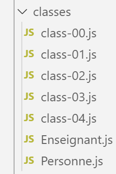

Les classes
===========

|image0|

Nous introduisons ici les classes d’ECMAScript 6. Tout d’abord nous
montrons que les fonctions peuvent être déjà utilisées comme des
classes.

script [class-00]
-----------------

Le script suivant montre une utilisation inhabituelle de fonctions. On
les utilise ici comme des objets.

.. code-block:: javascript 
   :linenos:

   'use strict';
   // une fonction peut être utilisée comme un objet

   // une coquille vide
   function f() {

   }
   // à qui on attribue des propriétés de l'extérieur
   f.prop1 = "val1";
   f.show = function () {
     console.log(this.prop1);
   }
   // utilisation de f
   f.show();

   // une fonction g fonctionnant comme une classe
   function g() {
     this.prop2 = "val2";
     this.show = function () {
       console.log(this.prop2);
     }
   }
   // instanciation de la fonction avec [new]
   new g().show();

**Commentaires**

-  lignes 5-7 : le corps de la fonction f ne définit aucune propriété ;

-  lignes 9-12 : on donne de l’extérieur des propriétés à la fonction
   f ;

-  ligne 14 : utilisation de la function (objet) f. Notez qu’on n’écrit
   pas **[f()]** mais simplement **[f]**. On a là la notation d’un
   objet ;

-  lignes 17-22 : on définit une fonction **[g]** comme si c’était une
   classe avec propriétés et méthodes ;

-  ligne 24 : la fonction **[g]** est instanciée par **[new g()]** ;

**Résultats de l’exécution**

.. code-block:: javascript 
   :linenos:

   [Running] C:\myprograms\laragon-lite\bin\nodejs\node-v10\node.exe -r esm "c:\Data\st-2019\dev\es6\javascript\classes\class-00.js"
   val1
   val2

ES6 a introduit la notion de classe qui nous permet désormais d’éviter
de passer par des fonctions pour avoir des classes.

script [class-01]
-----------------

Le script **[class-01]** présente une classe **[Personne]** :

.. code-block:: javascript 
   :linenos:

   // classe
   class Personne {

     // constructeur
     constructor(nom, prénom, âge) {
       this.nom = nom;
       this.prénom = prénom;
       this.âge = âge;
     }

     // getters et setters
     get nom() {
       return this._nom;
     }
     set nom(value) {
       this._nom = value;
     }

     get prénom() {
       return this._prénom;
     }
     set prénom(value) {
       this._prénom = value;
     }

     get âge() {
       return this._âge;
     }
     set âge(value) {
       this._âge = value;
     }

     // toString en JSON
     toString() {
       return JSON.stringify(this);
     }
   }

   // appel de la classe
   function main() {
     const personne = new Personne("Poirot", "Hercule", 66);
     console.log("personne=", personne.toString(), typeof (personne), personne instanceof (Personne));
   }

   // appel de main
   main();

**Commentaires**

-  ligne 2 : le mot clé **[class]** désigne une classe ;

-  lignes 5-9 : le mot clé **[constructor]** désigne le constructeur de
   la classe. Il ne peut y en avoir qu’un au plus. Il sert à construire
   et initialiser une instance de la classe. Notez qu’il n’y a pas de
   déclaration des propriétés **[nom, prénom, âge]** ;

-  lignes 11-36 : propriétés de la classe. On retrouve ici des choses
   déjà vues dans le paragraphe
   `lien <chap-05.html#objets_littéraux>`__. Seule la syntaxe diffère ;

-  ligne 41 : création d’un objet de type **[Personne]**. A partir de
   maintenant l’objet **[personne]** s’utilise comme un objet littéral.
   **[typeof (personne)]** vaut « object » et l’expression **[personne
   instanceof (Personne)]** est vraie. Il est donc possible de connaître
   le type exact d’une instance de classe ;

**Résultats de l’exécution**

.. code-block:: javascript 
   :linenos:

   [Running] C:\myprograms\laragon-lite\bin\nodejs\node-v10\node.exe -r esm "c:\Data\st-2019\dev\es6\javascript\classes\class-01.js"
   personne= {"_nom":"Poirot","_prénom":"Hercule","_âge":66} object true

script [class-02]
-----------------

Ce script montre la possibilité d’hériter d’une classe avec le mot clé
**[extends]**.

Tout d’abord nous isolons la classe **[Personne]** dans un module
**[Personne.js]** :

.. code-block:: javascript 
   :linenos:

   // classe
   class Personne {

     // constructeur
     constructor(nom, prénom, âge) {
       this.nom = nom;
       this.prénom = prénom;
       this.âge = âge;
     }

     // getters et setters
     get nom() {
       return this._nom;
     }
     set nom(value) {
       this._nom = value;
     }

     get prénom() {
       return this._prénom;
     }
     set prénom(value) {
       this._prénom = value;
     }

     get âge() {
       return this._âge;
     }
     set âge(value) {
       this._âge = value;
     }

     // toString en JSON
     toString() {
       return JSON.stringify(this);
     }
   }
   // export classe
   export default Personne;

-  ligne 39 : nous exportons la classe **[Personne]** pour que des
   scripts puissent l’importer ;

Le script **[class-02]** crée une classe **[Enseignant]** dérivée de la
classe **[Personne]** :

.. code-block:: javascript 
   :linenos:

   // imports
   import Personne from './Personne';

   // classe
   class Enseignant extends Personne {

     // constructeur
     constructor(nom, prénom, âge, discipline) {
       super(nom, prénom, âge);
       this.discipline = discipline;
     }

     // getters et setters
     get discipline() {
       return this._discipline;
     }
     set discipline(value) {
       this._discipline = value;
     }

   }

   // appel de la classe
   function main() {
     const enseignant = new Enseignant("Poirot", "Hercule", 66, "détective");
     console.log("enseignant=", enseignant.toString(), typeof (enseignant), enseignant instanceof Enseignant);
   }

   // appel de main
   main();

**Commentaires**

-  ligne 2 : on importe la classe **[Personne]** à partir du module
   **[Personne.js]** qui se trouve dans le même dossier que
   **[class-02]** ;

-  ligne 5 : la classe **[Enseignant]** étend (hérite de) la classe
   **[Personne]** avec le mot clé **[extends]** : elle lui ajoute une
   propriété **[_discipline]** avec les getter / setter qui vont avec ;

-  lignes 8-11 : le constructeur de la classe **[Enseignant]** reçoit
   quatre valeurs pour initialiser les quatre propriétés de la classe ;

-  ligne 9 : le mot clé **[super]** appelle le constructeur de la classe
   parent **[Personne]** qui va donc initialiser les propriétés **[_nom,
   \_prénom, \_âge]** ;

-  ligne 10 : on initialise la propriété **[_discipline]** qui lui
   appartient à la classe **[Enseignant]** ;

-  lignes 14-19 : le getter et le setter de la propriété
   **[_discipline]** ;

-  ligne 25 : on crée un objet de type **[Enseignant]** ;

-  ligne 26 : on utilise la méthode **[enseignant.toString()]**. La
   classe **[Enseignant]** n’a pas cette méthode. C’est alors celle de
   sa classe parent qui est automatiquement utilisée. Cette méthode rend
   l’expression **[JSON.stringify(this)]** où **[this]** va être ici un
   objet **[Enseignant]** et non un objet **[Personne]**. C’est qu’on
   appelle en programmation objet, le polymorphisme des classes. Un
   grand mot pour Javascript qui n’est pas un langage orienté objets.
   Néanmoins, Javascript fait ici ce qu’on attend de lui : il affiche
   bien un enseignant ;

Les résultats de l’exécution sont les suivants :

.. code-block:: javascript 
   :linenos:

   [Running] C:\myprograms\laragon-lite\bin\nodejs\node-v10\node.exe -r esm "c:\Data\st-2019\dev\es6\javascript\classes\class-02.js"
   enseignant= {"_nom":"Poirot","_prénom":"Hercule","_âge":66,"_discipline":"détective"} object true

-  ligne 2 : Javascript reconnaît bien que la variable **[enseignant]**
   est de type **[Enseignant]** ;

script [class-03]
-----------------

Le script **[class-03]** montre qu’une classe fille peut redéfinir
propriétés et méthodes de sa classe parent. Ici, nous redéfinissons la
méthode **[toString]** de la classe parent :

.. code-block:: javascript 
   :linenos:

   // imports
   import Personne from './Personne';

   // classe
   class Enseignant extends Personne {

     // constructeur
     constructor(nom, prénom, âge, discipline) {
       super(nom, prénom, âge);
       this.discipline = discipline;
     }

     // getters et setters
     get discipline() {
       return this._discipline;
     }
     set discipline(value) {
       this._discipline = value;
     }

     // redéfinition de toString
     toString() {
       return "[Enseignant]" + JSON.stringify(this);
     }
   }

   // appel de la classe
   function main() {
     const enseignant = new Enseignant("Poirot", "Hercule", 66, "détective");
     console.log("enseignant=", enseignant.toString(), typeof (enseignant), enseignant instanceof Enseignant);
   }

   // appel de main
   main();

Les résultats de l’exécution sont les suivants :

.. code-block:: javascript 
   :linenos:

   [Running] C:\myprograms\laragon-lite\bin\nodejs\node-v10\node.exe -r esm "c:\Data\st-2019\dev\es6\javascript\classes\class-03.js"
   enseignant= [Enseignant]{"_nom":"Poirot","_prénom":"Hercule","_âge":66,"_discipline":"détective"} object true

script [class-04]
-----------------

Le script **[class-04]** montre de nouveau le polymorphisme à l’oeuvre :
là où une fonction attend un paramètre formel de type **[Personne]**, on
peut passer un type dérivé tel que **[Enseignant]**. En effet, de par la
dérivation, le type **[Enseignant]** a tous les attributs du type
**[Personne]**.

Tout d’abord, nous isolons le type **[Enseignant]** dans un module
**[Enseignant.js]** :

.. code-block:: javascript 
   :linenos:

   // imports
   import Personne from './Personne';

   // classe
   class Enseignant extends Personne {

     // constructeur
     constructor(nom, prénom, âge, discipline) {
       super(nom, prénom, âge);
       this.discipline = discipline;
     }

     // getters et setters
     get discipline() {
       return this._discipline;
     }
     set discipline(value) {
       this._discipline = value;
     }

   }

   // export classe
   export default Enseignant;

-  ligne 24 : la classe **[Enseignant]** est exportée pour que d’autres
   scripts puissent l’importer ;

Le script **[class-04]** est le suivant :

.. code-block:: javascript 
   :linenos:

   // imports
   import Enseignant from './Enseignant';
   import Personne from './Personne';

   // fonction acceptant une personne comme paramètre
   function show(personne) {
     // dans tous les cas
     console.log("paramètre=", personne.toString(), typeof (personne));
     // instance de Personne
     if (personne instanceof Personne) {
       console.log("personne=", personne.toString());
     }
     // instance de Enseignant
     if (personne instanceof Enseignant) {
       console.log("enseignant=", personne.toString());
     }
   }

   // appel de show avec un enseignant
   show(new Enseignant("Poirot", "Hercule", 66, "détective"));
   show(new Personne("Marple", "Miss", 70));

-  ligne 6 : la fonction **[show]** attend un type **[Personne]** ou
   dérivé ;

-  ligne 8 : on affiche la chaîne du paramètre et son type. On va
   trouver **[object]** ;

-  lignes 10-16 : on est capable de savoir si c’est un type
   **[Personne]** ou un type **[Enseignant]**. Le code peut donc être
   adapté au type réel du paramètre ;

Les résultats de l’exécution sont les suivants :

.. code-block:: javascript 
   :linenos:

   [Running] C:\myprograms\laragon-lite\bin\nodejs\node-v10\node.exe -r esm "c:\Data\st-2019\dev\es6\javascript\classes\class-04.js"
   paramètre= {"_nom":"Poirot","_prénom":"Hercule","_âge":66,"_discipline":"détective"} object
   personne= {"_nom":"Poirot","_prénom":"Hercule","_âge":66,"_discipline":"détective"}
   enseignant= {"_nom":"Poirot","_prénom":"Hercule","_âge":66,"_discipline":"détective"}
   paramètre= {"_nom":"Marple","_prénom":"Miss","_âge":70} object
   personne= {"_nom":"Marple","_prénom":"Miss","_âge":70}

-  lignes 4 et 6 : Javascript connaît correctement le type des instances
   de classe ;

