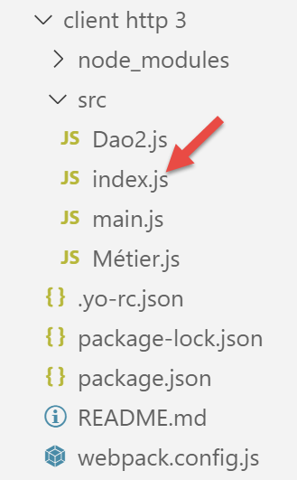
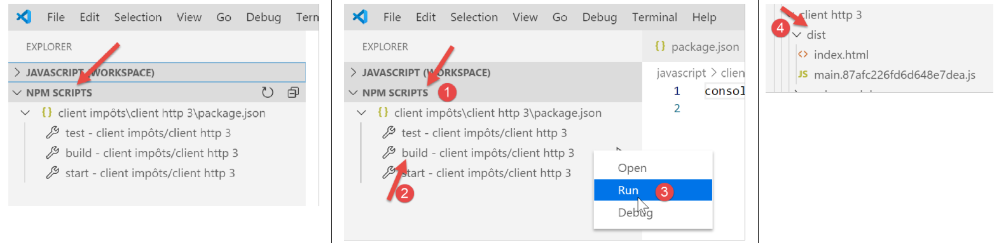
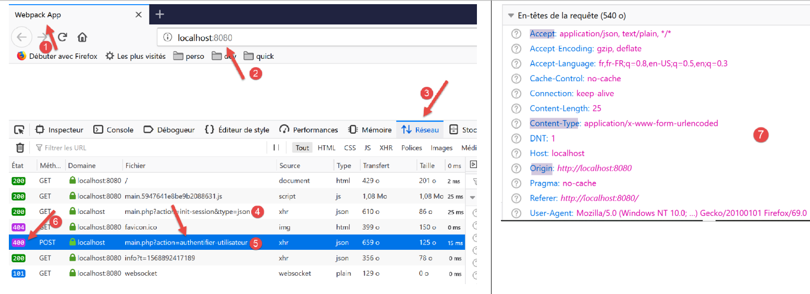

Clients HTTP Javascript du service de calcul de l’impôt
=======================================================

Introduction
------------

Nous nous proposons ici d’écrire un client **[node.js]** de la version
14 du service de calcul de l’impôt. L’architecture client / serveur sera
la suivante :

|image0|

Nous étudierons deux versions du client :

-  la version 1 du client aura la structure **[main, dao]** en couches
   suivante :

|image1|

-  la version 2 du client aura une structure **[main, métier, dao]**. La
   couche **[métier]** du serveur sera déportée sur le client :

|image2|

Client HTTP 1
-------------

|image3|

Comme nous l’avons dit, le client HTTP 1 implémente l’architecture
client / serveur suivante :

|image4|

Nous implémenterons :

-  la couche **[dao]** sous la forme d’une classe ;

-  la couche **[main]** sous la forme d’un script utilisant cette
   classe ;

La couche [dao]
~~~~~~~~~~~~~~~

La couche **[dao]** sera implémentée par la classe suivante
**[Dao1.js]** :

.. code-block:: javascript 
   :linenos:

   'use strict';

   // imports
   import qs from 'qs'

   class Dao1 {

     // constructeur
     constructor(axios) {
       // bibliothèque axios pour faire les requêtes HTTP
       this.axios = axios;
       // cookie de session
       this.sessionCookieName = "PHPSESSID";
       this.sessionCookie = '';
     }

     // init session
     async  initSession() {
       // options de la requête HHTP [get /main.php?action=init-session&type=json]
       const options = {
         method: "GET",
         // paramètres de l'URL
         params: {
           action: 'init-session',
           type: 'json'
         }
       };
       // exécution de la requête HTTP
       return await this.getRemoteData(options);
     }

     async  authentifierUtilisateur(user, password) {
       // options de la requête HHTP [post /main.php?action=authentifier-utilisateur]
       const options = {
         method: "POST",
         headers: {
           'Content-type': 'application/x-www-form-urlencoded',
         },
         // corps du POST
         data: qs.stringify({
           user: user,
           password: password
         }),
         // paramètres de l'URL
         params: {
           action: 'authentifier-utilisateur'
         }
       };
       // exécution de la requête HTTP
       return await this.getRemoteData(options);
     }

     // calcul de l'impôt
     async  calculerImpot(marié, enfants, salaire) {
       // options de la requête HHTP [post /main.php?action=calculer-impot]
       const options = {
         method: "POST",
         headers: {
           'Content-type': 'application/x-www-form-urlencoded',
         },
         // corps du POST [marié, enfants, salaire]
         data: qs.stringify({
           marié: marié,
           enfants: enfants,
           salaire: salaire
         }),
         // paramètres de l'URL
         params: {
           action: 'calculer-impot'
         }
       };
       // exécution de la requête HTTP
       const data = await this.getRemoteData(options);
       // résultat
       return data;
     }

     // liste des simulations
     async  listeSimulations() {
       // options de la requête HHTP [get /main.php?action=lister-simulations]
       const options = {
         method: "GET",
         // paramètres de l'URL
         params: {
           action: 'lister-simulations'
         },
       };
       // exécution de la requête HTTP
       const data = await this.getRemoteData(options);
       // résultat
       return data;
     }

     // liste des simulations
     async  supprimerSimulation(index) {
       // options de la requête HHTP  [get /main.php?action=supprimer-simulation&numéro=index]
       const options = {
         method: "GET",
         // paramètres de l'URL
         params: {
           action: 'supprimer-simulation',
           numéro: index
         },
       };
       // exécution de la requête HTTP
       const data = await this.getRemoteData(options);
       // résultat
       return data;
     }

     async  getRemoteData(options) {
       // pour le cookie de session
       if (!options.headers) {
         options.headers = {};
       }
       options.headers.Cookie = this.sessionCookie;
       // exécution de la requête HTTP
       let response;
       try {
         // requête asynchrone
         response = await this.axios.request('main.php', options);
       } catch (error) {
         // le paramètre [error] est une instance d'exception - elle peut avoir diverses formes
         if (error.response) {
           // la réponse du serveur est dans [error.response]
           response = error.response;
         } else {
           // on relance l'erreur
           throw error;
         }
       }
       // response est l'ensemble de la réponse HTTP du serveur (entêtes HTTP + réponse elle-même)
       // on récupère le cookie de session s'il existe
       const setCookie = response.headers['set-cookie'];
       if (setCookie) {
         // setCookie est un tableau
         // on cherche le cookie de session dans ce tableau
         let trouvé = false;
         let i = 0;
         while (!trouvé && i < setCookie.length) {
           // on cherche le cookie de session
           const results = RegExp('^(' + this.sessionCookieName + '.+?);').exec(setCookie[i]);
           if (results) {
             // on mémorise le cookie de session
             // eslint-disable-next-line require-atomic-updates
             this.sessionCookie = results[1];
             // on a trouvé
             trouvé = true;
           } else {
             // élément suivant
             i++;
           }
         }
       }
       // la réponse du serveur est dans [response.data]
       return response.data;
     }
   }

   // export de la classe
   export default Dao1;

Nous utilisons ici ce que nous avons appris au paragraphe
`lien <chap-12.html#fontions_http>`__, où nous avons présenté la
bibliothèque **[axios]** permettant de faire des requêtes HTTP aussi
bien sous **[node.js]** que dans un navigateur. On regardera en
particulier le script du paragraphe `lien <chap-12.html#axios_04>`__ ;

-  lignes 9-15 : le constructeur de la classe. Celle-ci aura trois
   propriétés :

   -  **[axios]** : l’objet **[axios]** permettant de faire les requêtes
      HTTP. Celui-ci est transmis par le code appelant ;

   -  **[sessionCookieName]** : selon les serveurs, le cookie de session
      porte des noms différents. Ici, c’est **[PHPSESSID]** ;

   -  **[sessionCookie]** : le cookie de session envoyé par le serveur
      et mémorisé par le client ;

-  lignes 53-76 : la fonction asynchrone **[calculerImpot]** fait la
   requête **[post /main.php?action=calculer-impot]** en postant les
   paramètres **[marié, enfants, salaire]**. Elle rend la chaîne jSON
   transmise par le serveur sous la forme d’un objet Javascript ;

-  lignes 79-92 : la fonction asynchrone **[listeSimulations]** fait la
   requête [get /main.php?action=lister-simulations. Elle rend la chaîne
   jSON transmise par le serveur sous la forme d’un objet Javascript ;

-  lignes 95-109 : la fonction asynchrone **[supprimerSimulation]** fait
   la requête **[get
   /main.php?action=supprimer-simulation&numéro=index]**. Elle rend la
   chaîne jSON transmise par le serveur sous la forme d’un objet
   Javascript ;

-  ligne 121 : on utilise la notation **[this.axios]** car ici, l’objet
   **[axios]** transmis au constructeur a été mémorisé dans la propriété
   **[this.axios]** ;

-  ligne 161 : la classe **[Dao1]** est exportée pour pouvoir être
   utilisée ;

Le script [main1.js]
~~~~~~~~~~~~~~~~~~~~

Le script **[main1.js]** fait une série d’appels au serveur à l’aide de
la classe **[Dao1]** :

-  initialisation d’une session jSON ;

-  authentification avec **[admin, admin]** ;

-  demande trois calculs d’impôts ;

-  demande la liste des simulations ;

-  supprime l’une d’elles ;

Le code est le suivant :

.. code-block:: javascript 
   :linenos:

   // import axios
   import axios from 'axios';
   // import de la classe Dao1
   import Dao from './Dao1';

   // fonction asynchrone [main]
   async function main() {
     // configuration axios
     axios.defaults.timeout = 2000;
     axios.defaults.baseURL = 'http://localhost/php7/scripts-web/impots/version-14';
     // instanciation couche [dao]
     const dao = new Dao(axios);
     // utilisation de la couche [dao]
     try {
       // init session
       log("-----------init-session");
       let response = await dao.initSession();
       log(response);
       // authentification
       log("-----------authentifier-utilisateur");
       response = await dao.authentifierUtilisateur("admin", "admin");
       log(response);
       // calculs d'impôt
       log("-----------calculer-impot x 3");
       response = await Promise.all([
         dao.calculerImpot("oui", 2, 45000),
         dao.calculerImpot("non", 2, 45000),
         dao.calculerImpot("non", 1, 30000)
       ]);
       log(response);
       // liste des simulations
       log("-----------liste-des-simulations");
       response = await dao.listeSimulations();
       log(response);
       // suppression d'une simulation
       log("-----------suppression simulation n° 1");
       response = await dao.supprimerSimulation(1);
       log(response);
     } catch (error) {
       // on logue l'erreur
       console.log("erreur=", error.message);
     }
   }

   // log jSON
   function log(object) {
     console.log(JSON.stringify(object, null, 2));
   }

   // exécution
   main();

**Commentaires**

-  ligne 2 : on importe la bibliothèque **[axios]** ;

-  ligne 4 : on importe la classe **[Dao]** ;

-  ligne 7 : la fonction **[main]** qui dialogue avec le serveur est
   asynchrone ;

-  lignes 9-10 : configuration par défaut des requêtes HTTP qui seront
   faites au serveur :

   -  ligne 9 : **[timeout]** de 2 secondes ;

   -  ligne 10 : toutes les URL ont pour préfixe, l’URL base de la
      version 14 du serveur de calcul de l’impôt ;

-  ligne 12 : la couche **[Dao]** est construite. On peut désormais
   l’utiliser ;

-  lignes 46-48 : la fonction **[log]** a pour objet d’afficher la
   chaîne jSON d’un objet Javascript sous une forme embellie : sous
   forme verticale avec une indentation de deux espaces (3ième
   paramètre) ;

-  lignes 15-18 : initialisation de la session jSON ;

-  lignes 19-22 : authentification ;

-  lignes 23-30 : trois calculs d’impôt sont demandés en parallèle.
   Grâce à **[await Promise.all]**, l’exécution est bloquée tant que les
   trois résultats n’ont pas été tous obtenus ;

-  lignes 31-34 : liste des simulations ;

-  lignes 35-38 : suppression d’une simulation ;

-  lignes 39-42 : gestion de l’éventuelle exception ;

Les résultats de l’exécution sont les suivants :

.. code-block:: javascript 
   :linenos:

   [Running] C:\myprograms\laragon-lite\bin\nodejs\node-v10\node.exe -r esm "c:\Data\st-2019\dev\es6\javascript\client impôts\client http 1\main1.js"
   "-----------init-session"
   {
     "action": "init-session",
     "état": 700,
     "réponse": "session démarrée avec type [json]"
   }
   "-----------authentifier-utilisateur"
   {
     "action": "authentifier-utilisateur",
     "état": 200,
     "réponse": "Authentification réussie [admin, admin]"
   }
   "-----------calculer-impot x 3"
   [
     {
       "action": "calculer-impot",
       "état": 300,
       "réponse": {
         "marié": "oui",
         "enfants": "2",
         "salaire": "45000",
         "impôt": 502,
         "surcôte": 0,
         "décôte": 857,
         "réduction": 126,
         "taux": 0.14
       }
     },
     {
       "action": "calculer-impot",
       "état": 300,
       "réponse": {
         "marié": "non",
         "enfants": "2",
         "salaire": "45000",
         "impôt": 3250,
         "surcôte": 370,
         "décôte": 0,
         "réduction": 0,
         "taux": 0.3
       }
     },
     {
       "action": "calculer-impot",
       "état": 300,
       "réponse": {
         "marié": "non",
         "enfants": "1",
         "salaire": "30000",
         "impôt": 1687,
         "surcôte": 0,
         "décôte": 0,
         "réduction": 0,
         "taux": 0.14
       }
     }
   ]
   "-----------liste-des-simulations"
   {
     "action": "lister-simulations",
     "état": 500,
     "réponse": [
       {
         "marié": "oui",
         "enfants": "2",
         "salaire": "45000",
         "impôt": 502,
         "surcôte": 0,
         "décôte": 857,
         "réduction": 126,
         "taux": 0.14,
         "arrayOfAttributes": null
       },
       {
         "marié": "non",
         "enfants": "2",
         "salaire": "45000",
         "impôt": 3250,
         "surcôte": 370,
         "décôte": 0,
         "réduction": 0,
         "taux": 0.3,
         "arrayOfAttributes": null
       },
       {
         "marié": "non",
         "enfants": "1",
         "salaire": "30000",
         "impôt": 1687,
         "surcôte": 0,
         "décôte": 0,
         "réduction": 0,
         "taux": 0.14,
         "arrayOfAttributes": null
       }
     ]
   }
   "-----------suppression simulation n° 1"
   {
     "action": "supprimer-simulation",
     "état": 600,
     "réponse": [
       {
         "marié": "oui",
         "enfants": "2",
         "salaire": "45000",
         "impôt": 502,
         "surcôte": 0,
         "décôte": 857,
         "réduction": 126,
         "taux": 0.14,
         "arrayOfAttributes": null
       },
       {
         "marié": "non",
         "enfants": "1",
         "salaire": "30000",
         "impôt": 1687,
         "surcôte": 0,
         "décôte": 0,
         "réduction": 0,
         "taux": 0.14,
         "arrayOfAttributes": null
       }
     ]
   }

   [Done] exited with code=0 in 0.516 seconds

Client HTTP 2
-------------

|image5|

L’architecture du client HTTP2 est la suivante :

|image6|

On a déporté la couche **[métier]** du serveur vers le client
Javascript. Contrairement à ce que nous avons pu faire dans le cours
PHP7, la couche **[main]** n’aura pas ici à passer par la couche
**[métier]** pour atteindre la couche **[dao]**. Nous utiliserons ces
deux couches comme des centres de compétences :

-  la couche **[main]** passe par la couche **[dao]** dès qu’elle a
   besoin de données qui sont sur le serveur ;

-  la couche **[main]** demande à la couche **[métier]** de faire les
   calculs de l’impôt ;

-  la couche **[métier]** est indépendante de la couche **[dao]** et ne
   fait jamais appel à elle ;

La classe Javascript [Métier]
~~~~~~~~~~~~~~~~~~~~~~~~~~~~~

L’essence de la classe **[Métier]** en PHP a été décrite dans l’article
`lien <https://tahe.developpez.com/tutoriels-cours/php7/>`__. C’est un
code plutôt complexe qu’on rappelle ici, non pour l’expliquer, mais pour
pouvoir le traduire en Javascript :

.. code-block:: javascript 
   :linenos:

   <?php

   // espace de noms
   namespace Application;

   class Metier implements InterfaceMetier {
     // couche Dao
     private $dao;
     // données administration fiscale
     private $taxAdminData;

     //---------------------------------------------
     // setter couche [dao]
     public function setDao(InterfaceDao $dao) {
       $this->dao = $dao;
       return $this;
     }

     public function __construct(InterfaceDao $dao) {
       // on mémorise une référence sur la couche [dao]
       $this->dao = $dao;
       // on récupère les données permettant le calcul de l'impôt
       // la méthode [getTaxAdminData] peut lancer une exception ExceptionImpots
       // on la laisse alors remonter au code appelant
       $this->taxAdminData = $this->dao->getTaxAdminData();
     }

   // calcul de l'impôt
   // --------------------------------------------------------------------------
     public function calculerImpot(string $marié, int $enfants, int $salaire): array {
       // $marié : oui, non
       // $enfants : nombre d'enfants
       // $salaire : salaire annuel
       // $this->taxAdminData : données de l'administration fiscale
       //
       // on vérifie qu'on a bien les données de l'administration fiscale
       if ($this->taxAdminData === NULL) {
         $this->taxAdminData = $this->getTaxAdminData();
       }
       // calcul de l'impôt avec enfants
       $result1 = $this->calculerImpot2($marié, $enfants, $salaire);
       $impot1 = $result1["impôt"];
       // calcul de l'impôt sans les enfants
       if ($enfants != 0) {
         $result2 = $this->calculerImpot2($marié, 0, $salaire);
         $impot2 = $result2["impôt"];
         // application du plafonnement du quotient familial
         $plafonDemiPart = $this->taxAdminData->getPlafondQfDemiPart();
         if ($enfants < 3) {
           // $PLAFOND_QF_DEMI_PART euros pour les 2 premiers enfants
           $impot2 = $impot2 - $enfants * $plafonDemiPart;
         } else {
           // $PLAFOND_QF_DEMI_PART euros pour les 2 premiers enfants, le double pour les suivants
           $impot2 = $impot2 - 2 * $plafonDemiPart - ($enfants - 2) * 2 * $plafonDemiPart;
         }
       } else {
         $impot2 = $impot1;
         $result2 = $result1;
       }
       // on prend l'impôt le plus fort
       if ($impot1 > $impot2) {
         $impot = $impot1;
         $taux = $result1["taux"];
         $surcôte = $result1["surcôte"];
       } else {
         $surcôte = $impot2 - $impot1 + $result2["surcôte"];
         $impot = $impot2;
         $taux = $result2["taux"];
       }
       // calcul d'une éventuelle décôte
       $décôte = $this->getDecôte($marié, $salaire, $impot);
       $impot -= $décôte;
       // calcul d'une éventuelle réduction d'impôts
       $réduction = $this->getRéduction($marié, $salaire, $enfants, $impot);
       $impot -= $réduction;
       // résultat
       return ["impôt" => floor($impot), "surcôte" => $surcôte, "décôte" => $décôte, "réduction" => $réduction, "taux" => $taux];
     }

   // --------------------------------------------------------------------------
     private function calculerImpot2(string $marié, int $enfants, float $salaire): array {
       // $marié : oui, non
       // $enfants : nombre d'enfants
       // $salaire : salaire annuel
       // $this->taxAdminData : données de l'administration fiscale
       //
       // nombre de parts
       $marié = strtolower($marié);
       if ($marié === "oui") {
         $nbParts = $enfants / 2 + 2;
       } else {
         $nbParts = $enfants / 2 + 1;
       }
       // 1 part par enfant à partir du 3ième
       if ($enfants >= 3) {
         // une demi-part de + pour chaque enfant à partir du 3ième
         $nbParts += 0.5 * ($enfants - 2);
       }
       // revenu imposable
       $revenuImposable = $this->getRevenuImposable($salaire);
       // surcôte
       $surcôte = floor($revenuImposable - 0.9 * $salaire);
       // pour des pbs d'arrondi
       if ($surcôte < 0) {
         $surcôte = 0;
       }
       // quotient familial
       $quotient = $revenuImposable / $nbParts;
       // calcul de l'impôt
       $limites = $this->taxAdminData->getLimites();
       $coeffR = $this->taxAdminData->getCoeffR();
       $coeffN = $this->taxAdminData->getCoeffN();
       // est mis à la fin du tableau limites pour arrêter la boucle qui suit
       $limites[count($limites) - 1] = $quotient;
       // recherche du taux d'imposition
       $i = 0;
       while ($quotient > $limites[$i]) {
         $i++;
       }
       // du fait qu'on a placé $quotient à la fin du tableau $limites, la boucle précédente
       // ne peut déborder du tableau $limites
       // maintenant on peut calculer l'impôt
       $impôt = floor($revenuImposable * $coeffR[$i] - $nbParts * $coeffN[$i]);
       // résultat
       return ["impôt" => $impôt, "surcôte" => $surcôte, "taux" => $coeffR[$i]];
     }

     // revenuImposable=salaireAnnuel-abattement
     // l'abattement a un min et un max
     private function getRevenuImposable(float $salaire): float {
       // abattement de 10% du salaire
       $abattement = 0.1 * $salaire;
       // cet abattement ne peut dépasser $this->taxAdminData->getAbattementDixPourCentMax()
       if ($abattement > $this->taxAdminData->getAbattementDixPourCentMax()) {
         $abattement = $this->taxAdminData->getAbattementDixPourcentMax();
       }
       // l'abattement ne peut être inférieur à $this->taxAdminData->getAbattementDixPourcentMin()
       if ($abattement < $this->taxAdminData->getAbattementDixPourcentMin()) {
         $abattement = $this->taxAdminData->getAbattementDixPourcentMin();
       }
       // revenu imposable
       $revenuImposable = $salaire - $abattement;
       // résultat
       return floor($revenuImposable);
     }

   // calcule une décôte éventuelle
     private function getDecôte(string $marié, float $salaire, float $impots): float {
       // au départ, une décôte nulle
       $décôte = 0;
       // montant maximal d'impôt pour avoir la décôte
       $plafondImpôtPourDécôte = $marié === "oui" ?
         $this->taxAdminData->getPlafondImpotCouplePourDecote() :
         $this->taxAdminData->getPlafondImpotCelibatairePourDecote();
       if ($impots < $plafondImpôtPourDécôte) {
         // montant maximal de la décôte
         $plafondDécôte = $marié === "oui" ?
           $this->taxAdminData->getPlafondDecoteCouple() :
           $this->taxAdminData->getPlafondDecoteCelibataire();
         // décôte théorique
         $décôte = $plafondDécôte - 0.75 * $impots;
         // la décôte ne peut dépasser le montant de l'impôt
         if ($décôte > $impots) {
           $décôte = $impots;
         }
         // pas de décôte <0
         if ($décôte < 0) {
           $décôte = 0;
         }
       }
       // résultat
       return ceil($décôte);
     }

   // calcule une réduction éventuelle
     private function getRéduction(string $marié, float $salaire, int $enfants, float $impots): float {
       // le plafond des revenus pour avoir droit à la réduction de 20%
       $plafondRevenuPourRéduction = $marié === "oui" ?
         $this->taxAdminData->getPlafondRevenusCouplePourReduction() :
         $this->taxAdminData->getPlafondRevenusCelibatairePourReduction();
       $plafondRevenuPourRéduction += $enfants * $this->taxAdminData->getValeurReducDemiPart();
       if ($enfants > 2) {
         $plafondRevenuPourRéduction += ($enfants - 2) * $this->taxAdminData->getValeurReducDemiPart();
       }
       // revenu imposable
       $revenuImposable = $this->getRevenuImposable($salaire);
       // réduction
       $réduction = 0;
       if ($revenuImposable < $plafondRevenuPourRéduction) {
         // réduction de 20%
         $réduction = 0.2 * $impots;
       }
       // résultat
       return ceil($réduction);
     }

     // calcul des impôts en mode batch
     public function executeBatchImpots(string $taxPayersFileName, string $resultsFileName, string $errorsFileName): void {
       // on laisse remonter les exceptions qui proviennent de la couche [dao]
       // on récupère les données contribuables
       $taxPayersData = $this->dao->getTaxPayersData($taxPayersFileName, $errorsFileName);
       // tableau des résultats
       $results = [];
       // on les exploite
       foreach ($taxPayersData as $taxPayerData) {
         // on calcule l'impôt
         $result = $this->calculerImpot(
           $taxPayerData->getMarié(),
           $taxPayerData->getEnfants(),
           $taxPayerData->getSalaire());
         // on complète [$taxPayerData]
         $taxPayerData->setMontant($result["impôt"]);
         $taxPayerData->setDécôte($result["décôte"]);
         $taxPayerData->setSurCôte($result["surcôte"]);
         $taxPayerData->setTaux($result["taux"]);
         $taxPayerData->setRéduction($result["réduction"]);
         // on met le résultat dans le tableau des résultats
         $results [] = $taxPayerData;
       }
       // enregistrement des résultats
       $this->dao->saveResults($resultsFileName, $results);
     }

   }

-  lignes 19-26 : le constructeur de la classe PHP. Parce que nous avons
   dit qu’on construisait une couche **[métier]** indépendante de la
   couche **[dao]**, nous ferons en Javascript deux modifications à ce
   constructeur :

   -  il ne recevra pas une instance de la couche **[dao]** (il n’en a
      plus besoin) ;

   -  il ne demandera pas les données fiscales de l’administration
      **[taxAdminData]** à la couche **[dao]** : c’est le code appelant
      qui transmettra cette donnée au constructeur ;

-  lignes 197-122 : nous n’implémenterons pas la méthode
   **[executeBatchImpots]** dont le but final était d’enregistrer des
   résultats de simulations dans un fichier texte. Nous voulons un code
   qui fonctionne à la fois sous **[node.js]** et dans un navigateur. Or
   sauvegarder des données sur le système de fichiers de la machine
   exécutant le navigateur client n’est pas possible ;

Avec ces restrictions, le code de la classe Javascript **[Métier]** est
le suivant :

.. code-block:: javascript 
   :linenos:

   'use strict';

   // classe Métier
   class Métier {

     // constructeur
     constructor(taxAdmindata) {
       // this.taxAdminData : données de l'administration fiscale
       this.taxAdminData = taxAdmindata;
     }

     // calcul de l'impôt
     // --------------------------------------------------------------------------
     calculerImpot(marié, enfants, salaire) {
       // marié : oui, non
       // enfants : nombre d'enfants
       // salaire : salaire annuel
       // this.taxAdminData : données de l'administration fiscale
       //
       // calcul de l'impôt avec enfants
       const result1 = this.calculerImpot2(marié, enfants, salaire);
       const impot1 = result1["impôt"];
       // calcul de l'impôt sans les enfants
       let result2, impot2, plafondDemiPart;
       if (enfants !== 0) {
         result2 = this.calculerImpot2(marié, 0, salaire);
         impot2 = result2["impôt"];
         // application du plafonnement du quotient familial
         plafondDemiPart = this.taxAdminData.plafondQfDemiPart;
         if (enfants < 3) {
           // PLAFOND_QF_DEMI_PART euros pour les 2 premiers enfants
           impot2 = impot2 - enfants * plafondDemiPart;
         } else {
           // PLAFOND_QF_DEMI_PART euros pour les 2 premiers enfants, le double pour les suivants
           impot2 = impot2 - 2 * plafondDemiPart - (enfants - 2) * 2 * plafondDemiPart;
         }
       } else {
         // pas de reclacul de l'impôt
         impot2 = impot1;
         result2 = result1;
       }
       // on prend l'impôt le plus fortdans [impot1, impot2]
       let impot, taux, surcôte;
       if (impot1 > impot2) {
         impot = impot1;
         taux = result1["taux"];
         surcôte = result1["surcôte"];
       } else {
         surcôte = impot2 - impot1 + result2["surcôte"];
         impot = impot2;
         taux = result2["taux"];
       }
       // calcul d'une éventuelle décôte
       const décôte = this.getDecôte(marié, impot);
       impot -= décôte;
       // calcul d'une éventuelle réduction d'impôts
       const réduction = this.getRéduction(marié, salaire, enfants, impot);
       impot -= réduction;
       // résultat
       return {
         "impôt": Math.floor(impot), "surcôte": surcôte, "décôte": décôte, "réduction": réduction,
         "taux": taux
       };
     }

     // --------------------------------------------------------------------------
     calculerImpot2(marié, enfants, salaire) {
       // marié : oui, non
       // enfants : nombre d'enfants
       // salaire : salaire annuel
       // this->taxAdminData : données de l'administration fiscale
       //
       // nombre de parts
       marié = marié.toLowerCase();
       let nbParts;
       if (marié === "oui") {
         nbParts = enfants / 2 + 2;
       } else {
         nbParts = enfants / 2 + 1;
       }
       // 1 part par enfant à partir du 3ième
       if (enfants >= 3) {
         // une demi-part de + pour chaque enfant à partir du 3ième
         nbParts += 0.5 * (enfants - 2);
       }
       // revenu imposable
       const revenuImposable = this.getRevenuImposable(salaire);
       // surcôte
       let surcôte = Math.floor(revenuImposable - 0.9 * salaire);
       // pour des pbs d'arrondi
       if (surcôte < 0) {
         surcôte = 0;
       }
       // quotient familial
       const quotient = revenuImposable / nbParts;
       // calcul de l'impôt
       const limites = this.taxAdminData.limites;
       const coeffR = this.taxAdminData.coeffR;
       const coeffN = this.taxAdminData.coeffN;
       // est mis à la fin du tableau limites pour arrêter la boucle qui suit
       limites[limites.length - 1] = quotient;
       // recherche du taux d'imposition
       let i = 0;
       while (quotient > limites[i]) {
         i++;
       }
       // du fait qu'on a placé quotient à la fin du tableau limites, la boucle précédente
       // ne peut déborder du tableau limites
       // maintenant on peut calculer l'impôt
       const impôt = Math.floor(revenuImposable * coeffR[i] - nbParts * coeffN[i]);
       // résultat
       return { "impôt": impôt, "surcôte": surcôte, "taux": coeffR[i] };
     }

     // revenuImposable=salaireAnnuel-abattement
     // l'abattement a un min et un max
     getRevenuImposable(salaire) {
       // abattement de 10% du salaire
       let abattement = 0.1 * salaire;
       // cet abattement ne peut dépasser taxAdminData.getAbattementDixPourCentMax()
       if (abattement > this.taxAdminData.abattementDixPourCentMax) {
         abattement = this.taxAdminData.abattementDixPourcentMax;
       }
       // l'abattement ne peut être inférieur à taxAdminData.getAbattementDixPourcentMin()
       if (abattement < this.taxAdminData.abattementDixPourcentMin) {
         abattement = this.taxAdminData.abattementDixPourcentMin;
       }
       // revenu imposable
       const revenuImposable = salaire - abattement;
       // résultat
       return Math.floor(revenuImposable);
     }

     // calcule une décôte éventuelle
     getDecôte(marié, impots) {
       // au départ, une décôte nulle
       let décôte = 0;
       // montant maximal d'impôt pour avoir la décôte
       let plafondImpôtPourDécôte = marié === "oui" ?
         this.taxAdminData.plafondImpotCouplePourDecote :
         this.taxAdminData.plafondImpotCelibatairePourDecote;
       let plafondDécôte;
       if (impots < plafondImpôtPourDécôte) {
         // montant maximal de la décôte
         plafondDécôte = marié === "oui" ?
           this.taxAdminData.plafondDecoteCouple :
           this.taxAdminData.plafondDecoteCelibataire;
         // décôte théorique
         décôte = plafondDécôte - 0.75 * impots;
         // la décôte ne peut dépasser le montant de l'impôt
         if (décôte > impots) {
           décôte = impots;
         }
         // pas de décôte <0
         if (décôte < 0) {
           décôte = 0;
         }
       }
       // résultat
       return Math.ceil(décôte);
     }

     // calcule une réduction éventuelle
     getRéduction(marié, salaire, enfants, impots) {
       // le plafond des revenus pour avoir droit à la réduction de 20%
       let plafondRevenuPourRéduction = marié === "oui" ?
         this.taxAdminData.plafondRevenusCouplePourReduction :
         this.taxAdminData.plafondRevenusCelibatairePourReduction;
       plafondRevenuPourRéduction += enfants * this.taxAdminData.valeurReducDemiPart;
       if (enfants > 2) {
         plafondRevenuPourRéduction += (enfants - 2) * this.taxAdminData.valeurReducDemiPart;
       }
       // revenu imposable
       const revenuImposable = this.getRevenuImposable(salaire);
       // réduction
       let réduction = 0;
       if (revenuImposable < plafondRevenuPourRéduction) {
         // réduction de 20%
         réduction = 0.2 * impots;
       }
       // résultat
       return Math.ceil(réduction);
     }
   }

   // export de la classe
   export default Métier;

-  le code Javascript suit scrupuleusement le code PHP ;

-  la classe **[Métier]** est exportée, ligne 187 ;

La classe Javascript [Dao2]
~~~~~~~~~~~~~~~~~~~~~~~~~~~

|image7|

La classe **[Dao2]** implémente la couche **[dao]** du client Javascript
ci-dessus de la façon suivante :

.. code-block:: javascript 
   :linenos:

   'use strict';

   // imports
   import qs from 'qs'

   class Dao2 {

     // constructeur
     constructor(axios) {
       this.axios = axios;
       // cookie de session
       this.sessionCookieName = "PHPSESSID";
       this.sessionCookie = '';
     }

     // init session
     async  initSession() {
       // options de la requête HHTP [get /main.php?action=init-session&type=json]
       const options = {
         method: "GET",
         // paramètres de l'URL
         params: {
           action: 'init-session',
           type: 'json'
         }
       };
       // exécution de la requête HTTP
       return await this.getRemoteData(options);
     }

     async  authentifierUtilisateur(user, password) {
       // options de la requête HHTP [post /main.php?action=authentifier-utilisateur]
       const options = {
         method: "POST",
         headers: {
           'Content-type': 'application/x-www-form-urlencoded',
         },
         // corps du POST
         data: qs.stringify({
           user: user,
           password: password
         }),
         // paramètres de l'URL
         params: {
           action: 'authentifier-utilisateur'
         }
       };
       // exécution de la requête HTTP
       return await this.getRemoteData(options);
     }

     async getAdminData() {
       // options de la requête HHTP [get /main.php?action=get-admindata]
       const options = {
         method: "GET",
         // paramètres de l'URL
         params: {
           action: 'get-admindata'
         }
       };
       // exécution de la requête HTTP
       const data = await this.getRemoteData(options);
       // résultat
       return data;
     }

     async  getRemoteData(options) {
       // pour le cookie de session
       if (!options.headers) {
         options.headers = {};
       }
       options.headers.Cookie = this.sessionCookie;
       // exécution de la requête HTTP
       let response;
       try {
         // requête asynchrone
         response = await this.axios.request('main.php', options);
       } catch (error) {
         // le paramètre [error] est une instance d'exception - elle peut avoir diverses formes
         if (error.response) {
           // la réponse du serveur est dans [error.response]
           response = error.response;
         } else {
           // on relance l'erreur
           throw error;
         }
       }
       // response est l'ensemble de la réponse HTTP du serveur (entêtes HTTP + réponse elle-même)
       // on récupère le cookie de session s'il existe
       const setCookie = response.headers['set-cookie'];
       if (setCookie) {
         // setCookie est un tableau
         // on cherche le cookie de session dans ce tableau
         let trouvé = false;
         let i = 0;
         while (!trouvé && i < setCookie.length) {
           // on cherche le cookie de session
           const results = RegExp('^(' + this.sessionCookieName + '.+?);').exec(setCookie[i]);
           if (results) {
             // on mémorise le cookie de session
             // eslint-disable-next-line require-atomic-updates
             this.sessionCookie = results[1];
             // on a trouvé
             trouvé = true;
           } else {
             // élément suivant
             i++;
           }
         }
       }
       // la réponse du serveur est dans [response.data]
       return response.data;
     }
   }

   // export de la classe
   export default Dao2;

**Commentaires**

-  la classe **[Dao2]** n’implémente que trois des requêtes possibles
   vers le serveur de calcul d’impôt :

   -  **[init-session]** (lignes 17-29) : pour initialiser la session
      jSON ;

   -  **[authentifier-utilisateur]** (lignes 31-50) : pour
      s’authentifier ;

   -  **[get-admindata]** (lignes 52-65) : pour avoir les données de
      l’administration fiscale qui vont permettre de faire les calculs
      de l’impôt, côté client ;

-  lignes 52-65 : nous introduisons une nouvelle action
   **[get-admindata]** vers le serveur. Cette action n’était pas
   jusqu’alors implémentée. Nous le faisons maintenant.

Modification du serveur de calcul de l’impôt
~~~~~~~~~~~~~~~~~~~~~~~~~~~~~~~~~~~~~~~~~~~~

Le serveur de calcul de l’impôt doit implémenter une nouvelle action.
Nous allons le faire sur la version 14 du serveur. L’action à
implémenter a les caractéristiques suivantes :

-  elle est demandée par une opération **[get
   /main.php?action=get-admindata]** ;

-  elle rend la chaîne jSON d’un objet encapsulant les données de
   l’administration fiscale ;

Nous allons revoir comment ajouter une action à notre serveur.

La modification se fera sous Netbeans :

|image8|

En **[2]**, nous modifions le fichier **[config.json]** pour ajouter la
nouvelle action :

.. code-block:: javascript 
   :linenos:

   {
       "databaseFilename": "Config/database.json",
       "corsAllowed": true,
       "rootDirectory": "C:/myprograms/laragon-lite/www/php7/scripts-web/impots/version-14",
       "relativeDependencies": [

           "/Entities/BaseEntity.php",
           "/Entities/Simulation.php",
           "/Entities/Database.php",
           "/Entities/TaxAdminData.php",
           "/Entities/ExceptionImpots.php",

           "/Utilities/Logger.php",
           "/Utilities/SendAdminMail.php",        

           "/Model/InterfaceServerDao.php",
           "/Model/ServerDao.php",
           "/Model/ServerDaoWithSession.php",
           "/Model/InterfaceServerMetier.php",
           "/Model/ServerMetier.php",

           "/Responses/InterfaceResponse.php",
           "/Responses/ParentResponse.php",
           "/Responses/JsonResponse.php",
           "/Responses/XmlResponse.php",
           "/Responses/HtmlResponse.php",

           "/Controllers/InterfaceController.php",
           "/Controllers/InitSessionController.php",
           "/Controllers/ListerSimulationsController.php",
           "/Controllers/AuthentifierUtilisateurController.php",
           "/Controllers/CalculerImpotController.php",
           "/Controllers/SupprimerSimulationController.php",
           "/Controllers/FinSessionController.php",
           "/Controllers/AfficherCalculImpotController.php",
           "/Controllers/AdminDataController.php"
       ],
       "absoluteDependencies": [
           "C:/myprograms/laragon-lite/www/vendor/autoload.php",
           "C:/myprograms/laragon-lite/www/vendor/predis/predis/autoload.php"
       ],
       "users": [
           {
               "login": "admin",
               "passwd": "admin"
           }
       ],
       "adminMail": {
           "smtp-server": "localhost",
           "smtp-port": "25",
           "from": "guest@localhost",
           "to": "guest@localhost",
           "subject": "plantage du serveur de calcul d'impôts",
           "tls": "FALSE",
           "attachments": []
       },
       "logsFilename": "Logs/logs.txt",
       "actions":
               {
                   "init-session": "\\InitSessionController",
                   "authentifier-utilisateur": "\\AuthentifierUtilisateurController",
                   "calculer-impot": "\\CalculerImpotController",
                   "lister-simulations": "\\ListerSimulationsController",
                   "supprimer-simulation": "\\SupprimerSimulationController",
                   "fin-session": "\\FinSessionController",
                   "afficher-calcul-impot": "\\AfficherCalculImpotController",
                   "get-admindata": "\\AdminDataController"
               },
       "types": {
           "json": "\\JsonResponse",
           "html": "\\HtmlResponse",
           "xml": "\\XmlResponse"
       },
       "vues": {
           "vue-authentification.php": [700, 221, 400],
           "vue-calcul-impot.php": [200, 300, 341, 350, 800],
           "vue-liste-simulations.php": [500, 600]
       },
       "vue-erreurs": "vue-erreurs.php"
   }

La modification consiste :

-  ligne 67 : ajouter l’action **[get-admindata]** et l’associer à un
   contrôleur ;

-  ligne 36 : déclarer ce contrôleur dans la liste des classes à charger
   par l’application PHP ;

La phase suivante est d’implémenter le contrôleur
**[AdminDataController]** **[3]** :

.. code-block:: javascript 
   :linenos:

   <?php

   namespace Application;

   // dépendances Symfony
   use \Symfony\Component\HttpFoundation\Response;
   use \Symfony\Component\HttpFoundation\Request;
   use \Symfony\Component\HttpFoundation\Session\Session;
   // alias de la couche [dao]
   use \Application\ServerDaoWithSession as ServerDaoWithRedis;

   class AdminDataController implements InterfaceController {

     // $config est la configuration de l'application
     // traitement d'une requête Request
     // utile la session Session et peut la modifier
     // $infos sont des informations supplémentaires propres à chaque contrôleur
     // rend un tableau [$statusCode, $état, $content, $headers]
     public function execute(
       array $config,
       Request $request,
       Session $session,
       array $infos = NULL): array {

       // on doit avoir un unique paramètre GET
       $method = strtolower($request->getMethod());
       $erreur = $method !== "get" || $request->query->count() != 1;
       if ($erreur) {
         // on note l'erreur
         $message = "il faut utiliser la méthode [get] avec l'unique paramètre [action] dans l'URL";
         $état = 1001;
         // retour résultat au contrôleur principal
         return [Response::HTTP_BAD_REQUEST, $état, ["réponse" => $message], []];
       }

       // on peut travailler
       // Redis
       \Predis\Autoloader::register();
       try {
         // client [predis]
         $redis = new \Predis\Client();
         // on se connecte au serveur pour voir s'il est là
         $redis->connect();
       } catch (\Predis\Connection\ConnectionException $ex) {
         // ça s'est mal passé
         // retour résultat avec erreur au contrôleur principal
         $état = 1050;
         return [Response::HTTP_INTERNAL_SERVER_ERROR, $état,
           ["réponse" => "[redis], " . utf8_encode($ex->getMessage())], []];
       }

       // récupération des données de l'administration fiscale
       // on cherche d'abord dans le cache [redis]
       if (!$redis->get("taxAdminData")) {
         try {
           // on va chercher les données fiscales en base de données
           $dao = new ServerDaoWithRedis($config["databaseFilename"], NULL);
           // taxAdminData
           $taxAdminData = $dao->getTaxAdminData();
           // on met dans redis les données récupérées
           $redis->set("taxAdminData", $taxAdminData);
         } catch (\RuntimeException $ex) {
           // ça s'est mal passé
           // retour résultat avec erreur au contrôleur principal
           $état = 1041;
           return [Response::HTTP_INTERNAL_SERVER_ERROR, $état,
             ["réponse" => utf8_encode($ex->getMessage())], []];
         }
       } else {
         // les données fiscales sont prises dans la mémoire [redis] de portée [application]
         $arrayOfAttributes = \json_decode($redis->get("taxAdminData"), true);
         // on instancie un objet [TaxAdminData] à partir du tableau d'attributs précédent
         $taxAdminData = (new TaxAdminData())->setFromArrayOfAttributes($arrayOfAttributes);
       }

       // retour résultat au contrôleur principal
       $état = 1000;
       return [Response::HTTP_OK, $état, ["réponse" => $taxAdminData], []];
     }

   }

**Commentaires**

-  ligne 12 : comme les autres contrôleurs du serveur,
   **[AdminDataController]** implémente l’interface
   **[InterfaceController]** constituée par la méthode **[execute]** des
   lignes 19-79 ;

-  ligne 78 : comme pour les autres contrôleurs du serveur, la méthode
   **[AdminDataController.execute]** rend un tableau **[$status, $état,
   [‘réponse’=>$response]**] avec :

   -  **[$status]** : le code de statut de la réponse HTTP ;

   -  **[$état]** : un code interne à l’application représentant l’état
      dans lequel se trouve le serveur après exécution de la requête du
      client ;

   -  **[$response]** : un tableau encapsulant la réponse à envoyer au
      client. Ici, ce tableau sera ultérieurement transformé en chaîne
      jSON ;

-  lignes 25-34 : on vérifie que l’action **[get-admindata]** du client
   est syntaxiquement correcte ;

-  lignes 37-74 : on récupère un objet **[TaxAdminData]** trouvé soit :

   -  lignes 56-59 : dans la base de données si on ne l’a pas trouvé
      dans le cache **[redis]** ;

   -  lignes 70-73 : dans le cache **[redis]** ;

Ce code reprend celui du contrôleur **[CalculerImpotController]**
expliqué dans l’article
`lien <https://tahe.developpez.com/tutoriels-cours/php7/>`__. En effet,
ce contrôleur devait lui aussi récupérer l’objet **[TaxAdminData]**
encapsulant les données de l’administration fiscale.

Lors des tests du client Javascript, la forme jSON de **[TaxAdminData]**
a posé problème lorsque cet objet était trouvé dans le cache
**[redis]**. Pour le comprendre, examinons sous quelle forme cet objet
est stocké dans **[redis]** :

|image9|

|image10|

-  en **[5-7]**, on voit que des valeurs numériques ont été stockées
   sous forme de chaînes de caractères. PHP s’en est accommodé car
   l’opérateur + dans les calculs entre nombres et chaînes provoque
   implicitement un changement de type de la chaîne vers un nombre. Mais
   Javascript fait le contraire : l’opérateur + dans les calculs entre
   nombres et chaînes provoque implicitement un changement de type du
   nombre vers une chaîne de caractères. Les calculs de la classe
   Javascript **[Métier]** sont alors erronés ;

Pour remédier à ce problème, nous modifions la méthode
**[TaxAdminData.setFromArrayOfAttributes]** utilisée ligne 71 du
contrôleur pour instancier un objet **[TaxAdminData]** (cf.
`article <https://tahe.developpez.com/tutoriels-cours/php7/>`__) à
partir de la chaîne jSON trouvée dans le cache **[redis]** :

.. code-block:: javascript 
   :linenos:

   <?php

   namespace Application;

   class TaxAdminData extends BaseEntity {
     // tranches d'impôt
     protected $limites;
     protected $coeffR;
     protected $coeffN;
     // constantes de calcul de l'impôt
     protected $plafondQfDemiPart;
     protected $plafondRevenusCelibatairePourReduction;
     protected $plafondRevenusCouplePourReduction;
     protected $valeurReducDemiPart;
     protected $plafondDecoteCelibataire;
     protected $plafondDecoteCouple;
     protected $plafondImpotCouplePourDecote;
     protected $plafondImpotCelibatairePourDecote;
     protected $abattementDixPourcentMax;
     protected $abattementDixPourcentMin;

     // initialisation
     public function setFromJsonFile(string $taxAdminDataFilename) {
       // parent
       parent::setFromJsonFile($taxAdminDataFilename);
       // on vérifie les valeurs des attributs
       $this->checkAttributes();
       // on rend l'objet
       return $this;
     }

     protected function check($value): \stdClass {
       // $value est un tableau d'éléments de type string ou un unique élément
       if (!\is_array($value)) {
         $tableau = [$value];
       } else {
         $tableau = $value;
       }
       // on transforme le tableau de strings en tableau de réels
       $newTableau = [];
       $result = new \stdClass();
       // les éléments du tableau doivent être des nombres décimaux positifs ou nuls
       $modèle = '/^\s*([+]?)\s*(\d+\.\d*|\.\d+|\d+)\s*$/';
       for ($i = 0; $i < count($tableau); $i ++) {
         if (preg_match($modèle, $tableau[$i])) {
           // on met le float dans newTableau
           $newTableau[] = (float) $tableau[$i];
         } else {
           // on note l'erreur
           $result->erreur = TRUE;
           // on quitte
           return $result;
         }
       }
       // on rend le résultat
       $result->erreur = FALSE;
       if (!\is_array($value)) {
         // une seule valeur
         $result->value = $newTableau[0];
       } else {
         // une liste de valeurs
         $result->value = $newTableau;
       }
       return $result;
     }

     // initialisation par un tableau d’attributs
     public function setFromArrayOfAttributes(array $arrayOfAttributes) {
       // parent
       parent::setFromArrayOfAttributes($arrayOfAttributes);
       // on vérifie les valeurs des attributs
       $this->checkAttributes();
       // on rend l'objet
       return $this;
     }

     // vérification des valeurs des attributs
     protected function checkAttributes() {
       // on vérifie que les valeurs des attributs sont des réels >=0
       foreach ($this as $key => $value) {
         if (is_string($value)) {
           // $value doit être un nbre réel >=0 ou un tableau de réels >=0
           $result = $this->check($value);
           // erreur ?
           if ($result->erreur) {
             // on lance une exception
             throw new ExceptionImpots("La valeur de l'attribut [$key] est invalide");
           } else {
             // on note la valeur
             $this->$key = $result->value;
           }
         }
       }

       // on rend l'objet
       return $this;
     }

     // getters et setters
     ...

   }

**Commentaires**

-  ligne 5 : la classe **[TaxAdminData]** étend la classe
   **[BaseEntity]** qui a déjà la méthode
   **[setFromArrayOfAttributes]**. Celle-ci ne convenant pas, nous la
   redéfinissons aux lignes 67-75 ;

-  ligne 70 : la méthode **[setFromArrayOfAttributes]** de la classe
   parent est d’abord utilisée pour initialiser les attributs de la
   classe ;

-  ligne 72 : la méthode **[checkAttributes]** vérifie que les valeurs
   associées sont bien des nombres. Si ce sont des chaînes, celles-ci
   sont converties en nombres ;

-  ligne 74 : l’objet **[$this]** rendu est alors un objet avec des
   attributs à valeurs numériques ;

-  lignes 78-93 : la méthode **[checkAttributes]** vérifie que les
   valeurs associées aux attributs de l’objet sont bien numériques ;

-  ligne 80 : on parcourt la liste des attributs ;

-  ligne 81 : si la valeur d’un attribut est de type **[string]** ;

-  ligne 83 : alors on vérifie que cette chaîne représente un nombre ;

-  ligne 90 : si c’est le cas, la chaîne est transformée en nombre et
   affectée à l’attribut testé ;

-  lignes 85-86 : si ce n’est pas le cas, une exception est lancée ;

-  lignes 32-65 : la fonction **[check]** fait un peu plus que
   nécessaire. Elle traite aussi bien des tableaux que des valeurs
   uniques. Or ici, elle n’est appelée que pour vérifier une valeur de
   type **[string]**. Elle rend un objet avec les propriétés **[erreur,
   value]** où :

   -  **[erreur]** est un booléen signalant une erreur ou non ;

   -  **[value]** est le paramètre **[value]** de la ligne 32,
      transformée en nombre ou tableau de nombres selon les cas ;

La classe **[BaseEntity]** qui pouvait avoir un attribut nommé
**[arrayOfAttributes]** est modifiée pour ne plus avoir celui-ci : il
pollue en effet la chaîne jSON de **[TaxAdminData]**. La classe est
réécrite de la façon suivante :

.. code-block:: javascript 
   :linenos:

   <?php

   namespace Application;

   class BaseEntity {
     
     // initialisation à partir d'un fichier JSON
     public function setFromJsonFile(string $jsonFilename) {
       // on récupère le contenu du fichier des données fiscales
       $fileContents = \file_get_contents($jsonFilename);
       $erreur = FALSE;
       // erreur ?
       if (!$fileContents) {
         // on note l'erreur
         $erreur = TRUE;
         $message = "Le fichier des données [$jsonFilename] n'existe pas";
       }
       if (!$erreur) {
         // on récupère le code JSON du fichier de configuration dans un tableau associatif
         $arrayOfAttributes = \json_decode($fileContents, true);
         // erreur ?
         if ($arrayOfAttributes === FALSE) {
           // on note l'erreur
           $erreur = TRUE;
           $message = "Le fichier de données JSON [$jsonFilename] n'a pu être exploité correctement";
         }
       }
       // erreur ?
       if ($erreur) {
         // on lance une exception
         throw new ExceptionImpots($message);
       }
       // initialisation des attributs de la classe
       foreach ($arrayOfAttributes as $key => $value) {
         $this->$key = $value;
       }
       // on vérifie la présence de tous les attributs
       $this->checkForAllAttributes($arrayOfAttributes);
       // on rend l'objet
       return $this;
     }

     public function checkForAllAttributes($arrayOfAttributes) {
       // on vérifie que toutes les clés ont été initialisées
       foreach (\array_keys($arrayOfAttributes) as $key) {
         if (!isset($this->$key)) {
           throw new ExceptionImpots("L'attribut [$key] de la classe "
             . get_class($this) . " n'a pas été initialisé");
         }
       }
     }

     public function setFromArrayOfAttributes(array $arrayOfAttributes) {
       // on initialise certains attributs de la classe (pas forcément tous)
       foreach ($arrayOfAttributes as $key => $value) {
         $this->$key = $value;
       }
       // on retourne l'objet
       return $this;
     }

     // toString
     public function __toString() {
       // attributs de l'objet
       $arrayOfAttributes = \get_object_vars($this);
       // chaîne jSON de l'objet
       return \json_encode($arrayOfAttributes, JSON_UNESCAPED_UNICODE);
     }

   }

**Commentaires**

-  ligne 20 : l’attribut **[$this→arrayOfAttributes]** a été transformée
   en variable qui doit être désormais passée à la méthode
   **[checkForAllAttributes]**, ligne 38 qui auparavant opérait sur
   l’attribut **[$this→arrayOfAttributes]** ;

A cause de ce changement sur **[BaseEntity]**, la classe **[Database]**
doit être également légèrement modifiée :

.. code-block:: javascript 
   :linenos:

   <?php

   namespace Application;

   class Database extends BaseEntity {
     // attributs
     protected $dsn;
     protected $id;
     protected $pwd;
     protected $tableTranches;
     protected $colLimites;
     protected $colCoeffR;
     protected $colCoeffN;
     protected $tableConstantes;
     protected $colPlafondQfDemiPart;
     protected $colPlafondRevenusCelibatairePourReduction;
     protected $colPlafondRevenusCouplePourReduction;
     protected $colValeurReducDemiPart;
     protected $colPlafondDecoteCelibataire;
     protected $colPlafondDecoteCouple;
     protected $colPlafondImpotCelibatairePourDecote;
     protected $colPlafondImpotCouplePourDecote;
     protected $colAbattementDixPourcentMax;
     protected $colAbattementDixPourcentMin;

     // setter
     // initialisation
     public function setFromJsonFile(string $jsonFilename) {
       // parent
       parent::setFromJsonFile($jsonFilename);
       // on retourne l'objet
       return $this;
     }

     // getters et setters
     ...
   }

**Commentaires**

-  dans le code original, après la ligne 30, on appelait la méthode
   **[parent::checkForAllAttributes]**. Cela n’a plus à être fait
   puisque c’est désormais pris automatiquement en charge par la méthode
   **[parent::setFromJsonFile($jsonFilename)]** ;

Tests [Postman] du serveur
~~~~~~~~~~~~~~~~~~~~~~~~~~

**[Postman]** a été présenté dans l’article
`lien <https://tahe.developpez.com/tutoriels-cours/php7/>`__.

Nous utilisons les tests Postman suivants :

|image11|

|image12|

|image13|

Le résultat jSON de cette dernière requête est la suivante :

|image14|

-  en **[5-8]**, on peut remarquer que les attributs de la chaîne jSON
   ont bien des valeurs numériques (et non chaînes de caractères). Ce
   résultat va permettre à la classe Javascript **[Métier]** de
   s’exécuter normalement ;

Le script principal [main]
~~~~~~~~~~~~~~~~~~~~~~~~~~

|image15|

Le script principal **[main]** du client Javascript est le suivant :

.. code-block:: javascript 
   :linenos:

   // imports
   import axios from 'axios';

   // imports
   import Dao from './Dao2';
   import Métier from './Métier';

   // fonction asynchrone [main]
   async function main() {
     // configuration axios
     axios.defaults.timeout = 2000;
     axios.defaults.baseURL = 'http://localhost/php7/scripts-web/impots/version-14';
     // instanciation couche [dao]
     const dao = new Dao(axios);
     // requêtes HTTP
     let taxAdminData;
     try {
       // init session
       log("-----------init-session");
       let response = await dao.initSession();
       log(response);
       // authentification
       log("-----------authentifier-utilisateur");
       response = await dao.authentifierUtilisateur("admin", "admin");
       log(response);
       // données fiscales
       log("-----------get-admindata");
       response = await dao.getAdminData();
       log(response);
       taxAdminData = response.réponse;
     } catch (error) {
       // on logue l'erreur
       console.log("erreur=", error.message);
       // fin
       return;
     }

     // instanciation couche [métier]
     const métier = new Métier(taxAdminData);

     // calculs d'impôt
     log("-----------calculer-impot x 3");
     const simulations = [];
     simulations.push(métier.calculerImpot("oui", 2, 45000));
     simulations.push(métier.calculerImpot("non", 2, 45000));
     simulations.push(métier.calculerImpot("non", 1, 30000));
     // liste des simulations
     log("-----------liste-des-simulations");
     log(simulations);
     // suppression d'une simulation
     log("-----------suppression simulation n° 1");
     simulations.splice(1, 1);
     log(simulations);
   }

   // log jSON
   function log(object) {
     console.log(JSON.stringify(object, null, 2));
   }

   // exécution
   main();

**Commentaires**

-  lignes 5-6 : imports des classes **[Dao]** et **[Métier]** ;

-  ligne 9 : la fonction asynchrone **[main]** qui va organiser le
   dialogue avec le serveur grâce à la classe **[Dao]** et demander à la
   classe **[Métier]** de faire les calculs d’impôt ;

-  lignes 10-36 : le script appelle successivement et de façon
   bloquante, les méthodes **[initSession, authentifierUtilisateur,
   getAdminData]** de la couche **[dao]** ;

-  ligne 38 : on n’a plus besoin de la couche **[dao]**. On a tous les
   éléments pour faire travailler la couche **[métier]** du client
   Javascript ;

-  lignes 41-46 : on fait trois calculs d’impôt dont on cumule les
   résultats dans un tableau **[simulations]** ;

-  ligne 49 : on affiche le tableau des simulations ;

-  ligne 52 : on supprime l’une d’elles ;

Les résultats de l’exécution du script principal sont les suivants :

.. code-block:: javascript 
   :linenos:

   [Running] C:\myprograms\laragon-lite\bin\nodejs\node-v10\node.exe -r esm "c:\Data\st-2019\dev\es6\javascript\client impôts\client http 2\main2.js"
   "-----------init-session"
   {
     "action": "init-session",
     "état": 700,
     "réponse": "session démarrée avec type [json]"
   }
   "-----------authentifier-utilisateur"
   {
     "action": "authentifier-utilisateur",
     "état": 200,
     "réponse": "Authentification réussie [admin, admin]"
   }
   "-----------get-admindata"
   {
     "action": "get-admindata",
     "état": 1000,
     "réponse": {
       "limites": [
         9964,
         27519,
         73779,
         156244,
         0
       ],
       "coeffR": [
         0,
         0.14,
         0.3,
         0.41,
         0.45
       ],
       "coeffN": [
         0,
         1394.96,
         5798,
         13913.69,
         20163.45
       ],
       "plafondQfDemiPart": 1551,
       "plafondRevenusCelibatairePourReduction": 21037,
       "plafondRevenusCouplePourReduction": 42074,
       "valeurReducDemiPart": 3797,
       "plafondDecoteCelibataire": 1196,
       "plafondDecoteCouple": 1970,
       "plafondImpotCouplePourDecote": 2627,
       "plafondImpotCelibatairePourDecote": 1595,
       "abattementDixPourcentMax": 12502,
       "abattementDixPourcentMin": 437
     }
   }
   "-----------calculer-impot x 3"
   "-----------liste-des-simulations"
   [
     {
       "impôt": 502,
       "surcôte": 0,
       "décôte": 857,
       "réduction": 126,
       "taux": 0.14
     },
     {
       "impôt": 3250,
       "surcôte": 370,
       "décôte": 0,
       "réduction": 0,
       "taux": 0.3
     },
     {
       "impôt": 1687,
       "surcôte": 0,
       "décôte": 0,
       "réduction": 0,
       "taux": 0.14
     }
   ]
   "-----------suppression simulation n° 1"
   [
     {
       "impôt": 502,
       "surcôte": 0,
       "décôte": 857,
       "réduction": 126,
       "taux": 0.14
     },
     {
       "impôt": 1687,
       "surcôte": 0,
       "décôte": 0,
       "réduction": 0,
       "taux": 0.14
     }
   ]

   [Done] exited with code=0 in 0.583 seconds

Client HTTP 3
-------------

|image16|

Dans cette section, nous portons l’application **[Client HTTP 2]** dans
un navigateur selon l’architecture suivane :

|image17|

Le portage n’est pas immédiat. Si **[node.js]** sait exécuter du
Javascript ES6, ce n’est pas le cas en général des navigateurs. Il faut
alors utiliser des outils qui traduisent le code ES6 en code ES5 compris
par les navigateurs récents. Heureusement ces outils sont à la fois
puissants et plutôt simples d’utilisation.

Nous avons ici suivi l’article **[How to write ES6 code that’s safe to
run in the browser - Web Developer's Journal]**.

Dans le dossier **[client HTTP 3/src]**, on a mis les éléments
**[main.js, Métier.js, Dao2.js]** de l’application **[Client Http 2]**
que nous venons de développer.

Initialisation du projet
~~~~~~~~~~~~~~~~~~~~~~~~

Nous allons travailler dans le dossier **[client http 3]**. Nous ouvrons
un terminal dans **[VSCode]** et nous nous positionnons sur ce dossier :

|image18|

Nous initialisons ce projet avec la commande **[npm init]** et nous
acceptons pour les questions posées les réponses proposées par défaut :

|image19|

-  en **[4-5]**, le fichier de configuration du projet
   **[package.json]** généré à partir des différentes réponses données ;

Installation des dépendances du projet
~~~~~~~~~~~~~~~~~~~~~~~~~~~~~~~~~~~~~~

Nous allons installer les dépendances suivantes :

-  **[@babel/core]** : le coeur de l’outil **[Babel]**
   **[https://babeljs.io]** qui transforme du code ES 2015+ en code
   exécutable sur les navigateurs récents et plus anciens ;

-  **[@babel/preset-env]** : fait partie de l’outillage Babel.
   Intervient avant la transpilation ES6 → ES5 ;

-  **[babel-loader]** : cette dépendance permet à l’outil **[webpack]**
   de faire appel à l’outil **[Babel]** ;

-  **[webpack]** : chef d’orchestre. C’est **[webpack]** qui fait appel
   à Babel pour faire la transpilation des codes ES6 → ES5 puis lui qui
   assemble la totalité des fichiers résultants dans un unique fichier ;

-  **[webpack-cli]** : nécessaire à **[webpack]** ;

-  **[@webpack-cli/init]** : utilisé pour configurer **[webpack]** ;

-  **[webpack-dev-server]** : fournit un serveur web de développement
   opérant par défaut sur le port 8080. Lorsque les fichiers sources
   sont modifiés, recharge automatiquement l’application web ;

Les dépendances du projet sont installées de la façon suivante dans un
terminal de **[VSCode]** :

npm --save-dev install @babel/core @babel/preset-env babel-loader
webpack webpack-cli webpack-dev-server @webpack-cli/init

|image20|

Après l’installation des dépendances, le fichier **[package.json]** a
évolué de la façon suivante :

.. code-block:: javascript 
   :linenos:

   {
     "name": "client-http-3",
     "version": "1.0.0",
     "description": "client jS du serveur de calcul de l'impôt",
     "main": "index.js",
     "scripts": {
       "test": "echo \"Error: no test specified\" && exit 1"
     },
     "author": "serge.tahe@gmail.com",
     "license": "ISC",
     "devDependencies": {
       "@babel/core": "^7.6.0",
       "@babel/preset-env": "^7.6.0",
       "@webpack-cli/init": "^0.2.2",
       "babel-loader": "^8.0.6",
       "cross-env": "^6.0.0",
       "webpack": "^4.40.2",
       "webpack-cli": "^3.3.9",
       "webpack-dev-server": "^3.8.1"
     }
   }

-  lignes 12-19 : les dépendances du projet sont des
   **[devDependencies]** : on en a besoin pendant la phase de
   développement mais plus dans la phase de production. En effet, en
   production, c’est le fichier **[dist/main.js]** qui est utilisé. Il
   est codé en ES5 et n’a plus besoin des outils de transpilation de
   code ES6 vers du code ES5 ;

Il nous faut ajouter deux dépendances au projet :

-  **[core-js]** : contient des « polyfills » pour ECMAScript 2019. Un
   polyfill permet d’exécuter un code récent, comme ECMAScript 2019
   (sept 2019), sur des navigateurs anciens ;

-  **[regenerator-runtime]** : selon le site de la bibliothèque -->
   **[Source transformer enabling ECMAScript 6 generator functions in
   JavaScript-of-today]** ;

Ces deux dépendances remplacent, à partir de Babel 7, la dépendance
**[@babel/polyfill]** qui jouait auparavant ce rôle et qui est
maintenant (sept 2019) dépréciée. Elles sont installées de la façon
suivante :

|image21|

Le fichier **[package.json]** évolue alors de la façon suivante :

.. code-block:: javascript 
   :linenos:

   {
     "name": "client-http-3",
     "version": "1.0.0",
     "description": "My webpack project",
     "main": "index.js",
     "scripts": {
       "test": "echo \"Error: no test specified\" && exit 1",
       "build": "webpack",
       "start": "webpack-dev-server"
     },
     "author": "serge.tahe@gmail.com",
     "license": "ISC",
     "devDependencies": {
       "@babel/core": "^7.6.0",
       "@babel/preset-env": "^7.6.0",
       "@webpack-cli/init": "^0.2.2",
       "babel-loader": "^8.0.6",
       "babel-plugin-syntax-dynamic-import": "^6.18.0",
       "html-webpack-plugin": "^3.2.0",
       "webpack": "^4.40.2",
       "webpack-cli": "^3.3.9",
       "webpack-dev-server": "^3.8.1"
     },
     "dependencies": {
       "core-js": "^3.2.1",
       "regenerator-runtime": "^0.13.3"
     }
   }

L’utilisation des dépendances **[core-js, regenerator-runtime]** impose
de mettre les **[imports]** suivants (lignes 3-4) dans le script
principal **[src/main.js]** :

.. code-block:: javascript 
   :linenos:

   // imports
   import axios from 'axios';
   import "core-js/stable";
   import "regenerator-runtime/runtime";

   // imports
   import Dao from './Dao2';
   import Métier from './Métier';

Configuration de [webpack]
~~~~~~~~~~~~~~~~~~~~~~~~~~

**[webpack]** est l’outil qui va piloter :

-  la transpilation ES6 → ES5 de tous les fichiers Javascript du
   projet ;

-  l’assemblage des fichiers générés dans un unique fichier ;

Cet outil est piloté par un fichier de configuration
**[webpack.config.js]** qui peut être généré grâce à une dépendance
nommée **[@webpack-cli/init]** (sept 2019). Celle-ci a été installée
avec les autres au paragraphe `lien <chap-14.html#webpack>`__.

Nous exécutons la commande **[npx webpack-cli init]** dans un terminal
**[VSCode]** :

|image22|

Après avoir répondu aux différentes questions (dont on peut accepter la
plupart des réponses proposées par défaut), un fichier
**[webpack.config.js]** est généré à la racine du projet **[4]** :

Le fichier **[webpack.config.js]** ressemble à ceci :

.. code-block:: javascript 
   :linenos:

   /* eslint-disable */

   const path = require('path');
   const webpack = require('webpack');

   /*
    * SplitChunksPlugin is enabled by default and replaced
    * deprecated CommonsChunkPlugin. It automatically identifies modules which
    * should be splitted of chunk by heuristics using module duplication count and
    * module category (i. e. node_modules). And splits the chunks…
    *
    * It is safe to remove "splitChunks" from the generated configuration
    * and was added as an educational example.
    *
    * https://webpack.js.org/plugins/split-chunks-plugin/
    *
    */

   const HtmlWebpackPlugin = require('html-webpack-plugin');

   /*
    * We've enabled HtmlWebpackPlugin for you! This generates a html
    * page for you when you compile webpack, which will make you start
    * developing and prototyping faster.
    *
    * https://github.com/jantimon/html-webpack-plugin
    *
    */

   module.exports = {
   	mode: 'development',
   	entry: './src/index.js',

   	output: {
   		filename: '[name].[chunkhash].js',
   		path: path.resolve(__dirname, 'dist')
   	},

   	plugins: [new webpack.ProgressPlugin(), new HtmlWebpackPlugin()],

   	module: {
   		rules: [
   			{
   				test: /.(js|jsx)$/,
   				include: [path.resolve(__dirname, 'src')],
   				loader: 'babel-loader',

   				options: {
   					plugins: ['syntax-dynamic-import'],

   					presets: [
   						[
   							'@babel/preset-env',
   							{
   								modules: false
   							}
   						]
   					]
   				}
   			}
   		]
   	},

   	optimization: {
   		splitChunks: {
   			cacheGroups: {
   				vendors: {
   					priority: -10,
   					test: /[\\/]node_modules[\\/]/
   				}
   			},

   			chunks: 'async',
   			minChunks: 1,
   			minSize: 30000,
   			name: true
   		}
   	},

   	devServer: {
   		open: true
   	}
   };

Je ne comprends pas tous les détails de ce fichier mais on peut
remarquer quelques points :

-  ligne 1 : le fichier ne contient pas du code ES6. **[Eslint]**
   déclare alors des erreurs qui remontent jusqu’à la racine du projet
   **[javascript]**. C’est gênant. Pour éviter qu’Eslint n’analyse un
   fichier, il suffit de mettre le commentaire de la ligne 1 ;

-  ligne 31 : on travaille en mode **[développement]** ;

-  ligne 32 : le script d’entrée est ici **[src/index.js]**. Nous serons
   amenés à changer cela ;

-  ligne 36 : le dossier où seront tockées les produits de **[webpack]**
   sera le dossier **[dist]** ;

-  ligne 46 : on voit que **[webpack]** utilise **[babel-loader]**, une
   des dépendances que nous avons installées ;

-  ligne 54 : on voit que **[webpack]** utilise **[@babel-preset/env]**,
   une des dépendances que nous avons installées ;

L’initialisation de **[webpack]** a modifié le fichier
**[package.json]** (il demande l’autorisation) :

.. code-block:: javascript 
   :linenos:

   {
     "name": "client-http-3",
     "version": "1.0.0",
     "description": "My webpack project",
     "main": "index.js",
     "scripts": {
       "test": "echo \"Error: no test specified\" && exit 1",
       "build": "webpack",
       "start": "webpack-dev-server"
     },
     "author": "serge.tahe@gmail.com",
     "license": "ISC",
     "devDependencies": {
       "@babel/core": "^7.6.0",
       "@babel/preset-env": "^7.6.0",
       "@webpack-cli/init": "^0.2.2",
       "babel-loader": "^8.0.6",
       "babel-plugin-syntax-dynamic-import": "^6.18.0",
       "html-webpack-plugin": "^3.2.0",
       "webpack": "^4.40.2",
       "webpack-cli": "^3.3.9",
       "webpack-dev-server": "^3.8.1"
     },
     "dependencies": {
       "core-js": "^3.2.1",
       "regenerator-runtime": "^0.13.3"
     }
   }

-  ligne 4 : elle a été modifiée ;

-  lignes 8-9, 18-19 : elles ont été ajoutées ;

-  ligne 8 : la tâche **[npm]** qui permet de compiler le projet ;

-  ligne 9 : la tâche **[npm]** qui permet de l’exécuter ;

-  ligne 18 : ?

-  ligne 19 : permet la génération d’un fichier **[dist/index.html]**
   embarquant automatiquement le script **[dist/main.js]** généré par
   **[webpack]** et c’est celui-ci qui est exploité lorsque le projet
   est exécuté ;

Enfin la configuration de **[webpack]** a généré un fichier
**[src/index.js]** :

|image23|

Le contenu de **[index.js]** est le suivant (sept 2019) :

1. console.log("Hello World from your main file!");

Compilation et exécution du projet
~~~~~~~~~~~~~~~~~~~~~~~~~~~~~~~~~~

Le fichier **[package.json]** a trois tâches **[npm]** :

.. code-block:: javascript 
   :linenos:

   "scripts": {
       "test": "echo \"Error: no test specified\" && exit 1",
       "build": "webpack",
       "start": "webpack-dev-server"
   },

Ces tâches sont comprises par **[VSCode]** qui les propose à
l’exécution :

|image24|

-  en **[1-3]**, on compile le projet ;

-  en **[4]** : le projet est compilé dans **[dist/main.hash.js]** et
   une page **[dist/index.html]** est créée ;

La page **[index.html]** générée est la suivante :

.. code-block:: javascript 
   :linenos:

   <!DOCTYPE html>
   <html>
     <head>
       <meta charset="UTF-8">
       <title>Webpack App</title>
     </head>
     <body>
     </body>
   </html>

Cette page se contente donc d’encapsuler le fichier **[main.hash.js]**
généré par **[webpack]**.

Le projet est exécuté par la tâche **[start]** :

|image25|

La page **[dist/index.html]** est alors chargée sur un serveur,
appartenant à la suite **[webpack]**, opérant sur le port 8080 de la
machine locale et affichée par le navigateur par défaut de la machine :

|image26|

-  en **[2]**, le port de service du serveur web de **[webpack]** ;

-  en **[3]**, le corps de la page **[dist/index.html]** est vide ;

-  en **[4]**, l’onglet **[console]** des outils de développement du
   navigateur, ici Firefox (F12) ;

-  en **[5]**, le résultat de l’exécution du fichier **[src/index.js]**.
   On rappelle que le contenu de celui-ci était le suivant :

1. console.log("Hello World from your main file!");

Maintenant, changeons ce contenu en la ligne suivante :

1. console.log("Bonjour le monde");

Automatiquement (sans recompiler), de nouveaux fichiers **[main.js,
index.html]** sont générés et le nouveau fichier **[index.html]** chargé
dans le navigateur :

|image27|

Il n’est pas nécessaire d’exécuter la tâche **[build]** avant la tâche
**[start]** : cette dernière fait d’abord la compilation du projet. Elle
ne stocke pas les produits de cette compilation dans le dossier
**[dist]**. Pour s’en apercevoir, il suffit de supprimer ce dossier. On
verra alors que la tâche **[start]** compile et exécute le projet sans
créer le dossier **[dist]**. Elle semble stocker ses produits
**[index.html, main.hash.js]** dans un dossier propre à
**[webpackdev-server]**. Ce comportement est suffisant pour nos tests.

Lorsque le serveur de développement est lancé, toute modification
sauvegardée d’un des fichiers du projet provoque une recompilation. Pour
cette raison, nous inhibons le mode **[Auto Save]** de **[VSCode]**. En
effet, nous ne voulons pas de recompilation dès qu’on tape des
caractères dans un des fichiers du projet. Nous ne voulons de
recompilation qu’au moment des sauvegardes des modifications :

|image28|

-  en **[2]**, l’option **[Auto Save]** ne doit pas être cochée ;

Tests du client Javascript du serveur de calcul de l’impôt
~~~~~~~~~~~~~~~~~~~~~~~~~~~~~~~~~~~~~~~~~~~~~~~~~~~~~~~~~~

Pour tester le client Javascript du serveur de calcul de l’impôt, il
faut désigner **[main.js]** **[1]** comme le point d’entrée du projet
dans le fichier **[webpack.config.js]** **[2-3]** :

|image29|

N’oublions pas que le script **[main.js]** doit inclure deux imports
supplémentaires par rapport à sa version dans **[Client http 2]** :

|image30|

Par ailleurs, nous avons légèrement modifié le code pour gérer les
erreurs que peut envoyer le serveur :

.. code-block:: javascript 
   :linenos:

   // imports
   import axios from 'axios';
   import "core-js/stable";
   import "regenerator-runtime/runtime";

   // imports
   import Dao from './Dao2';
   import Métier from './Métier';

   // fonction asynchrone [main]
   async function main() {
     // configuration axios
     axios.defaults.timeout = 2000;
     axios.defaults.baseURL = 'http://localhost/php7/scripts-web/impots/version-14';
     // instanciation couche [dao]
     const dao = new Dao(axios);
     // requêtes HTTP
     let taxAdminData;
     try {
       // init session
       log("-----------init-session");
       let response = await dao.initSession();
       log(response);
       if (response.état != 700) {
         throw new Error(JSON.stringify(response.réponse));
       }
       // authentification
       log("-----------authentifier-utilisateur");
       response = await dao.authentifierUtilisateur("admin", "admin");
       log(response);
       if (response.état != 200) {
         throw new Error(JSON.stringify(response.réponse));
       }
       // données fiscales
       log("-----------get-admindata");
       response = await dao.getAdminData();
       log(response);
       if (response.état != 1000) {
         throw new Error(JSON.stringify(response.réponse));
       }
       taxAdminData = response.réponse;
     } catch (error) {
       // on logue l'erreur
       console.log("erreur=", error.message);
       // fin
       return;
     }

     // instanciation couche [métier]
     const métier = new Métier(taxAdminData);

     // calculs d'impôt
     log("-----------calculer-impot x 3");
     const simulations = [];
     simulations.push(métier.calculerImpot("oui", 2, 45000));
     simulations.push(métier.calculerImpot("non", 2, 45000));
     simulations.push(métier.calculerImpot("non", 1, 30000));
     // liste des simulations
     log("-----------liste-des-simulations");
     log(simulations);
     // suppression d'une simulation
     log("-----------suppression simulation n° 1");
     simulations.splice(1, 1);
     log(simulations);
   }

   // log jSON
   function log(object) {
     console.log(JSON.stringify(object, null, 2));
   }

   // exécution
   main();

**Commentaires**

-  aux lignes **[24-26]**, **[31-33]**, **[38-40]**, on teste le code
   **[response.état]** envoyé dans la réponse jSON du serveur. Si ce
   code dénote une erreur, une exception est lancée avec pour message
   d’erreur la chaîne jSON de la réponse du serveur
   **[response.réponse]** ;

Ceci fait, nous exécutons le projet **[5-6]**.

La page **[index.html]** est alors générée et chargée dans le
navigateur :

|image31|

-  en **[7]**, on voit que l’action **[init-session]** n’a pu aller à
   son terme à cause d’un problème **[CORS]** (Cross-Origin Resource
   Sharing) ;

Le problème CORS vient de la relation client / serveur :

-  notre client Javascript a été téléchargée sur la machine
   **[http://localhost:8080]**;

-  le serveur de calcul d’impôt s’exécute sur la machine
   **[http://localhost:80]**;

-  le client et le serveur ne sont pas alors dans les mêmes domaines
   (même machine mais pas même port);

-  le navigateur qui exécute le client Javascript chargé à partir de la
   machine **[http://localhost:8080]** bloque toute requête qui n’a pas
   pour cible **[http://localhost:80]**. C’est une mesure de sécurité.
   Aussi bloque-t-il la requête du client vers le serveur qui opère sur
   la machine **[http://localhost:80]**;

En fait, le navigateur ne bloque pas totalement la requête. Il attend en
fait que le serveur lui ‘dise’ qu’il accepte les requêtes
inter-domaines. S’il obtient cette autorisation, le navigateur
transmettra alors la requête inter-domaines.

Le serveur donne son autorisation en envoyant des entêtes HTTP
particuliers :

.. code-block:: javascript 
   :linenos:

   Access-Control-Allow-Origin: http://localhost:8080
   Access-Control-Allow-Headers: Accept, Content-Type
   Access-Control-Allow-Methods: GET, POST
   Access-Control-Allow-Credentials: true

-  ligne 1 : le client Javascript opère sur le domaine
   **[http://localhost:8080]**. Le serveur doit explicitement répondre
   qu’il accepte ce domaine ;

-  ligne 2 : le client Javascript va utiliser dans ses requêtes les
   entêtes HTTP **[Accept, Content-Type]** :

   -  **[Accept]** : cet entête est envoyé dans toute requête ;

   -  **[Content-Type]** : cet entête est utilisé dans les opérations
      POST pour indiquer le type des paramètres du POST ;

..

   Le serveur doit explicitement accepter ces deux entêtes HTTP ;

-  ligne 3 : le client Javascript va utiliser des requêtes GET et POST.
   Le serveur doit explicitement accepter ces deux types de requêtes ;

-  ligne 4 : le client Javascript va envoyer des cookies de session. Le
   serveur les accepte avec l’entête de la ligne 4 ;

Il nous faut donc modifier le serveur. Nous faisons cela dans
**[Netbeans]**. Le problème des CORS est un problème rencontré
uniquement en mode développement. En production, le client et le serveur
travailleront dans le même domaine **[http://localhost:80]** et il n’y
aura pas de problème CORS. Il nous faut donc un moyen d’autoriser ou pas
les requêtes CORS par configuration du serveur.

|image32|

Les modifications du serveur se font à trois endroits :

-  **[1, 4]** : dans le fichier de configuration **[config.json]** pour
   y mettre un booléen qui contrôlera l’acceptation ou non des requêtes
   inter-domaines ;

-  **[2]** : dans la classe **[ParentResponse]** qui envoie la réponse
   au client Javascript. C’est elle qui enverra les entêtes CORS
   attendus par le navigateur client ;

-  **[3]** : dans les classes **[HtmlResponse, JsonResponse,
   XmlResponse]** qui génèrent les réponses pour respectivement les
   sessions **[html, json, xml]**. Ces classes doivent passer à leur
   classe parente **[2]**, le booléen **[corsAllowed]** trouvé en
   **[4]**. Cela se fait en **[5]**, en passant le tableau image du
   fichier jSON **[2]** ;

La classe **[ParentResponse]** **[2]** évolue de la façon suivante :

.. code-block:: javascript 
   :linenos:

   <?php

   namespace Application;

   // dépendances Symfony
   use Symfony\Component\HttpFoundation\Response;
   use Symfony\Component\HttpFoundation\Request;

   class ParentResponse {

     // int $statusCode : le code HTTP de statut de la réponse
     // string $content : le corps de la réponse à envoyer
     // selon les cas, c'est une chaîne JSON, XML, HTML
     // array $headers : les entêtes HTTP à ajouter à la réponse

     public function sendResponse(
       Request $request,
       int $statusCode,
       string $content,
       array $headers,
       array $config): void {

       // préparation de la réponse texte du serveur
       $response = new Response();
       $response->setCharset("utf-8");
       // code de statut
       $response->setStatusCode($statusCode);
       // headers pour les requêtes inter-domaines
       if ($config['corsAllowed']) {
         $origin = $request->headers->get("origin");
         if (strpos($origin, "http://localhost") === 0) {
           $headers = array_merge($headers,
             ["Access-Control-Allow-Origin" => $origin,
               "Access-Control-Allow-Headers" => "Accept, Content-Type",
               "Access-Control-Allow-Methods" => "GET, POST",
               "Access-Control-Allow-Credentials" => "true"
           ]);
         }
       }
       foreach ($headers as $text => $value) {
         $response->headers->set($text, $value);
       }
       // cas particulier de la méthode [OPTIONS]
       // seuls les entêtes sont importants dans ce cas
       $method = strtolower($request->getMethod());
       if ($method === "options") {
         $content = "";
         $response->setStatusCode(Response::HTTP_OK);
       }
       // on envoie la réponse
       $response->setContent($content);
       $response->send();
     }

   }

-  ligne 29 : on regarde si on doit gérer les requêtes inter-domaines.
   Si oui, on va générer les entêtes HTTP CORS (lignes 33-37) même si la
   requête courante n’est pas une requête inter-domaines. Dans ce
   dernier cas, les entêtes CORS seront inutiles et resteront
   inexploités par le client ;

-  ligne 30 : dans une requête inter-domaines, le navigateur client qui
   interroge le serveur envoie un entête HTTP **[Origin:
   http://localhost:8080]** (dans le cas précis de notre client
   Javascript). Ligne 30, on récupère cet entête HTTP dans la requête
   **[$request]** ;

-  ligne 31 : on n’acceptera des requêtes inter-domaines provenant
   uniquement de la machine **[http://localhost]**. On rappelle que ces
   requêtes n’ont lieu qu’en mode développement du projet ;

-  lignes 32-36 : on ajoute les entêtes CORS aux entêtes déjà présents
   dans le tableau **[$headers]** ;

-  lignes 45-49 : la façon dont le navigateur client demande les
   autorisations CORS peut différer selon le client exécuté. Il arrive
   parfois que le navigateur client demande ces autorisations avec une
   commande HTTP **[OPTIONS]**. C’est une nouveauté pour notre serveur
   qui a été construit pour servir uniquement les commandes **[GET,
   POST]**. Dans le cas d’une commande **[OPTIONS]**, le serveur génère
   actuellement une réponse d’erreur. Lignes 46-49, nous corrigeons cela
   au dernier moment : si ligne 46, nous constatons que la commande
   courante est une commande **[OPTIONS]**, alors on génère pour le
   client :

   -  lignes 47, 51 : une réponse **[$content]** vide ;

   -  ligne 48 : un code de statut de 200 indiquant que la commande est
      réussie. La seule chose importante pour cette commande est l’envoi
      des entêtes CORS des lignes 33-36. C’est ce qu’attend le
      navigateur client ;

Une fois le serveur ainsi corrigé, le client Javascript s’exécute mieux
mais fait apparaître une nouvelle erreur :

|image33|

-  en **[1]**, la session jSON est correctement initialisée ;

-  en **[2]**, l’action **[authentifier-utilisateur]** échoue : le
   serveur indique qu’il n’y a pas de session en cours. Cela signifie
   que le client Javascript ne lui pas renvoyé correctement le cookie de
   session qu’il a envoyé lors de l’action **[init-session]** ;

Examinons les échanges réseau qui ont eu lieu :

|image34|

-  en **[4]**, la requête **[init-session]**. Elle s’est bien déroulée
   avec un code 200 pour le statut de la réponse ;

-  en **[5]**, la requête **[authentifier-utilisateur]**. Celle-ci
   échoue avec un code 400 (Bad Request) **[6]** pour le statut de la
   réponse ;

Si on examine les entêtes HTTP **[7]** de la requête **[5]**, on peut
voir que le client Javascript n’a pas envoyé l’entête HTTP **[Cookie]**
qui lui aurait permis de renvoyer le cookie de session envoyé
initialement par le serveur. C’est la raison pour laquelle celui-ci
déclare qu’il n’y a pas de session.

Pour que le client envoie le cookie de session, il faut ajouter une
configuration à l’objet **[axios]** :

.. code-block:: javascript 
   :linenos:

   // imports
   import axios from 'axios';
   import "core-js/stable";
   import "regenerator-runtime/runtime";

   // imports
   import Dao from './Dao2';
   import Métier from './Métier';

   // fonction asynchrone [main]
   async function main() {
     // configuration axios
     axios.defaults.timeout = 2000;
     axios.defaults.baseURL = 'http://localhost/php7/scripts-web/impots/version-14';
     axios.defaults.withCredentials = true;
     // instanciation couche [dao]
     const dao = new Dao(axios);
     // requêtes HTTP
     let taxAdminData;
   ...

La ligne 15 demande à ce que les cookies soient inclus dans les entêtes
HTTP de la requête **[axios]**. Remarquons que cela n’avait pas été
nécessaire dans l’environnement **[node.js]**. Il y a donc des
différences de code entre les deux environnements.

Une fois cette erreur corrigée, le client Javascript se déroule
normalement :

|image35|

|image36|

Amélioration du client HTTP 3
-----------------------------

Lorsque la classe [Dao2] précédente s’exécute au sein d’un navigateur,
la gestion du cookie de session est inutile. En effet, c’est le
navigateur qui héberge la couche [dao] qui gère le cookie de session :
il renvoie automatiquement tout cookie que le serveur lui envoie. Du
coup la classe [Dao2] peut être réécrite en la classe [Dao3] suivante :

.. code-block:: javascript 
   :linenos:

   "use strict";

   // imports
   import qs from "qs";

   class Dao3 {
     // constructeur
     constructor(axios) {
       this.axios = axios;
     }

     // init session
     async initSession() {
       // options de la requête HHTP [get /main.php?action=init-session&type=json]
       const options = {
         method: "GET",
         // paramètres de l'URL
         params: {
           action: "init-session",
           type: "json"
         }
       };
       // exécution de la requête HTTP
       return await this.getRemoteData(options);
     }

     async authentifierUtilisateur(user, password) {
       // options de la requête HHTP [post /main.php?action=authentifier-utilisateur]
       const options = {
         method: "POST",
         headers: {
           "Content-type": "application/x-www-form-urlencoded"
         },
         // corps du POST
         data: qs.stringify({
           user: user,
           password: password
         }),
         // paramètres de l'URL
         params: {
           action: "authentifier-utilisateur"
         }
       };
       // exécution de la requête HTTP
       return await this.getRemoteData(options);
     }

     async getAdminData() {
       // options de la requête HHTP  [get /main.php?action=get-admindata]
       const options = {
         method: "GET",
         // paramètres de l'URL
         params: {
           action: "get-admindata"
         }
       };
       // exécution de la requête HTTP
       const data = await this.getRemoteData(options);
       // résultat
       return data;
     }

     async getRemoteData(options) {
       // exécution de la requête HTTP
       let response;
       try {
         // requête asynchrone
         response = await this.axios.request("main.php", options);
       } catch (error) {
         // le paramètre [error] est une instance d'exception - elle peut avoir diverses formes
         if (error.response) {
           // la réponse du serveur est dans [error.response]
           response = error.response;
         } else {
           // on relance l'erreur
           throw error;
         }
       }
       // response est l'ensemble de la réponse HTTP du serveur (entêtes HTTP + réponse elle-même)
       // la réponse du serveur est dans [response.data]
       return response.data;
     }
   }

   // export de la classe
   export default Dao3;

Tout ce qui avait trait à la gestion du cookie de gestion a disparu.

Nous modifions le projet précédent de la façon suivante :

|image37|

Dans le dossier [src], nous avons ajouté deux fichiers :

-  la classe [Dao3] que nous venons de présenter ;

-  le fichier [main3] chargée de lancer la nouvelle version ;

Le fichier [main3] reste identique au fichier [main] de la version
précédente mais il utilise désormais la classe [Dao3] :

.. code-block:: javascript 
   :linenos:

   // imports
   import axios from "axios";
   import "core-js/stable";
   import "regenerator-runtime/runtime";

   // imports
   import Dao from "./Dao3";
   import Métier from "./Métier";

   // fonction asynchrone [main]
   async function main() {
     // configuration axios
     axios.defaults.timeout = 2000;
     axios.defaults.baseURL =
       "http://localhost/php7/scripts-web/impots/version-14";
     axios.defaults.withCredentials = true;
     // instanciation couche [dao]
     const dao = new Dao(axios);
     // requêtes HTTP
     ...
   }

   // log jSON
   function log(object) {
     console.log(JSON.stringify(object, null, 2));
   }

   // exécution
   main();

Le fichier [webpack.config] est modifié pour exécuter maintenant, le
script [main3] :

.. code-block:: javascript 
   :linenos:

   /* eslint-disable */

   const path = require("path");
   const webpack = require("webpack");

   /*
    * SplitChunksPlugin is enabled by default and replaced
    * deprecated CommonsChunkPlugin. It automatically identifies modules which
    * should be splitted of chunk by heuristics using module duplication count and
    * module category (i. e. node_modules). And splits the chunks…
    *
    * It is safe to remove "splitChunks" from the generated configuration
    * and was added as an educational example.
    *
    * https://webpack.js.org/plugins/split-chunks-plugin/
    *
    */

   const HtmlWebpackPlugin = require("html-webpack-plugin");

   /*
    * We've enabled HtmlWebpackPlugin for you! This generates a html
    * page for you when you compile webpack, which will make you start
    * developing and prototyping faster.
    *
    * https://github.com/jantimon/html-webpack-plugin
    *
    */

   module.exports = {
     mode: "development",
     //entry: "./src/mainjs",
     entry: "./src/main3.js",
     output: {
       filename: "[name].[chunkhash].js",
       path: path.resolve(__dirname, "dist")
     },

     plugins: [new webpack.ProgressPlugin(), new HtmlWebpackPlugin()],
   ...
   };

Ceci fait, on exécute le projet après avoir lancé le serveur de calcul
de l’impôt :

|image38|

Les résultats obtenus dans la console du navigateur sont identiques à
ceux de la version précédente.

Conclusion
----------

Nous avons désormais désormais tous les outils pour développer le code
Javascript d’une application web. Nous pouvons :

-  utiliser le code ECMAScript le plus récent ;

-  tester des éléments isolés de ce code dans un environnement
   **[node.js]** plus simple pour le débogage et les tests ;

-  porter ensuite ce code dans un navigateur grâce aux outils
   **[babel]** et **[webpack]** ;

.. |image22| image:: ./chap-14/media/image23.png
   :width: 5.86614in
   :height: 1.31102in

.. |image27| image:: ./chap-14/media/image28.png
   :width: 3.53543in
   :height: 2.72835in
.. |image28| image:: ./chap-14/media/image29.png
   :width: 1.73228in
   :height: 2.36614in

